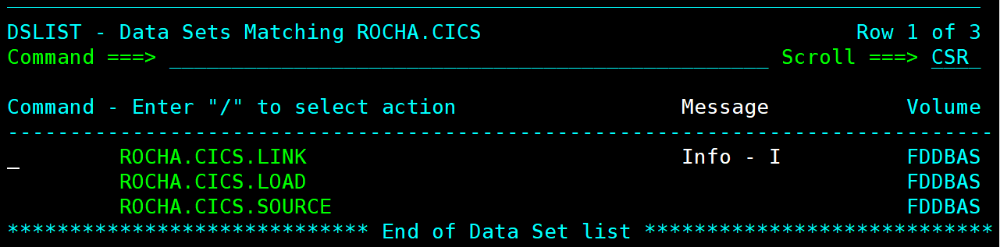
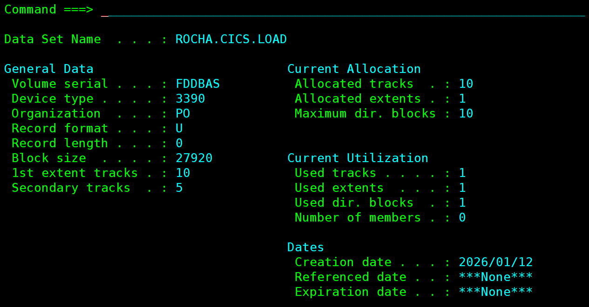

# Partie 0 : Préparation de l'environnement

[< Introduction](00-introduction.md) | [Partie 1 : Affichage >](02-partie-1-affichage.md)

---

## Exercice 0 : Création des Libraries

### Énoncé

Ce travail nécessite la création de trois Library pour stocker les membres à créer au cours de sa réalisation. Les Library à définir doivent porter le nom sous la forme suivante :
- **ROCHA.CICS.SOURCE** : Programmes COBOL et JCL
- **ROCHA.CICS.LINK** : Programmes objets (après compilation)
- **ROCHA.CICS.LOAD** : Programmes exécutables (après link-edit)

### Mon travail

Avant de commencer le développement des programmes CICS, j'ai créé les trois libraries nécessaires via ISPF option 3.2 (Data Set Utility). Ces libraries sont des PDS (Partitioned Data Sets) qui contiendront tous les membres du projet.

**Choix des caractéristiques :**
- **Format d'enregistrement** : FB (Fixed Block) avec LRECL=80 pour les sources
- **Taille** : 10 tracks primaires, 5 secondaires (suffisant pour le projet)
- **Directory blocks** : 10 blocs pour l'index des membres

### Résolution

Via ISPF 3.2 (Data Set Utility) :

```
Option ===> 3.2

DATA SET UTILITY

A - Allocate new data set

Data Set Name: ROCHA.CICS.SOURCE

Allocation Parameters:
  Management class  . .
  Storage class . . . .
  Volume serial . . . .
  Device type . . . . .
  Data class  . . . . .
  Space units . . . . . TRACK
  Primary quantity  . . 10
  Secondary quantity  . 5
  Directory blocks  . . 10
  Record format . . . . FB
  Record length . . . . 80
  Block size  . . . . . 27920
  Data set name type  . PDS
```

Répéter l'opération pour `ROCHA.CICS.LINK` et `ROCHA.CICS.LOAD`.

### Captures d'écran

#### Liste des Data Sets créés

La commande DSLIST (option 3.4) permet de vérifier que les trois libraries ont été correctement créées sur le volume FDDBAS :



*Cette capture montre les trois PDS créés : ROCHA.CICS.LINK, ROCHA.CICS.LOAD et ROCHA.CICS.SOURCE. La commande "I" (Info) permet d'afficher les caractéristiques détaillées de chaque Data Set.*

#### Caractéristiques de ROCHA.CICS.LINK

.PNG)

*La library LINK contient les modules objets après compilation. Elle utilise le format FB (Fixed Block) avec une longueur d'enregistrement de 80 octets, le standard pour les fichiers source z/OS. La date de création (2026/01/12) confirme l'allocation récente.*

#### Caractéristiques de ROCHA.CICS.LOAD



*La library LOAD contient les programmes exécutables (load modules). Elle utilise le format U (Undefined) car les modules exécutables n'ont pas de longueur d'enregistrement fixe. C'est le format standard pour les load modules z/OS.*

#### Caractéristiques de ROCHA.CICS.SOURCE

.PNG)

*La library SOURCE contiendra les programmes COBOL, les définitions BMS et les JCL. Comme LINK, elle utilise le format FB/80 pour la compatibilité avec les éditeurs ISPF et les compilateurs.*

### Structure des libraries

| Library | Contenu | RECFM | LRECL |
|---------|---------|-------|-------|
| ROCHA.CICS.SOURCE | Programmes COBOL (.cbl), MAPs BMS (.bms), JCL, Copybooks | FB | 80 |
| ROCHA.CICS.LINK | Modules objets après compilation | FB | 80 |
| ROCHA.CICS.LOAD | Modules exécutables (load modules) | U | - |

### Membres créés dans SOURCE

Au cours du projet, les membres suivants ont été créés dans `ROCHA.CICS.SOURCE` :

**Programmes COBOL :**

| Membre | Transaction | Description |
|--------|-------------|-------------|
| PRGCLIA | AFFI | Affichage client (READ) |
| PRGAJT | AJOU | Ajout client (WRITE) |
| PRGMAJ | MAJO | Mise à jour client (REWRITE) |
| PRGSUP | SUPP | Suppression client (DELETE) |
| PRGDELG | DELG | Suppression générique (STARTBR/READNEXT/DELETE) |
| PRGLGEN | LGEN | Liste générique (STARTBR/READNEXT) |
| PRGSTAT | STAT | Statistiques par région |

**MAPs BMS :**

| Membre | Programme | Description |
|--------|-----------|-------------|
| CLIAFF | PRGCLIA | Écran affichage client |
| CLIAJT | PRGAJT | Écran ajout client |
| CLIMAJ | PRGMAJ | Écran mise à jour client |
| CLISUP | PRGSUP | Écran suppression client |
| CLIDEL | PRGDELG | Écran suppression générique |
| CLILIST | PRGLGEN | Écran liste générique paginée |
| CLISTAT | PRGSTAT | Écran statistiques |

**JCL :**

| Membre | Usage | Exercice |
|--------|-------|----------|
| DEFVSAM | Définition cluster VSAM | Ex 1 |
| LOADVSAM | Chargement données initiales | Ex 1 |
| ASMCLAF | Assemblage MAP CLIAFF | Ex 2 |
| CMPCLAF | Compilation PRGCLIA | Ex 3 |
| ASMAJT | Assemblage MAP CLIAJT | Ex 6 |
| CMPAJT | Compilation PRGAJT | Ex 7 |
| ASMMAJ | Assemblage MAP CLIMAJ | Ex 9 |
| CMPMAJ | Compilation PRGMAJ | Ex 10 |
| ASMSUP | Assemblage MAP CLISUP | Ex 12 |
| CMPSUP | Compilation PRGSUP | Ex 13 |
| ASMDEL | Assemblage MAP CLIDEL | Ex 17 |
| CMPDELG | Compilation PRGDELG | Ex 17 |
| ASMLIST | Assemblage MAP CLILIST | Ex 18 |
| CMPLGEN | Compilation PRGLGEN | Ex 18 |
| DEFPATH | Définition AIX et PATH | Ex 19 |
| ASMSTAT | Assemblage MAP CLISTAT | Ex 19 |
| CMPSTAT | Compilation PRGSTAT | Ex 19 |

> **Note sur les copybooks** : Les copybooks pour les MAPs BMS sont générés automatiquement lors de l'assemblage avec l'option `TYPE=DSECT`. Ils contiennent les structures de données avec les suffixes :
> - `I` : Zone input (données reçues de l'écran)
> - `O` : Zone output (données à envoyer)
> - `L` : Longueur du champ saisi
> - `A` : Attribut du champ (couleur, intensité, etc.)

---

[< Introduction](00-introduction.md) | [Partie 1 : Affichage >](02-partie-1-affichage.md)
