# Partie 1 : Création du Data Set et Affichage

[< Partie 0 : Préparation](01-partie-0-preparation.md) | [Retour au sommaire](00-introduction.md) | [Partie 2a : Ajout >](03-partie-2a-ajout.md)

---

## Exercice 1 : Définition du Data Set CLIENT dans CICS

### Énoncé

Définir le Data Set CLIENT dans la procédure de démarrage de CICS et comme ressource VSAM à utiliser par les programmes. Les opérations de lecture, écriture et suppression seront autorisées sur ce Data Set.

### Mon travail

Cet exercice comporte deux étapes principales :

1. **Création du fichier VSAM** : J'ai utilisé IDCAMS pour définir un cluster KSDS avec une clé de 6 octets (numéro de compte) en position 0.

2. **Intégration dans CICS** : J'ai déclaré le fichier dans CICS via CEDA pour permettre les opérations READ, WRITE, REWRITE, DELETE et BROWSE.

**Choix des paramètres VSAM :**
- `KEYS(6 0)` : Clé de 6 caractères en début d'enregistrement (numéro compte)
- `RECORDSIZE(80 80)` : Enregistrements de taille fixe (80 octets) - compatible avec LRECL=80 par défaut du JCL
- `FREESPACE(20 10)` : Réserve de l'espace pour les insertions futures
- `SHAREOPTIONS(2 3)` : Permet le partage entre régions CICS

> **Note technique** : Les enregistrements font 80 octets (64 données + 16 filler) pour être compatibles avec le LRECL=80 par défaut des DD * en JCL. Les programmes COBOL utiliseront un FILLER de 16 caractères en fin d'enregistrement.

### Résolution

**Étape 1 : JCL de définition VSAM (IDCAMS)**

```jcl
//ROCHA01 JOB (ACCT),'DEF VSAM CLIENT',CLASS=A,MSGCLASS=X,
//             MSGLEVEL=(1,1),NOTIFY=&SYSUID
//*****************************************************************
//* DEFINITION DU DATA SET CLIENT (VSAM KSDS)
//*****************************************************************
//*
//* ETAPE 1 : SUPPRESSION DU CLUSTER EXISTANT (SI EXISTE)
//*
//STEP1    EXEC PGM=IDCAMS
//SYSPRINT DD SYSOUT=*
//SYSIN    DD *
  DELETE ROCHA.CICS.CLIENT CLUSTER
  SET MAXCC = 0
/*
//*
//* ETAPE 2 : DEFINITION DU CLUSTER VSAM KSDS
//*
//STEP2    EXEC PGM=IDCAMS
//SYSPRINT DD SYSOUT=*
//SYSIN    DD *
  DEFINE CLUSTER (                                    -
         NAME(ROCHA.CICS.CLIENT)                   -
         INDEXED                                      -
         VOLUMES(FDDBAS)                              -
         KEYS(6 0)                                    -
         RECORDSIZE(80 80)                            -
         TRACKS(5 5)                                  -
         FREESPACE(20 10)                             -
         SHAREOPTIONS(2 3)                            -
         )                                            -
         DATA (NAME(ROCHA.CICS.CLIENT.DATA))       -
         INDEX (NAME(ROCHA.CICS.CLIENT.INDEX))
/*
//*
//* ETAPE 3 : VERIFICATION DE LA CREATION
//*
//STEP3    EXEC PGM=IDCAMS
//SYSPRINT DD SYSOUT=*
//SYSIN    DD *
  LISTCAT ENTRIES(ROCHA.CICS.CLIENT) ALL
/*
```

**Étape 2 : Intégration dans CICS via CEDA**

Sur l'émulateur TK4-, j'utilise CEDA en mode interactif pour définir le fichier. La commande `CEDA DEFINE` ouvre un écran de saisie où je renseigne les paramètres :

```
CEDA DEFINE FILE(FCLIENT) GROUP(CLIGROUP)
```

Cela affiche un écran de définition. Je renseigne les paramètres suivants :

| Paramètre | Valeur | Description |
|-----------|--------|-------------|
| DSName | ROCHA.CICS.CLIENT | Nom physique du dataset VSAM |
| Add | Yes | Autoriser WRITE (ajout) |
| Browse | Yes | Autoriser STARTBR/READNEXT |
| Delete | Yes | Autoriser DELETE |
| Read | Yes | Autoriser READ |
| Update | Yes | Autoriser REWRITE |
| RECORDFormat | Fixed | Format d'enregistrement fixe |
| RECORDSize | 80 | Taille de l'enregistrement |
| Keylength | 6 | Longueur de la clé |

Après validation (ENTER), j'installe la ressource :

```
CEDA INSTALL FILE(FCLIENT) GROUP(CLIGROUP)
```

> **Note TK4-** : Sur l'émulateur, certains paramètres comme STATUS et OPENTIME peuvent avoir des valeurs par défaut. Le fichier s'ouvre automatiquement lors du premier accès.

**Étape 3 : Vérification avec CEMT**

```
CEMT INQUIRE FILE(FCLIENT)
```

Résultat attendu :
```
FILE(FCLIENT)   Dsn(ROCHA.CICS.CLIENT)
                Ena Ope Rea Upd Add Bro Del
                Vsam Ksds
```

**Commandes CEMT utiles pour la gestion du fichier :**

| Commande | Usage |
|----------|-------|
| `CEMT SET FILE(FCLIENT) OPEN` | Ouvrir le fichier |
| `CEMT SET FILE(FCLIENT) ENABLED` | Activer le fichier |
| `CEMT SET FILE(FCLIENT) CLOSED` | Fermer le fichier (pour maintenance VSAM) |
| `CEMT INQ FILE(FCLIENT)` | Vérifier l'état du fichier |

**Étape 4 : Chargement des données initiales**

Le chargement utilise directement IDCAMS REPRO avec des enregistrements de 80 octets (64 données + 16 espaces en filler). Le DD * lit par défaut en LRECL=80, ce qui est maintenant compatible avec notre définition VSAM.

```jcl
//ROCHA02 JOB (ACCT),'LOAD VSAM CLIENT',CLASS=A,MSGCLASS=X,
//             MSGLEVEL=(1,1),NOTIFY=&SYSUID
//*****************************************************************
//* CHARGEMENT DES DONNEES INITIALES DANS LE FICHIER CLIENT
//*
//* Structure enregistrement (80 octets) :
//*   Pos 01-06 : Numero compte (cle)
//*   Pos 07-08 : Code region
//*   Pos 09-10 : Nature compte
//*   Pos 11-20 : Nom client (10 car)
//*   Pos 21-30 : Prenom client (10 car)
//*   Pos 31-38 : Date naissance (AAAAMMJJ)
//*   Pos 39    : Sexe (M/F)
//*   Pos 40-41 : Activite professionnelle
//*   Pos 42    : Situation sociale (C/M/D/V)
//*   Pos 43-52 : Adresse (10 car)
//*   Pos 53-62 : Solde (10 car)
//*   Pos 63-64 : Position (DB/CR)
//*   Pos 65-80 : Filler (16 espaces)
//*****************************************************************
//*
//STEP1    EXEC PGM=IDCAMS
//SYSPRINT DD SYSOUT=*
//INFILE   DD *
0000010120DUPONT    JEAN      19850315M10CPARIS     0000150000CR
0000020125MARTIN    MARIE     19900622F15MPARIS     0000080000DB
0000030220BERNARD   PIERRE    19780410M20CMARSEILLE 0000250000CR
0000040225PETIT     SOPHIE    19880912F05MMARSEILLE 0000045000DB
0000050330ROBERT    ALAIN     19750520M10CLYON      0000320000CR
0000060335RICHARD   CLAIRE    19920805F25VLYON      0000012000DB
0000070420DURAND    PAUL      19820718M30DLILLE     0000180000CR
0000080425MOREAU    ANNE      19950303F15CLILLE     0000095000DB
0000090130LAURENT   MARC      19800125M20MPARIS     0000420000CR
0000100235SIMON     JULIE     19870930F10CMARSEILLE 0000067000DB
2220010120LEROY     MICHEL    19830214M05CPARIS     0000145000CR
2220020125ROUX      NATHALIE  19910607F15MMARSEILLE 0000032000DB
2220030230DAVID     FRANCOIS  19760819M20CLYON      0000278000CR
2220040335BERTRAND  ISABELLE  19890423F25VLILLE     0000089000DB
2220050420MOREL     PHILIPPE  19840111M30DPARIS     0000156000CR
/*
//SYSIN    DD *
 REPRO INFILE(INFILE) -
       OUTDATASET(ROCHA.CICS.CLIENT)
/*
//*
//STEP2    EXEC PGM=IDCAMS
//SYSPRINT DD SYSOUT=*
//SYSIN    DD *
 PRINT INDATASET(ROCHA.CICS.CLIENT) -
       CHARACTER
/*
//*
//STEP3    EXEC PGM=IDCAMS
//SYSPRINT DD SYSOUT=*
//SYSIN    DD *
 LISTCAT ENTRIES(ROCHA.CICS.CLIENT) ALL
/*
```

> **Note technique** : Les données font 64 caractères et sont automatiquement complétées à 80 caractères (padding avec des espaces) par le JCL. Le VSAM étant défini avec RECORDSIZE(80 80), les enregistrements sont compatibles.

**Données chargées :**

| Type | Numéros | Quantité | Usage |
|------|---------|----------|-------|
| Clients de base | 000001-000010 | 10 | Tests CRUD (Ex 3-15) |
| Clients 222xxx | 222001-222005 | 5 | Test READNEXT (Ex 18) |

**Répartition par région (pour Ex 19 - Statistiques) :**

| Région | Débiteurs | Créditeurs | Total |
|--------|-----------|------------|-------|
| 01 Paris | 1 | 4 | 5 |
| 02 Marseille | 2 | 2 | 4 |
| 03 Lyon | 1 | 2 | 3 |
| 04 Lille | 2 | 1 | 3 |

> **Note** : Les clients 111xxx, 444xxx et 777xxx seront créés manuellement via la transaction AJOU dans l'exercice 16.

### Captures d'écran

#### Création du cluster VSAM

Après exécution du JCL IDCAMS DEFINE, le cluster ROCHA.CICS.CLIENT est créé. La commande LISTCAT affiche les composants du cluster :

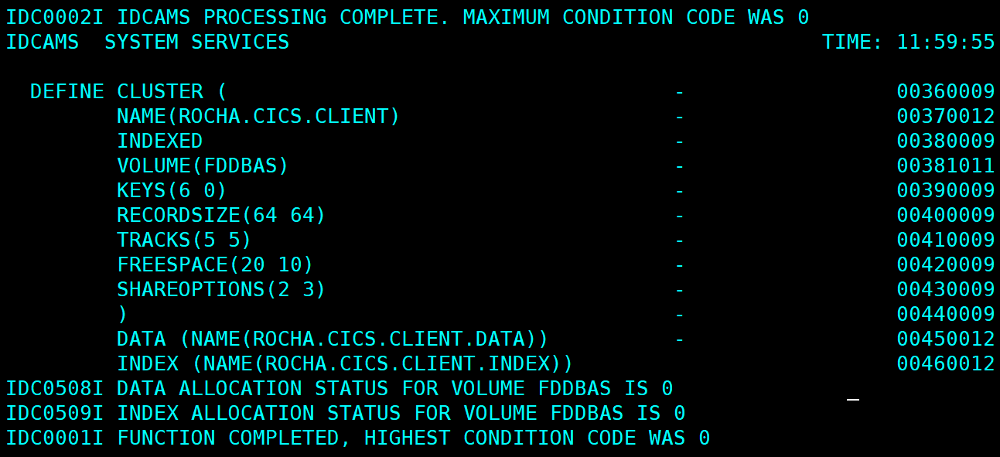

*Sortie IDCAMS montrant la création du cluster VSAM avec ses composants DATA et INDEX. Les paramètres KEYS(6 0) définissent la clé primaire (numéro de compte) en position 0 sur 6 octets.*

#### Vérification des Data Sets créés

La commande DSLIST montre le cluster VSAM avec ses composants (DATA et INDEX) ainsi que les libraries du projet :

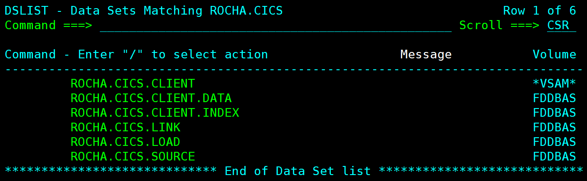

*Le cluster VSAM apparaît avec ses deux composants. Noter que VSAM gère automatiquement les composants DATA et INDEX - l'application accède uniquement au cluster via son nom (ROCHA.CICS.CLIENT).*

#### Contenu du fichier après chargement

Le JCL de chargement utilise IDCAMS REPRO pour insérer les 15 enregistrements. La commande PRINT affiche le contenu :

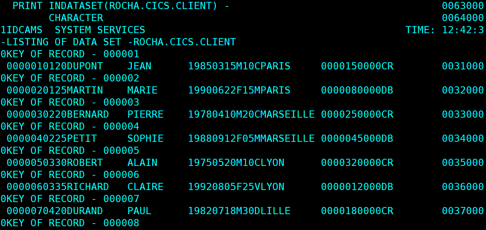

*Premiers enregistrements chargés (000001 à 000008). La structure est visible : numéro compte (6), code région (2), nature compte (2), nom (10), prénom (10), etc.*

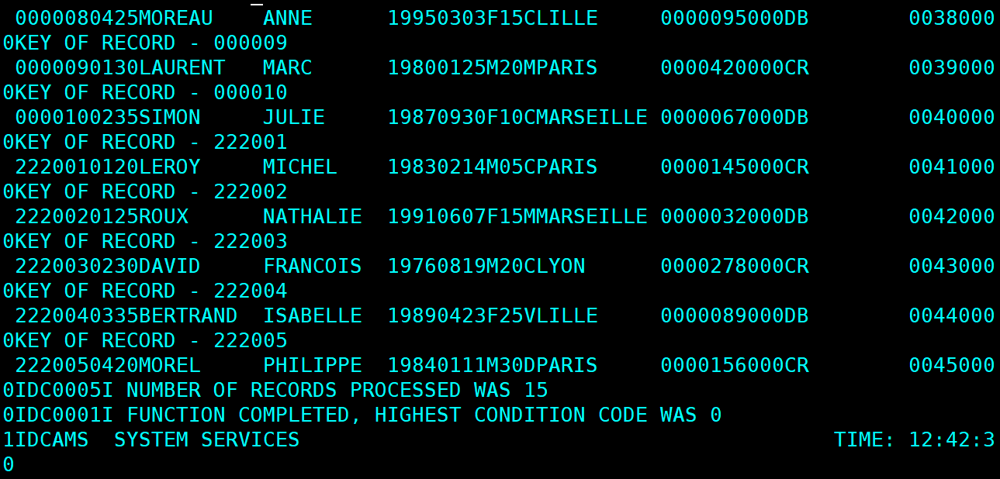

*Suite et fin des enregistrements (000009 à 222005). Les 15 clients sont correctement chargés, incluant les 5 clients 222xxx pour les tests de browse.*

#### Visualisation VSAM avec DITTO

L'utilitaire DITTO/ESA permet de naviguer dans le fichier VSAM et visualiser les enregistrements :

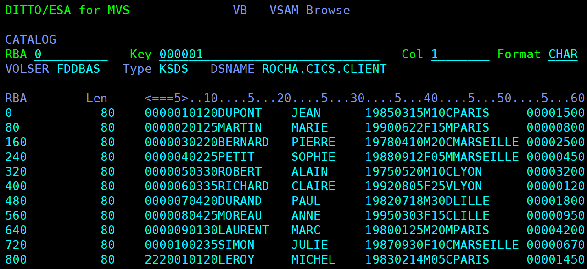

*DITTO montre les enregistrements avec leur RBA (Relative Byte Address) et leur contenu. On voit clairement les champs : DUPONT JEAN, PARIS, 0000150000CR pour le premier client.*

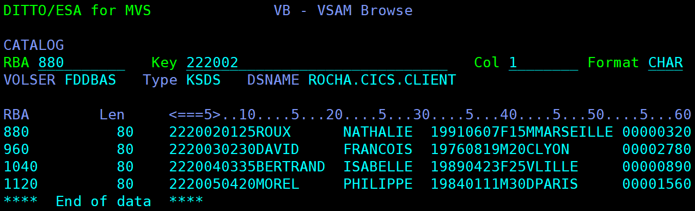

*Fin du fichier avec "End of data" confirmant les 15 enregistrements chargés. Le dernier client est MOREL PHILIPPE (222005).*

#### Définition du fichier dans CICS

La commande CEDA DEFINE FILE crée la ressource FCLIENT dans le groupe CLIGROUP :

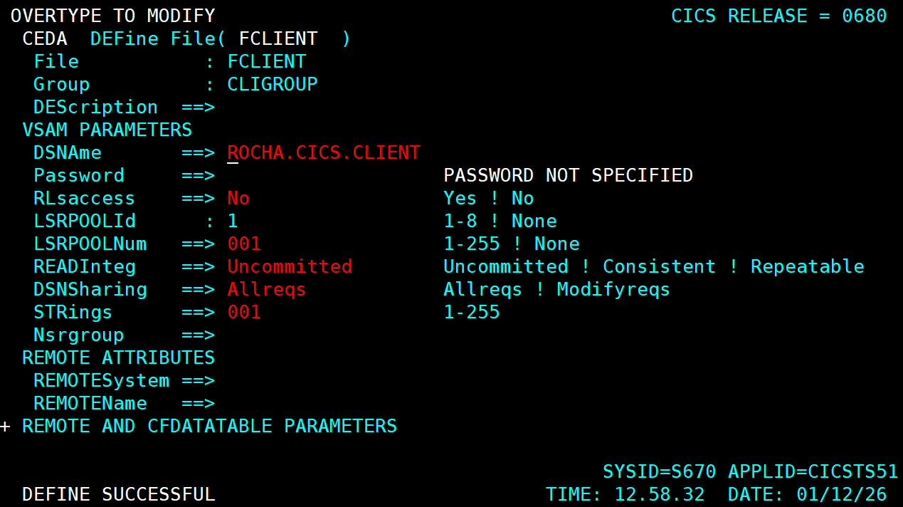

*Écran de définition du fichier CICS. Les paramètres importants : DSName=ROCHA.CICS.CLIENT, RLsaccess=No (pas de Record Level Sharing), DSNSharing=Allreqs (partage entre régions autorisé).*

#### Installation du fichier

Après définition, la ressource doit être installée pour être active :

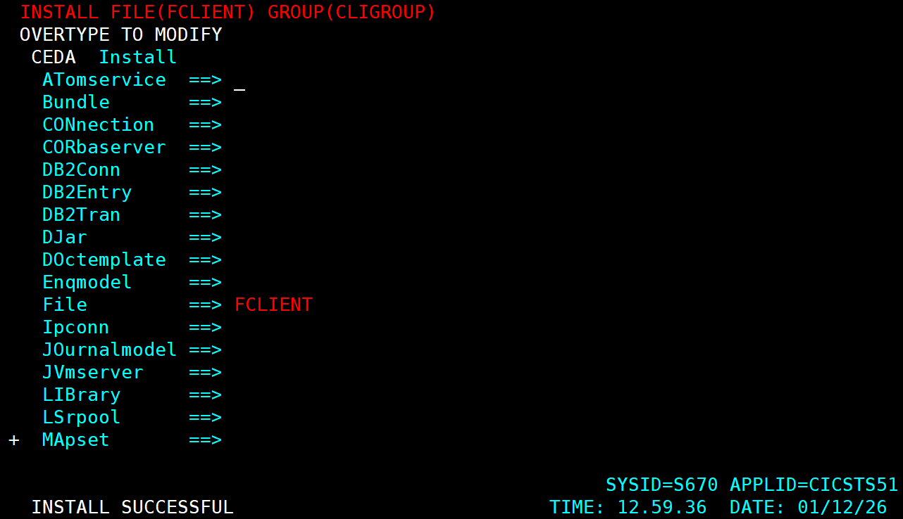

*Message "INSTALL SUCCESSFUL" confirmant que le fichier est maintenant actif dans CICS. La date/heure de l'installation est enregistrée.*

#### Vérification avec CEMT

La commande CEMT INQUIRE FILE permet de vérifier l'état du fichier :


*Le fichier est actif avec tous les droits : Vsa (VSAM), Clo (Closed au démarrage), Ena (Enabled), Rea (Read), Upd (Update), Add (Add), Bro (Browse), Del (Delete). Le statut "Sha" indique le partage activé.*

---

## Exercice 2 : Création de la MAP BMS pour affichage

### Énoncé

Créer la MAP conformément à la structure du Data Set CLIENT permettant l'affichage des nouvelles données. Prévoir dans ce cadre le contrôle des données redondantes et une zone de message de 40 caractères pour afficher les informations nécessaires en cas d'erreur ou de saisie correcte.

### Mon travail

J'ai créé une MAP BMS avec tous les champs du fichier CLIENT. La MAP comprend :
- Un titre en haut de l'écran
- Une zone de saisie pour le numéro de compte (clé de recherche)
- Les 12 champs d'affichage avec leurs libellés
- Des zones libellés pour afficher les descriptions (région, sexe, situation, position)
- Une zone de message de 60 caractères en bas
- Les touches fonction en bas de l'écran

**Choix de conception :**

- `CTRL=(FREEKB,FRSET)` : Clavier débloqué et MDT remis à zéro
- `TIOAPFX=YES` : Réserve 12 octets pour le préfixe TIOA (requis pour CICS)
- Seul le champ NUMCPT est saisissable (UNPROT), les autres sont en affichage (ASKIP)

**Comprendre les concepts BMS :**

| Option | Signification | Rôle |
|--------|---------------|------|
| **FREEKB** | Free Keyboard | Débloque le clavier après l'envoi de la MAP, permettant à l'utilisateur de saisir |
| **FRSET** | Flag Reset | Remet le MDT à zéro pour tous les champs |
| **MDT** | Modified Data Tag | Bit qui indique si un champ a été modifié par l'utilisateur |
| **TIOAPFX** | TIOA Prefix | Réserve 12 octets au début de la zone MAP pour le préfixe CICS |
| **UNPROT** | Unprotected | Champ saisissable par l'utilisateur |
| **ASKIP** | Auto-skip | Champ en affichage seul, le curseur le saute |

> **Le MDT (Modified Data Tag)** : Chaque champ de l'écran possède un bit MDT. Quand l'utilisateur modifie un champ, le MDT passe à 1. Lors du RECEIVE MAP, seuls les champs avec MDT=1 sont transmis au programme. L'option FRSET remet tous les MDT à 0 au SEND MAP, permettant de détecter les nouvelles modifications.

### Résolution

**MAP BMS : CLIAFF.bms**

Le code source est stocké dans `ROCHA.CICS.SOURCE(CLIAFF)`. Voici le code complet :

```
***********************************************************************
*  MAPSET : CLIAFF - Affichage Client
*  Transaction : AFFI
*  Fil Rouge CICS - Exercice 2
***********************************************************************
CLIAFF   DFHMSD TYPE=&SYSPARM,MODE=INOUT,LANG=COBOL,                   X
               STORAGE=AUTO,CTRL=(FREEKB,FRSET),TIOAPFX=YES
***********************************************************************
MAPAFF   DFHMDI SIZE=(24,80),LINE=1,COLUMN=1
*----------------------------------------------------------------------
* TITRE
*----------------------------------------------------------------------
         DFHMDF POS=(1,25),LENGTH=30,ATTRB=(ASKIP,BRT),                 X
               INITIAL='*** AFFICHAGE CLIENT ***'
         DFHMDF POS=(2,1),LENGTH=78,ATTRB=ASKIP,                        X
               INITIAL='------------------------------------------------X
               ------------------------------'
*----------------------------------------------------------------------
* ZONE DE SAISIE - NUMERO DE COMPTE (CLE)
*----------------------------------------------------------------------
         DFHMDF POS=(4,2),LENGTH=16,ATTRB=ASKIP,                        X
               INITIAL='NUMERO COMPTE :'
NUMCPT   DFHMDF POS=(4,19),LENGTH=6,ATTRB=(UNPROT,NUM,IC)
         DFHMDF POS=(4,26),LENGTH=1,ATTRB=ASKIP
*----------------------------------------------------------------------
* ZONES D'AFFICHAGE - DONNEES CLIENT
*----------------------------------------------------------------------
         DFHMDF POS=(6,2),LENGTH=16,ATTRB=ASKIP,                        X
               INITIAL='CODE REGION   :'
CODREG   DFHMDF POS=(6,19),LENGTH=2,ATTRB=(ASKIP,BRT)
         DFHMDF POS=(6,25),LENGTH=20,ATTRB=ASKIP
LIBREG   DFHMDF POS=(6,46),LENGTH=15,ATTRB=(ASKIP,BRT)
*
         DFHMDF POS=(7,2),LENGTH=16,ATTRB=ASKIP,                        X
               INITIAL='NATURE COMPTE :'
NATCPT   DFHMDF POS=(7,19),LENGTH=2,ATTRB=(ASKIP,BRT)
         DFHMDF POS=(7,25),LENGTH=20,ATTRB=ASKIP
LIBNAT   DFHMDF POS=(7,46),LENGTH=15,ATTRB=(ASKIP,BRT)
*
         DFHMDF POS=(8,2),LENGTH=16,ATTRB=ASKIP,                        X
               INITIAL='NOM           :'
NOM      DFHMDF POS=(8,19),LENGTH=10,ATTRB=(ASKIP,BRT)
*
         DFHMDF POS=(9,2),LENGTH=16,ATTRB=ASKIP,                        X
               INITIAL='PRENOM        :'
PRENOM   DFHMDF POS=(9,19),LENGTH=10,ATTRB=(ASKIP,BRT)
*
         DFHMDF POS=(10,2),LENGTH=16,ATTRB=ASKIP,                       X
               INITIAL='DATE NAISSANCE:'
DATNA    DFHMDF POS=(10,19),LENGTH=10,ATTRB=(ASKIP,BRT)
*
         DFHMDF POS=(11,2),LENGTH=16,ATTRB=ASKIP,                       X
               INITIAL='SEXE          :'
SEXE     DFHMDF POS=(11,19),LENGTH=1,ATTRB=(ASKIP,BRT)
         DFHMDF POS=(11,24),LENGTH=10,ATTRB=ASKIP
LIBSEX   DFHMDF POS=(11,35),LENGTH=8,ATTRB=(ASKIP,BRT)
*
         DFHMDF POS=(12,2),LENGTH=16,ATTRB=ASKIP,                       X
               INITIAL='ACTIVITE PRO  :'
ACTPRO   DFHMDF POS=(12,19),LENGTH=2,ATTRB=(ASKIP,BRT)
*
         DFHMDF POS=(13,2),LENGTH=16,ATTRB=ASKIP,                       X
               INITIAL='SITUATION SOC :'
SITSO    DFHMDF POS=(13,19),LENGTH=1,ATTRB=(ASKIP,BRT)
         DFHMDF POS=(13,24),LENGTH=10,ATTRB=ASKIP
LIBSIT   DFHMDF POS=(13,35),LENGTH=12,ATTRB=(ASKIP,BRT)
*
         DFHMDF POS=(14,2),LENGTH=16,ATTRB=ASKIP,                       X
               INITIAL='ADRESSE       :'
ADRESSE  DFHMDF POS=(14,19),LENGTH=10,ATTRB=(ASKIP,BRT)
*
         DFHMDF POS=(15,2),LENGTH=16,ATTRB=ASKIP,                       X
               INITIAL='SOLDE         :'
SOLDE    DFHMDF POS=(15,19),LENGTH=12,ATTRB=(ASKIP,BRT)
*
         DFHMDF POS=(16,2),LENGTH=16,ATTRB=ASKIP,                       X
               INITIAL='POSITION      :'
POSIT    DFHMDF POS=(16,19),LENGTH=2,ATTRB=(ASKIP,BRT)
         DFHMDF POS=(16,25),LENGTH=10,ATTRB=ASKIP
LIBPOS   DFHMDF POS=(16,36),LENGTH=10,ATTRB=(ASKIP,BRT)
*----------------------------------------------------------------------
* ZONE MESSAGE
*----------------------------------------------------------------------
         DFHMDF POS=(19,1),LENGTH=78,ATTRB=ASKIP,                       X
               INITIAL='------------------------------------------------X
               ------------------------------'
         DFHMDF POS=(20,2),LENGTH=10,ATTRB=ASKIP,INITIAL='MESSAGE :'
MSG      DFHMDF POS=(20,13),LENGTH=60,ATTRB=(ASKIP,BRT)
*----------------------------------------------------------------------
* TOUCHES FONCTION
*----------------------------------------------------------------------
         DFHMDF POS=(23,2),LENGTH=70,ATTRB=ASKIP,                       X
               INITIAL='ENTER=Rechercher  PF3=Quitter  CLEAR=Effacer'
***********************************************************************
         DFHMSD TYPE=FINAL
         END
```

**Zones de la MAP :**

| Zone | Longueur | Attribut | Description |
|------|----------|----------|-------------|
| NUMCPT | 6 | UNPROT,NUM,IC | Numéro compte (saisie) |
| CODREG | 2 | ASKIP,BRT | Code région |
| LIBREG | 15 | ASKIP,BRT | Libellé région |
| NATCPT | 2 | ASKIP,BRT | Nature compte |
| LIBNAT | 15 | ASKIP,BRT | Libellé nature |
| NOM | 10 | ASKIP,BRT | Nom client |
| PRENOM | 10 | ASKIP,BRT | Prénom client |
| DATNA | 10 | ASKIP,BRT | Date naissance |
| SEXE | 1 | ASKIP,BRT | Sexe |
| LIBSEX | 8 | ASKIP,BRT | Libellé sexe |
| ACTPRO | 2 | ASKIP,BRT | Activité professionnelle |
| SITSO | 1 | ASKIP,BRT | Situation sociale |
| LIBSIT | 12 | ASKIP,BRT | Libellé situation |
| ADRESSE | 10 | ASKIP,BRT | Adresse |
| SOLDE | 12 | ASKIP,BRT | Solde |
| POSIT | 2 | ASKIP,BRT | Position (DB/CR) |
| LIBPOS | 10 | ASKIP,BRT | Libellé position |
| MSG | 60 | ASKIP,BRT | Zone message |

**JCL d'assemblage : ASMCLAF.jcl**

> **Choix de conception** : J'ai créé un JCL d'assemblage par MAP BMS (ASMCLAF, ASMAJT, ASMMAJ, ASMSUP) plutôt qu'un JCL générique paramétrable. Ce choix permet :
> - Une meilleure traçabilité dans SDSF (nom de job explicite)
> - Une modification indépendante si une MAP nécessite des options spécifiques
> - Une simplicité d'utilisation (pas de substitution de variables)

```jcl
//ROCHA03 JOB (ACCT),'ASSEMBL BMS CLIAFF',CLASS=A,MSGCLASS=X,
//             MSGLEVEL=(1,1),NOTIFY=&SYSUID
//*****************************************************************
//* ASSEMBLAGE DE LA MAP BMS CLIAFF (AFFICHAGE CLIENT)
//*
//* Ce JCL assemble le source BMS et génère :
//*   - Le module MAP physique dans ROCHA.CICS.LOAD
//*   - Le copybook DSECT dans ROCHA.CICS.LINK
//*****************************************************************
//PROCMAN  JCLLIB ORDER=(DFH510.CICS.SDFHPROC,ROCHA.CICS.SOURCE,
//          ROCHA.CICS.LINK,ROCHA.CICS.LOAD)
//*
//ASSEM    EXEC DFHMAPS,INDEX='DFH510.CICS',
//          MAPLIB='ROCHA.CICS.LOAD',
//          DSCTLIB='ROCHA.CICS.LINK',
//          MAPNAME='CLIAFF',RMODE=24
//SYSPRINT DD SYSOUT=*
//SYSUT1   DD DSN=ROCHA.CICS.SOURCE(CLIAFF),DISP=SHR
/*
```

> **Note** : La procédure DFHMAPS génère automatiquement le module physique (MAP) et le copybook COBOL (DSECT). Le copybook sera stocké dans ROCHA.CICS.LINK avec le nom du mapset. Attention à ne pas utiliser la même library pour le source et le DSECT, sinon le source sera écrasé !

**Structure du copybook généré (DSECT) :**

Pour chaque champ nommé dans la MAP BMS (ex: NUMCPT), le copybook généré contient plusieurs variables avec des suffixes :

| Suffixe | Type | Description | Exemple |
|---------|------|-------------|---------|
| **L** | S9(04) COMP | Longueur des données reçues | NUMCPTL |
| **F** | X(01) | Flag (usage interne) | NUMCPTF |
| **A** | X(01) | Attribut dynamique | NUMCPTA |
| **I** | X(nn) | Zone input (données reçues) | NUMCPTI |
| **O** | X(nn) | Zone output (données à envoyer) | NUMCPTO |

> **Important** : Avec `STORAGE=AUTO`, les zones I et O partagent la même mémoire. Après un `RECEIVE MAP`, sauvegarder les valeurs importantes avant de faire `MOVE LOW-VALUES`.

**Maquette de l'écran MAPAFF :**

Cette maquette (wireframe) représente la disposition des champs sur l'écran 24x80 :

```
+------------------------------------------------------------------------------+
|                         *** AFFICHAGE CLIENT ***                             |
|------------------------------------------------------------------------------|
|                                                                              |
|  NUMERO COMPTE : ______                                                      |
|                                                                              |
|  CODE REGION   : __                            _______________               |
|  NATURE COMPTE : __                            _______________               |
|  NOM           : __________                                                  |
|  PRENOM        : __________                                                  |
|  DATE NAISSANCE: __________                                                  |
|  SEXE          : _               ________                                    |
|  ACTIVITE PRO  : __                                                          |
|  SITUATION SOC : _               ____________                                |
|  ADRESSE       : __________                                                  |
|  SOLDE         : ____________                                                |
|  POSITION      : __              __________                                  |
|                                                                              |
|------------------------------------------------------------------------------|
|  MESSAGE : ____________________________________________________________      |
|                                                                              |
|                                                                              |
|  ENTER=Rechercher  PF3=Quitter  CLEAR=Effacer                                |
+------------------------------------------------------------------------------+
```

### Captures d'écran

#### Assemblage du source BMS

Le JCL d'assemblage utilise la procédure DFHMAPS pour générer le module physique et le copybook DSECT :

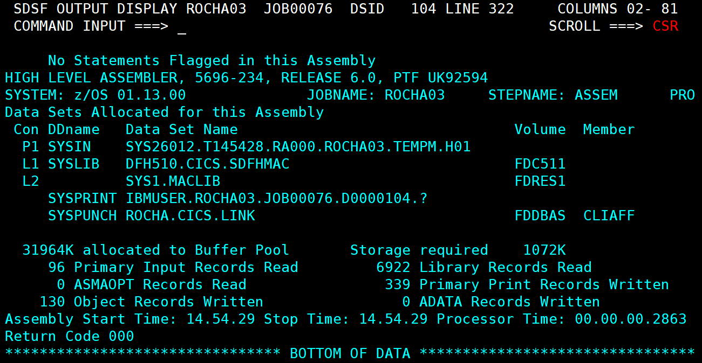

*Sortie de l'assembleur High Level Assembler. Le "Return Code 000" confirme l'assemblage réussi. On voit les fichiers utilisés : SYSLIB (macros CICS), SYSPUNCH (sortie vers ROCHA.CICS.LINK membre CLIAFF).*

#### Copybook généré dans ROCHA.CICS.LINK

L'assemblage génère automatiquement le copybook COBOL (DSECT) dans la library LINK :

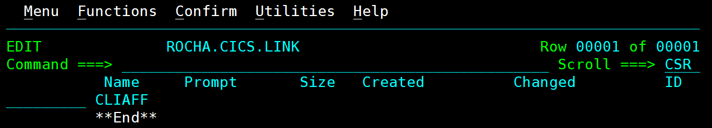

*Le membre CLIAFF est créé dans ROCHA.CICS.LINK. Ce copybook contient les structures de données avec les suffixes L, F, A, I, O pour chaque champ de la MAP.*

#### Définition du MAPSET dans CICS

La commande CEDA DEFINE MAPSET déclare l'écran BMS comme ressource CICS :

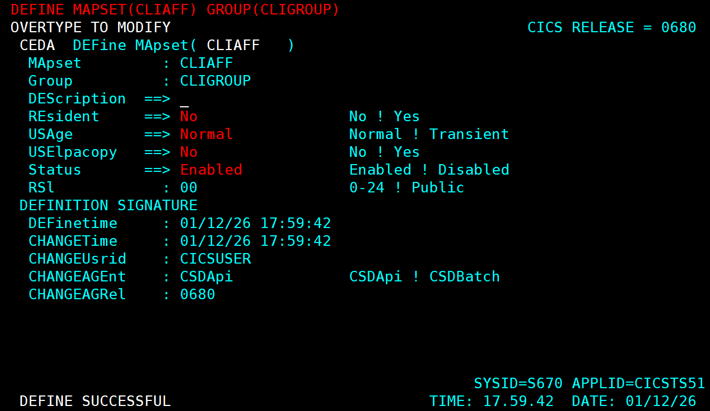

*Définition du mapset CLIAFF dans le groupe CLIGROUP. USAge=Normal signifie que le mapset sera chargé à la première utilisation et déchargé après un certain temps d'inactivité.*

#### Vérification de la définition

La commande CEDA VIEW permet de vérifier les caractéristiques du mapset :

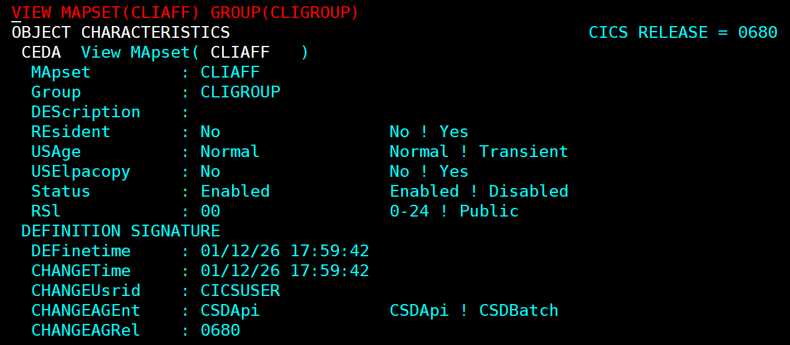

*Caractéristiques du mapset : Status=Enabled, DEFinetime indique la date/heure de création, CHANGEUsrid montre l'utilisateur qui a créé la définition (CICSUSER).*

---

## Exercice 3 : Programme COBOL-CICS d'affichage

### Énoncé

Créer le PROGRAMME nécessaire pour l'affichage des données pour un code CLIENT saisi. Il doit permettre une saisie multiple de code CLIENT jusqu'à fin de saisie d'affichage de la part de l'utilisateur. De même, il faut accompagner chaque anomalie ou action par un message d'information ou d'avertissement.

### Mon travail

J'ai développé un programme COBOL-CICS en mode **pseudo-conversationnel**.

#### Pourquoi le mode pseudo-conversationnel ?

J'ai choisi ce mode pour plusieurs raisons :
- **Optimisation des ressources** : Le programme libère la mémoire entre chaque interaction utilisateur
- **Exigence de l'énoncé** : "Saisie multiple jusqu'à fin de saisie" implique plusieurs allers-retours écran
- **Bonne pratique CICS** : C'est le mode standard pour les transactions interactives en production
- **Scalabilité** : Permet de supporter de nombreux utilisateurs simultanés

#### Comprendre le mode pseudo-conversationnel

En CICS, un programme ne reste pas en mémoire pendant que l'utilisateur réfléchit. Au lieu de cela :

1. **Le programme s'exécute** : traite les données, affiche un écran
2. **Le programme se TERMINE** : libère la mémoire et les ressources
3. **L'utilisateur saisit** : pendant ce temps, le programme n'existe plus
4. **CICS relance le programme** : quand l'utilisateur appuie sur une touche

C'est le mode **pseudo-conversationnel** : l'utilisateur a l'impression d'une conversation continue, mais en réalité le programme est relancé à chaque interaction.

```
┌─────────────────────────────────────────────────────────────────┐
│ LANCEMENT TRANSACTION "AFFI"                                    │
└─────────────────────────────────────────────────────────────────┘
                            │
                            ▼
┌─────────────────────────────────────────────────────────────────┐
│ PREMIER PASSAGE (EIBCALEN = 0)                                  │
│ ──────────────────────────────────────────────────────────────  │
│ → CICS lance le programme pour la première fois                 │
│ → EIBCALEN = 0 (pas de COMMAREA, c'est un nouveau contexte)     │
│ → Le programme affiche l'écran vide (SEND MAP)                  │
│ → Le programme se TERMINE (RETURN TRANSID)                      │
│ → Mémoire libérée, ressources libérées                          │
└─────────────────────────────────────────────────────────────────┘
                            │
        L'utilisateur saisit un numéro et appuie sur ENTRÉE
                            │
                            ▼
┌─────────────────────────────────────────────────────────────────┐
│ PASSAGES SUIVANTS (EIBCALEN > 0)                                │
│ ──────────────────────────────────────────────────────────────  │
│ → CICS relance le programme (nouveau processus)                 │
│ → EIBCALEN > 0 (la COMMAREA indique un contexte existant)       │
│ → Le programme reçoit la saisie (RECEIVE MAP)                   │
│ → Le programme lit le fichier (READ FILE)                       │
│ → Le programme affiche le résultat (SEND MAP)                   │
│ → Le programme se TERMINE à nouveau (RETURN TRANSID)            │
└─────────────────────────────────────────────────────────────────┘
```

#### Variables clés du EIB (Exec Interface Block)

CICS fournit un bloc de données appelé EIB contenant des informations sur le contexte :

| Variable | Description | Valeurs typiques |
|----------|-------------|------------------|
| **EIBCALEN** | Longueur de la COMMAREA | 0 = premier passage, >0 = passage suivant |
| **EIBAID** | Touche appuyée | DFHENTER, DFHPF3, DFHCLEAR |
| **EIBTRNID** | Code transaction | 'AFFI' |
| **EIBRESP** | Code réponse dernière commande | 0=OK, 13=NOTFND |

#### Logique du programme

Le programme utilise un `EVALUATE` pour aiguiller selon le contexte :

| Condition | Action | Paragraphe |
|-----------|--------|------------|
| EIBCALEN = 0 | Premier passage, afficher écran vide | 1000-PREMIER-PASSAGE |
| EIBAID = DFHPF3 | Touche PF3, quitter | 9000-FIN-PROGRAMME |
| EIBAID = DFHCLEAR | Touche CLEAR, réinitialiser | 1000-PREMIER-PASSAGE |
| Autre (ENTER) | Traiter la saisie | 2000-TRAITEMENT |

#### Points techniques importants

- **DFHAID** : Copybook contenant les constantes des touches (DFHPF3, DFHCLEAR, DFHENTER)
- **SEND TEXT** : Nécessite une variable, pas une constante littérale (`FROM(WS-MSG)` pas `FROM('texte')`)
- **Copybook BMS** : Généré par l'assemblage, contient MAPAFFI (input) et MAPAFFO (output)

### Résolution

**Programme : PRGCLIA.cbl**

Le code source est stocké dans `ROCHA.CICS.SOURCE(PRGCLIA)`. Voici le code complet :

```cobol
       IDENTIFICATION DIVISION.
       PROGRAM-ID. PRGCLIA.
      ******************************************************************
      * PROGRAMME : PRGCLIA
      * FONCTION  : Affichage d'un client par numéro de compte
      * TRANSACTION : AFFI
      * FICHIER   : FCLIENT (VSAM KSDS)
      * MAP       : MAPAFF (MAPSET CLIAFF)
      *
      * MODE PSEUDO-CONVERSATIONNEL :
      *   - Premier passage : Affiche écran vide
      *   - Passages suivants : Lit et affiche le client
      *   - PF3 : Quitter la transaction
      *
      * FIL ROUGE CICS - EXERCICE 3
      ******************************************************************
       ENVIRONMENT DIVISION.
       CONFIGURATION SECTION.
       DATA DIVISION.
      ******************************************************************
       WORKING-STORAGE SECTION.
      ******************************************************************
      *-----------------------------------------------------------------
      * ZONE DE COMMUNICATION (COMMAREA)
      *-----------------------------------------------------------------
       01  WS-COMMAREA.
           05 WS-FLAG-INIT         PIC X(01) VALUE 'N'.
              88 PREMIER-PASSAGE   VALUE 'N'.
              88 PASSAGE-SUIVANT   VALUE 'O'.

      *-----------------------------------------------------------------
      * COPYBOOKS CICS
      *-----------------------------------------------------------------
       COPY DFHAID.
      *-----------------------------------------------------------------
      * COPYBOOK GENERE PAR ASSEMBLAGE BMS (DSECT)
      * Stocké dans ROCHA.CICS.LINK(CLIAFF)
      *-----------------------------------------------------------------
       COPY CLIAFF.

      *-----------------------------------------------------------------
      * STRUCTURE ENREGISTREMENT CLIENT (80 OCTETS)
      *-----------------------------------------------------------------
       01  ENR-CLIENT.
           05 CLI-NUMCPT           PIC X(06).
           05 CLI-CODREG           PIC X(02).
           05 CLI-NATCPT           PIC X(02).
           05 CLI-NOM              PIC X(10).
           05 CLI-PRENOM           PIC X(10).
           05 CLI-DATNAISS         PIC X(08).
           05 CLI-SEXE             PIC X(01).
           05 CLI-ACTPRO           PIC X(02).
           05 CLI-SITSO            PIC X(01).
           05 CLI-ADRESSE          PIC X(10).
           05 CLI-SOLDE            PIC X(10).
           05 CLI-POSITION         PIC X(02).
           05 FILLER               PIC X(16).

      *-----------------------------------------------------------------
      * VARIABLES DE TRAVAIL
      *-----------------------------------------------------------------
       01  WS-RESP                 PIC S9(08) COMP VALUE 0.
       01  WS-NUMCPT               PIC X(06) VALUE SPACES.
       01  WS-MSG-FIN              PIC X(40)
           VALUE 'TRANSACTION AFFI TERMINEE - AU REVOIR'.

      ******************************************************************
       PROCEDURE DIVISION.
      ******************************************************************

      *-----------------------------------------------------------------
       0000-PRINCIPAL.
      *-----------------------------------------------------------------
      * Point d'entrée du programme
      *-----------------------------------------------------------------
           EVALUATE TRUE
               WHEN EIBCALEN = 0
                   PERFORM 1000-PREMIER-PASSAGE
               WHEN EIBAID = DFHPF3
                   PERFORM 9000-FIN-PROGRAMME
               WHEN EIBAID = DFHCLEAR
                   PERFORM 1000-PREMIER-PASSAGE
               WHEN OTHER
                   PERFORM 2000-TRAITEMENT
           END-EVALUATE

           EXEC CICS RETURN
               TRANSID('AFFI')
               COMMAREA(WS-COMMAREA)
               LENGTH(LENGTH OF WS-COMMAREA)
           END-EXEC.

      *-----------------------------------------------------------------
       1000-PREMIER-PASSAGE.
      *-----------------------------------------------------------------
      * Affichage de l'écran vide avec message de saisie
      *-----------------------------------------------------------------
           MOVE LOW-VALUES TO MAPAFFO
           MOVE 'SAISIR LE NUMERO DE COMPTE ET APPUYER SUR ENTREE'
               TO MSGO
           MOVE 'O' TO WS-FLAG-INIT

           EXEC CICS SEND MAP('MAPAFF')
               MAPSET('CLIAFF')
               ERASE
           END-EXEC.

      *-----------------------------------------------------------------
       2000-TRAITEMENT.
      *-----------------------------------------------------------------
      * Réception des données et recherche du client
      *-----------------------------------------------------------------
           EXEC CICS RECEIVE MAP('MAPAFF')
               MAPSET('CLIAFF')
               RESP(WS-RESP)
           END-EXEC

      * Gestion MAPFAIL (aucune donnée transmise)
           IF WS-RESP = DFHRESP(MAPFAIL)
               MOVE LOW-VALUES TO MAPAFFO
               MOVE 'ERREUR RECEPTION - RESSAISIR' TO MSGO
               EXEC CICS SEND MAP('MAPAFF')
                   MAPSET('CLIAFF')
                   ERASE
               END-EXEC
               GO TO 2000-FIN
           END-IF

      * Vérifier que le numéro de compte est saisi
           IF NUMCPTL = 0 OR NUMCPTI = SPACES
               MOVE LOW-VALUES TO MAPAFFO
               MOVE 'VEUILLEZ SAISIR UN NUMERO DE COMPTE' TO MSGO
               EXEC CICS SEND MAP('MAPAFF')
                   MAPSET('CLIAFF')
               END-EXEC
               GO TO 2000-FIN
           END-IF

      * Préparer la clé de recherche
           MOVE NUMCPTI TO WS-NUMCPT

      * Lecture du fichier VSAM
           EXEC CICS READ
               FILE('FCLIENT')
               INTO(ENR-CLIENT)
               RIDFLD(WS-NUMCPT)
               RESP(WS-RESP)
           END-EXEC

      * Traitement du résultat
           EVALUATE WS-RESP
               WHEN DFHRESP(NORMAL)
                   PERFORM 3000-AFFICHER-CLIENT
               WHEN DFHRESP(NOTFND)
                   MOVE LOW-VALUES TO MAPAFFO
                   MOVE WS-NUMCPT TO NUMCPTO
                   MOVE 'CLIENT INEXISTANT - VERIFIEZ LE NUMERO'
                       TO MSGO
               WHEN OTHER
                   MOVE LOW-VALUES TO MAPAFFO
                   MOVE 'ERREUR LECTURE FICHIER - CONTACTEZ SUPPORT'
                       TO MSGO
           END-EVALUATE

           EXEC CICS SEND MAP('MAPAFF')
               MAPSET('CLIAFF')
           END-EXEC.

       2000-FIN.
           EXIT.

      *-----------------------------------------------------------------
       3000-AFFICHER-CLIENT.
      *-----------------------------------------------------------------
      * Transfert des données du fichier vers la MAP
      *-----------------------------------------------------------------
           MOVE LOW-VALUES TO MAPAFFO

      * Données directes
           MOVE CLI-NUMCPT   TO NUMCPTO
           MOVE CLI-CODREG   TO CODREGO
           MOVE CLI-NATCPT   TO NATCPTO
           MOVE CLI-NOM      TO NOMO
           MOVE CLI-PRENOM   TO PRENOMO
           MOVE CLI-DATNAISS TO DATNAO
           MOVE CLI-SEXE     TO SEXEO
           MOVE CLI-ACTPRO   TO ACTPROO
           MOVE CLI-SITSO    TO SITSOO
           MOVE CLI-ADRESSE  TO ADRESSEO
           MOVE CLI-SOLDE    TO SOLDEO
           MOVE CLI-POSITION TO POSITO

      * Libellé région
           EVALUATE CLI-CODREG
               WHEN '01' MOVE '01 - PARIS' TO LIBREGO
               WHEN '02' MOVE '02 - MARSEILLE' TO LIBREGO
               WHEN '03' MOVE '03 - LYON' TO LIBREGO
               WHEN '04' MOVE '04 - LILLE' TO LIBREGO
               WHEN OTHER MOVE 'REGION INCONNUE' TO LIBREGO
           END-EVALUATE

      * Libellé sexe
           EVALUATE CLI-SEXE
               WHEN 'M' MOVE 'MASCULIN' TO LIBSEXO
               WHEN 'F' MOVE 'FEMININ' TO LIBSEXO
               WHEN OTHER MOVE 'INCONNU' TO LIBSEXO
           END-EVALUATE

      * Libellé situation sociale
           EVALUATE CLI-SITSO
               WHEN 'C' MOVE 'CELIBATAIRE' TO LIBSITO
               WHEN 'M' MOVE 'MARIE(E)' TO LIBSITO
               WHEN 'D' MOVE 'DIVORCE(E)' TO LIBSITO
               WHEN 'V' MOVE 'VEUF(VE)' TO LIBSITO
               WHEN OTHER MOVE 'INCONNU' TO LIBSITO
           END-EVALUATE

      * Libellé position
           EVALUATE CLI-POSITION
               WHEN 'CR' MOVE 'CREDITEUR' TO LIBPOSO
               WHEN 'DB' MOVE 'DEBITEUR' TO LIBPOSO
               WHEN OTHER MOVE 'INCONNU' TO LIBPOSO
           END-EVALUATE

           MOVE 'CLIENT TROUVE - PF3=QUITTER OU NOUVELLE RECHERCHE'
               TO MSGO.

      *-----------------------------------------------------------------
       9000-FIN-PROGRAMME.
      *-----------------------------------------------------------------
      * Fin de la transaction
      *-----------------------------------------------------------------
           EXEC CICS SEND TEXT
               FROM(WS-MSG-FIN)
               LENGTH(40)
               ERASE
           END-EXEC

           EXEC CICS RETURN
           END-EXEC.
```

**JCL de compilation : CMPCLAF.jcl**

```jcl
//ROCHA04 JOB (ACCT),'COMPILE PRGCLIA',CLASS=A,MSGCLASS=X,
//             MSGLEVEL=(1,1),NOTIFY=&SYSUID
//*****************************************************************
//* COMPILATION DU PROGRAMME COBOL-CICS PRGCLIA
//*****************************************************************
//PROCMAN  JCLLIB ORDER=(DFH510.CICS.SDFHPROC,ROCHA.CICS.SOURCE,
//          ROCHA.CICS.LINK,ROCHA.CICS.LOAD)
//*
//COMPIL   EXEC PROC=DFHYITVL,
//          INDEX='DFH510.CICS',
//          PROGLIB='ROCHA.CICS.LOAD',
//          AD370HLQ='IGY420',
//          DSCTLIB='ROCHA.CICS.LINK',
//          LE370HLQ='CEE'
//TRN.SYSIN DD DSN=ROCHA.CICS.SOURCE(PRGCLIA),DISP=SHR
//LKED.SYSIN DD *
     INCLUDE SYSLIB(DFHELII)
     NAME PRGCLIA(R)
/*
```

**Commandes CICS utilisées :**

| Commande | Usage |
|----------|-------|
| SEND MAP | Envoyer l'écran |
| RECEIVE MAP | Recevoir la saisie |
| READ FILE | Lire VSAM par clé |
| RETURN TRANSID | Retour pseudo-conversationnel |
| SEND TEXT | Message de fin |

**Structure du programme :**

| Paragraphe | Fonction |
|------------|----------|
| 0000-PRINCIPAL | Point d'entrée, aiguillage selon EIBCALEN et EIBAID |
| 1000-PREMIER-PASSAGE | Affichage de l'écran vide |
| 2000-TRAITEMENT | Réception saisie, lecture VSAM, affichage résultat |
| 3000-AFFICHER-CLIENT | Transfert données vers MAP avec conversion libellés |
| 9000-FIN-PROGRAMME | Message de fin et RETURN sans TRANSID |

### Captures d'écran

#### Modules compilés dans ROCHA.CICS.LOAD

Après compilation du programme COBOL et assemblage de la MAP, les modules exécutables sont stockés dans ROCHA.CICS.LOAD :

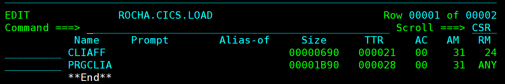

*La library LOAD contient les deux modules : CLIAFF (module physique de la MAP BMS) et PRGCLIA (programme COBOL compilé). La taille et le TTR (Track Table Record) confirment que les modules sont bien générés.*

#### Compilation COBOL réussie

Le JCL de compilation utilise la procédure DFHYITVL qui effectue la traduction CICS, la compilation COBOL et le link-edit :

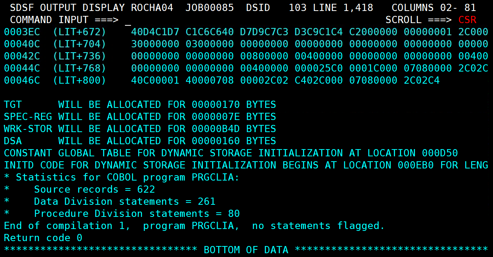

*Statistiques de compilation : 622 source records, 261 Data Division statements, 80 Procedure Division statements. Le "Return code 0" confirme une compilation sans erreur.*

#### Définition du programme dans CICS

La commande CEDA DEFINE PROGRAM déclare le programme compilé :

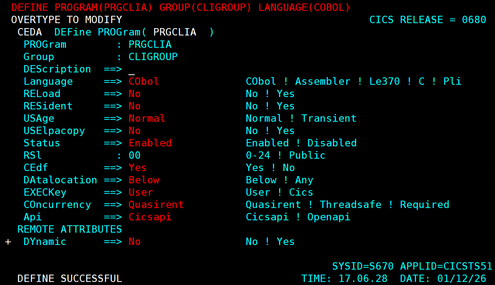

*Définition du programme PRGCLIA avec Language=CObol. Les paramètres CEdf=Yes permettent le debug avec CEDF, DATalocation=Below indique que les données seront allouées sous la barre des 16 Mo (compatible 24-bit).*

#### Vérification du programme

La commande CEMT INQUIRE PROGRAM vérifie l'état du programme :


*Le programme PRGCLIA est actif : Cob (COBOL), Pro (Protected), Ena (Enabled), Pri (Private). Leng indique la taille du module en mémoire.*

---

## Exercice 4 : Création de la transaction via CEDA

### Énoncé

Créer la transaction correspondante à l'opération d'affichage des données de CLIENT avec l'interface CICS en utilisant la commande CEDA. Mettre éventuellement le GROUP et la LIST à jour en cas de besoin.

### Mon travail

Pour qu'une transaction CICS fonctionne, plusieurs ressources doivent être définies et liées :

1. **FILE** : Le fichier VSAM (déjà défini dans l'exercice 1)
2. **MAPSET** : Le module BMS compilé (écran physique)
3. **PROGRAM** : Le programme COBOL-CICS compilé
4. **TRANSACTION** : Le code de 4 caractères qui lance le programme

Ces ressources sont regroupées dans un GROUP (ici CLIGROUP) qui permet de les gérer ensemble. L'ordre de définition est important car la transaction référence le programme.

### Résolution

**Étape 1 : Définition des nouvelles ressources**

Le fichier FCLIENT étant déjà défini et installé (exercice 1), je définis uniquement les nouvelles ressources :

```
CEDA DEFINE MAPSET(CLIAFF) GROUP(CLIGROUP)

CEDA DEFINE PROGRAM(PRGCLIA) GROUP(CLIGROUP)
     LANGUAGE(COBOL)

CEDA DEFINE TRANSACTION(AFFI) GROUP(CLIGROUP)
     PROGRAM(PRGCLIA)
```

**Étape 2 : Installation des ressources**

*Option A : Installation individuelle (recommandée)*

Cette méthode évite les erreurs si certaines ressources sont déjà installées :

```
CEDA INSTALL MAPSET(CLIAFF) GROUP(CLIGROUP)
CEDA INSTALL PROGRAM(PRGCLIA) GROUP(CLIGROUP)
CEDA INSTALL TRANSACTION(AFFI) GROUP(CLIGROUP)
```

*Option B : Installation du groupe complet*

```
CEDA INSTALL GROUP(CLIGROUP)
```

> **Note** : Si FCLIENT est déjà installé (exercice 1), cette commande affichera une erreur "ALREADY INSTALLED" pour le fichier. C'est normal et les autres ressources seront quand même installées.

**Tableau récapitulatif des ressources du groupe CLIGROUP :**

| Ressource | Nom | Défini dans | Description |
|-----------|-----|-------------|-------------|
| FILE | FCLIENT | Exercice 1 | Fichier VSAM CLIENT |
| MAPSET | CLIAFF | Exercice 4 | Écran BMS d'affichage |
| PROGRAM | PRGCLIA | Exercice 4 | Programme COBOL-CICS |
| TRANSACTION | AFFI | Exercice 4 | Code transaction (4 car) |

**Étape 3 : Vérification avec CEMT**

```
CEMT INQ FILE(FCLIENT)
```
Résultat attendu : `Fil(FCLIENT) Dsn(ROCHA.CICS.CLIENT) Ena Ope Rea Upd Add Bro Del Vsam Ksds`

```
CEDA VIEW MAPSET(CLIAFF) GROUP(CLIGROUP)
```
Résultat attendu : Affichage de la définition du mapset (DEFINITION SIGNATURE, RESIDENT, etc.)

```
CEMT INQ PROG(PRGCLIA)
```
Résultat attendu : `Pro(PRGCLIA) Len(...) Cob Ena Pri`

```
CEMT INQ TRAN(AFFI)
```
Résultat attendu : `Tra(AFFI) Pro(PRGCLIA) Ena`

### Captures d'écran

#### Définition de la transaction

La commande CEDA DEFINE TRANSACTION crée le lien entre le code AFFI et le programme PRGCLIA :

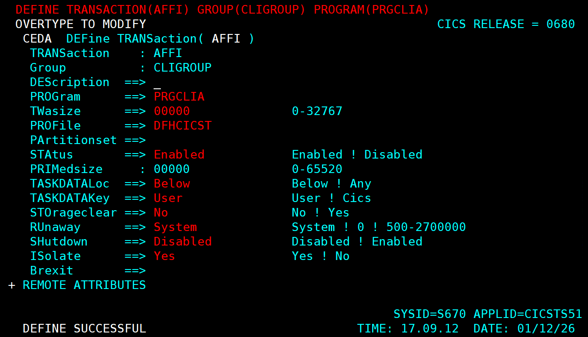

*Définition de la transaction AFFI. Les paramètres importants : PROGram=PRGCLIA (programme à exécuter), PROFile=DFHCICST (profil par défaut), STAtus=Enabled (transaction active).*

#### Installation du groupe complet

L'installation du groupe CLIGROUP tente d'installer toutes les ressources définies :

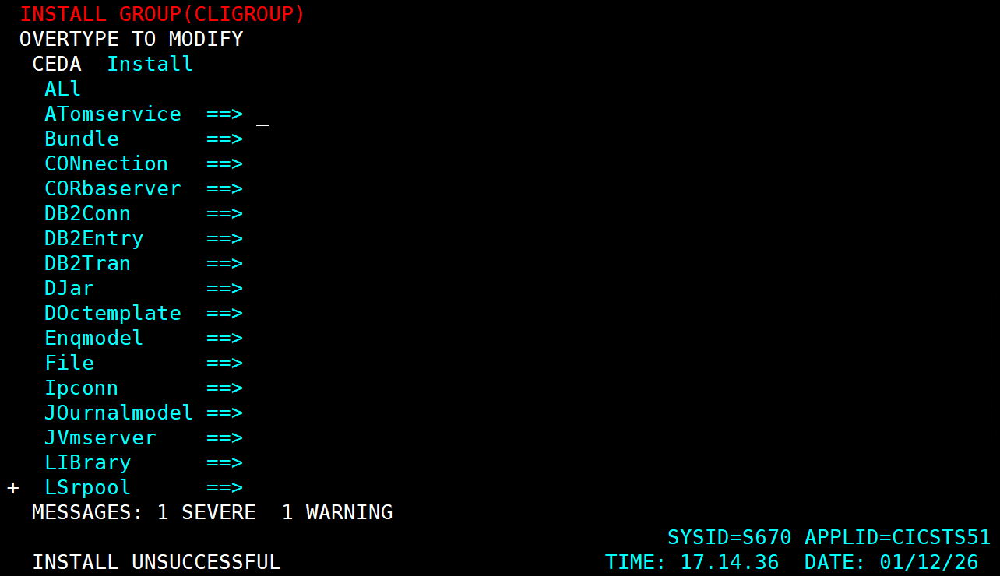

*L'installation échoue partiellement avec "1 SEVERE 1 WARNING". Ceci est normal car certaines ressources (comme FCLIENT) sont déjà installées depuis l'exercice 1.*

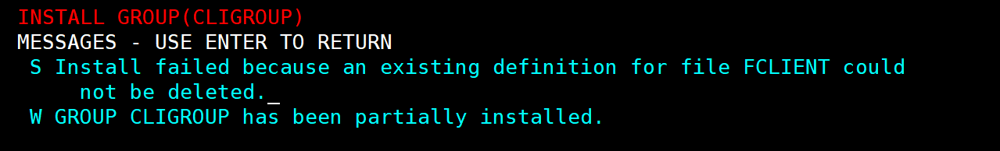

*Le message explique l'échec : "Install failed because an existing definition for file FCLIENT could not be deleted." C'est un comportement attendu - FCLIENT était déjà installé. Le groupe est "partially installed", les autres ressources sont actives.*

#### Vérification de la transaction

Malgré l'erreur partielle, la transaction AFFI est bien installée et opérationnelle :

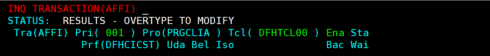

*La transaction AFFI est active : Pri(001) = priorité 1, Pro(PRGCLIA) = programme associé, Tcl(DFHTCL00) = classe de transaction, Ena Sta = Enabled Status. La transaction est prête à être utilisée.*

---

## Exercice 5 : Test avec debugger CEDF

### Énoncé

Activer la transaction en mode debugger avec la commande CEDF et par suite sans debugger.

### Mon travail

J'ai testé la transaction AFFI en mode debug avec CEDF pour vérifier le bon enchaînement des commandes CICS et observer les valeurs des variables EIB (voir Exercice 3 pour les explications sur le mode pseudo-conversationnel et les variables EIB).

### Résolution

**Étape 1 : Activation du debugger et lancement de la transaction**

```
CEDF
```

L'écran se vide et le curseur se positionne en haut. Le mode EDF est activé mais aucun message ne s'affiche. Il faut maintenant lancer la transaction à déboguer :

```
AFFI
```

CEDF intercepte alors la transaction et affiche le premier point d'arrêt.

> **Note** : Sur TK4-, CEDF n'affiche pas de message de confirmation. Le debugger est actif dès que la commande est saisie.

**Étape 2 : Navigation dans CEDF**

| Touche | Action |
|--------|--------|
| ENTER | Passer à l'étape suivante |
| PF5 | Afficher la WORKING-STORAGE |
| PF4 | Afficher l'EIB (Exec Interface Block) |
| PF3 | Terminer le debug et continuer l'exécution |

**Étape 3 : Points d'arrêt observés**

| Étape | Commande CICS | RESP attendu |
|-------|---------------|--------------|
| 1 | SEND MAP | NORMAL |
| 2 | RETURN TRANSID | - |
| 3 | TASK TERMINATION | - |
| 4 | RECEIVE MAP | NORMAL |
| 5 | READ FILE | NORMAL ou NOTFND |
| 6 | SEND MAP | NORMAL |
| 7 | RETURN TRANSID | - |

**Étape 4 : Test sans debugger**

Pour tester la transaction sans le debugger CEDF, il suffit de lancer directement la transaction depuis un écran CICS vierge (sans avoir activé CEDF au préalable) :

```
AFFI
```

La transaction s'exécute normalement sans interruption, affichant directement l'écran de saisie.

> **Désactiver CEDF** : Pour sortir du mode debug, appuyer sur PF3 pendant un point d'arrêt, ou simplement lancer une nouvelle transaction sans avoir tapé CEDF.

### Captures d'écran

#### Premier passage - Écran vide

Lors du lancement de la transaction AFFI, le programme affiche l'écran de saisie vide :

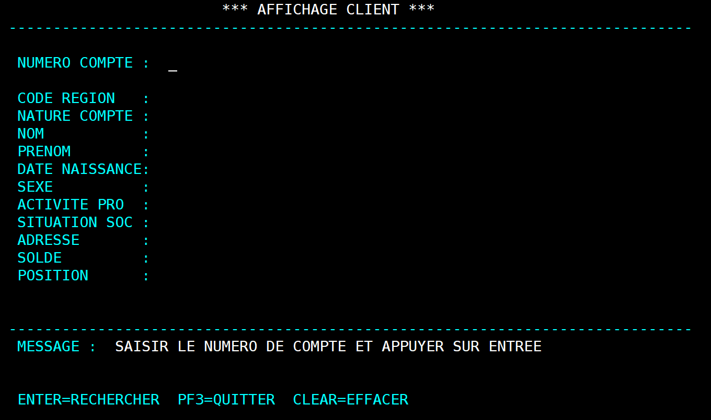

*L'écran initial invite l'utilisateur à saisir un numéro de compte. Tous les champs sont vides et le curseur est positionné sur NUMERO COMPTE (attribut IC = Initial Cursor dans la MAP BMS).*

#### Debug CEDF - SEND MAP

Le debugger CEDF intercepte la commande SEND MAP et affiche les détails :

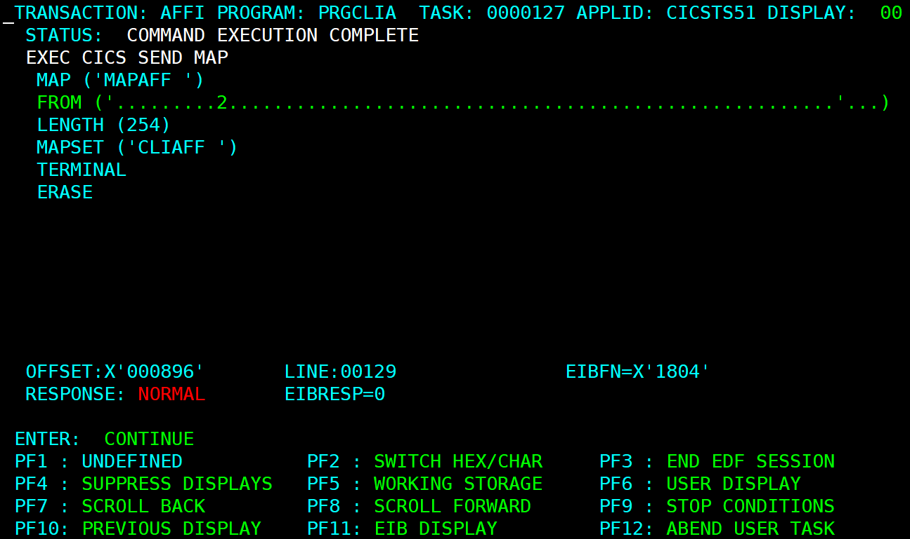

*Point d'arrêt après SEND MAP : MAP='MAPAFF', MAPSET='CLIAFF', RESPONSE: NORMAL (EIBRESP=0). La zone FROM contient les données de la MAP envoyées à l'écran (254 octets).*

#### Terminaison du premier passage

Après le SEND MAP, le programme exécute RETURN TRANSID et se termine :

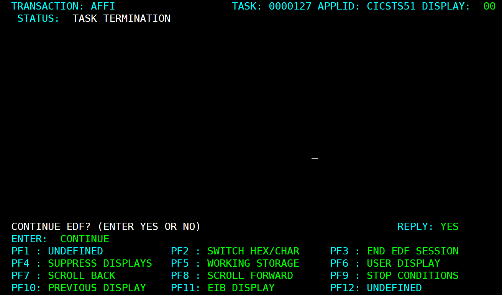

*Fin de la tâche (TASK TERMINATION). Le prompt "CONTINUE EDF? (ENTER YES OR NO)" permet de continuer le debug lors du prochain passage ou de désactiver CEDF.*

#### Saisie d'un numéro de compte

L'utilisateur saisit le numéro 000001 pour rechercher un client :

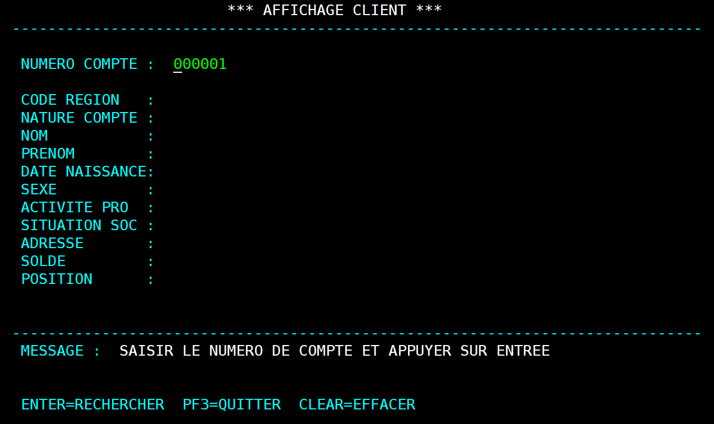

*Le numéro de compte 000001 est saisi. Après ENTER, CICS relance le programme qui va recevoir cette saisie via RECEIVE MAP.*

#### Debug CEDF - RECEIVE MAP

Le debugger montre la réception des données saisies par l'utilisateur :

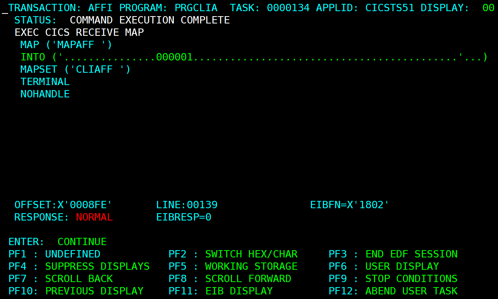

*Point d'arrêt après RECEIVE MAP : la zone INTO contient "000001" (le numéro saisi). RESPONSE: NORMAL confirme que la saisie a été correctement transmise au programme.*

#### Debug CEDF - READ FILE

Le programme effectue ensuite une lecture VSAM avec la clé saisie :

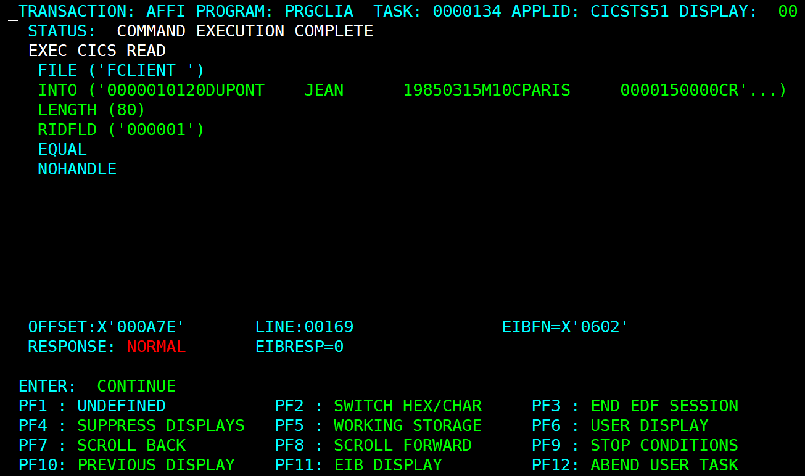

*Point d'arrêt après READ FILE : la zone INTO contient l'enregistrement complet du client DUPONT Jean. On voit les données : 0000010120DUPONT JEAN 19850315M10CPARIS 0000150000CR.*

#### Résultat - Client trouvé

Après le READ réussi, le programme affiche les données du client :

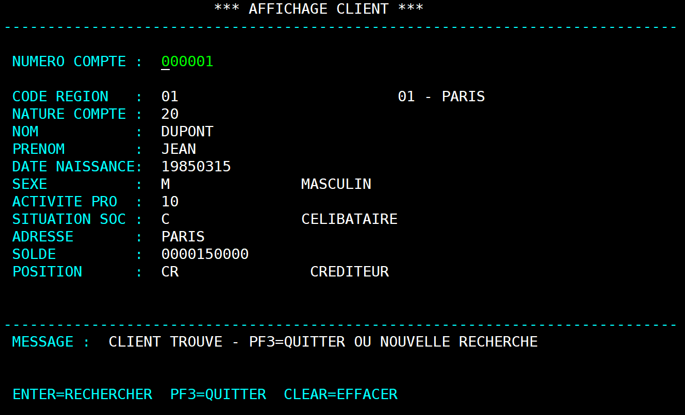

*Le client Jean DUPONT est affiché avec toutes ses informations : région 01 (Paris), nature compte 20, date de naissance 19850315, sexe M (MASCULIN), situation C (CELIBATAIRE), solde 0000150000, position CR (CREDITEUR). Le message confirme "CLIENT TROUVE".*

#### Fin du debug

L'utilisateur peut arrêter le mode debug en répondant "no" au prompt :

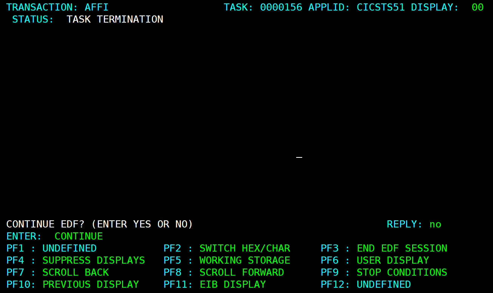

*En tapant "no", CEDF se désactive et la transaction continue sans interruption. Pour les prochains tests, il suffit de lancer directement AFFI sans passer par CEDF.*

#### Test d'erreur - Client inexistant

Le programme gère correctement les erreurs, par exemple un numéro de compte inexistant :

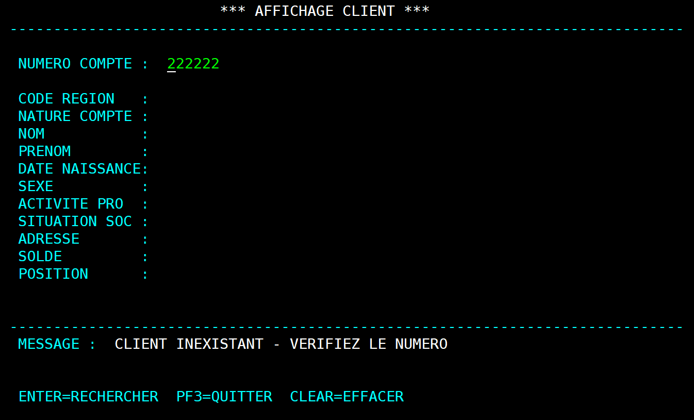

*Le numéro 222222 n'existe pas dans le fichier. Le programme affiche le message "CLIENT INEXISTANT - VERIFIEZ LE NUMERO" et conserve le numéro saisi pour correction.*

---

[< Partie 0 : Préparation](01-partie-0-preparation.md) | [Retour au sommaire](00-introduction.md) | [Partie 2a : Ajout >](03-partie-2a-ajout.md)
