# Partie 2a : Opérations d'Ajout (WRITE)

[< Partie 1 : Affichage](02-partie-1-affichage.md) | [Retour au sommaire](00-introduction.md) | [Partie 2b : Mise à jour >](04-partie-2b-maj.md)

---

Cette section couvre les exercices 6 à 8 : création de la MAP d'ajout, programme d'ajout avec la commande WRITE, et définition de la transaction AJOU.

## READ vs WRITE : Deux opérations opposées

Après avoir maîtrisé la lecture (READ) dans la Partie 1, cette section introduit l'écriture (WRITE). Ces deux commandes sont complémentaires :

| Aspect | READ (Partie 1) | WRITE (Partie 2a) |
|--------|-----------------|-------------------|
| **Action** | Lire un enregistrement existant | Créer un nouvel enregistrement |
| **Prérequis** | Le client DOIT exister | Le client ne doit PAS exister |
| **Erreur typique** | NOTFND (client inexistant) | DUPREC (doublon) |
| **Données** | Fichier → Programme | Programme → Fichier |
| **Clé (RIDFLD)** | Recherche | Insertion |

---

## Exercice 6 : MAP pour ajout de client

### Énoncé

Créer ou adapter la MAP précédente pour une opération d'ajout de CLIENT dans le Data Set CLIENT.

### Mon travail

J'ai adapté la MAP d'affichage (CLIAFF) pour créer une nouvelle MAP de saisie (CLIAJT). La structure BMS est similaire mais le comportement des champs change fondamentalement.

#### Pourquoi une MAP différente pour l'ajout ?

En affichage, l'utilisateur ne saisit que le numéro de compte (clé de recherche) et les autres champs sont en lecture seule. En ajout, **tous les champs** doivent être saisissables car l'utilisateur crée un nouveau client de toutes pièces.

**Différences entre CLIAFF et CLIAJT :**

| Aspect | CLIAFF (Affichage) | CLIAJT (Ajout) |
|--------|-------------------|----------------|
| NUMCPT | UNPROT (saisie clé) | UNPROT (saisie) |
| Autres champs | ASKIP (affichage) | UNPROT (saisie) |
| Libellés (région, sexe...) | Affichés (LIBREG, LIBSEX...) | Non présents |
| Titre | "AFFICHAGE CLIENT" | "AJOUT CLIENT" |
| Touches | ENTER=Rechercher | ENTER=Valider |

#### Pourquoi pas de libellés dans la MAP d'ajout ?

Dans CLIAFF, des zones supplémentaires (LIBREG, LIBSEX, LIBSIT, LIBPOS) affichent les libellés correspondant aux codes (ex: "01" → "PARIS"). En ajout, l'utilisateur saisit directement les codes, donc ces zones seraient vides et inutiles. On les remplace par des indications statiques à côté des champs (ex: "(01=Paris,02=Mars...)").

### Résolution

**MAP BMS : CLIAJT.bms**

Le code source est stocké dans `ROCHA.CICS.SOURCE(CLIAJT)`. La structure reprend les mêmes concepts BMS que CLIAFF (voir Partie 1, Exercice 2 pour les explications sur DFHMSD, DFHMDI, DFHMDF et les attributs).

**Extrait du code BMS - Déclaration du MAPSET :**

```
***********************************************************************
*  MAPSET : CLIAJT - Ajout Client
*  Transaction : AJOU
***********************************************************************
CLIAJT   DFHMSD TYPE=&SYSPARM,MODE=INOUT,LANG=COBOL,                   X
               STORAGE=AUTO,CTRL=(FREEKB,FRSET),TIOAPFX=YES
***********************************************************************
MAPAJT   DFHMDI SIZE=(24,80),LINE=1,COLUMN=1
```

**Extrait - Champs de saisie (tous en UNPROT) :**

```
*----------------------------------------------------------------------
* ZONES DE SAISIE - TOUS LES CHAMPS EN UNPROT
*----------------------------------------------------------------------
         DFHMDF POS=(4,2),LENGTH=16,ATTRB=ASKIP,                        X
               INITIAL='NUMERO COMPTE :'
NUMCPT   DFHMDF POS=(4,19),LENGTH=6,ATTRB=(UNPROT,NUM,IC)
         DFHMDF POS=(4,26),LENGTH=1,ATTRB=ASKIP
*
         DFHMDF POS=(5,2),LENGTH=16,ATTRB=ASKIP,                        X
               INITIAL='CODE REGION   :'
CODREG   DFHMDF POS=(5,19),LENGTH=2,ATTRB=(UNPROT,NUM)
         DFHMDF POS=(5,22),LENGTH=25,ATTRB=ASKIP,                       X
               INITIAL='(01=PAR,02=MAR,03=LYO,04=LIL)'
*
         DFHMDF POS=(7,2),LENGTH=16,ATTRB=ASKIP,                        X
               INITIAL='NOM           :'
NOM      DFHMDF POS=(7,19),LENGTH=10,ATTRB=UNPROT
         DFHMDF POS=(7,30),LENGTH=1,ATTRB=ASKIP
```

> **Différence clé avec CLIAFF** : Tous les champs de données sont en `UNPROT` (saisissables) au lieu de `ASKIP` (affichage seul). Des indications statiques comme `(01=PAR,02=MAR,03=LYO,04=LIL)` remplacent les zones de libellés dynamiques.

**Zones de saisie :**

| Zone | Longueur | Attribut | Description |
|------|----------|----------|-------------|
| NUMCPT | 6 | UNPROT,NUM,IC | Numéro de compte (curseur initial) |
| CODREG | 2 | UNPROT,NUM | Code région (01/02/03/04) |
| NATCPT | 2 | UNPROT,NUM | Nature du compte |
| NOM | 10 | UNPROT | Nom du client |
| PRENOM | 10 | UNPROT | Prénom du client |
| DATNA | 8 | UNPROT,NUM | Date de naissance (AAAAMMJJ) |
| SEXE | 1 | UNPROT | Sexe (M/F) |
| ACTPRO | 2 | UNPROT,NUM | Code activité professionnelle |
| SITSO | 1 | UNPROT | Situation sociale (C/M/D/V) |
| ADRESSE | 10 | UNPROT | Adresse |
| SOLDE | 10 | UNPROT,NUM | Solde du compte |
| POSIT | 2 | UNPROT | Position (DB/CR) |
| MSG | 60 | ASKIP,BRT | Zone message (affichage seul) |

> **Note** : L'attribut `IC` (Initial Cursor) sur NUMCPT positionne automatiquement le curseur sur ce champ au premier affichage. L'attribut `NUM` (Numeric) force la saisie en mode numérique sur certains terminaux.

**JCL d'assemblage : ASMAJT.jcl**

Le JCL d'assemblage suit la même structure que ASMCLAF.jcl (voir Partie 1, Exercice 2). Seuls le nom du job (ROCHA05) et le membre source (CLIAJT) changent.

### Définition CICS

La définition et l'installation du mapset suivent le même processus que pour CLIAFF (voir Partie 1, Exercice 4 pour les explications sur CEDA) :

```
CEDA DEFINE MAPSET(CLIAJT) GROUP(CLIGROUP)
CEDA INSTALL MAPSET(CLIAJT) GROUP(CLIGROUP)
```

### Vérification

```
CEDA VIEW MAPSET(CLIAJT) GROUP(CLIGROUP)
```

### Captures d'écran

#### Résultat de l'assemblage BMS

Après soumission du JCL d'assemblage ASMAJT, le job ROCHA05 s'exécute avec succès.

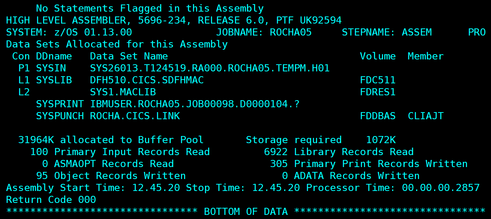

*Le job d'assemblage retourne RC=0000, confirmant que la MAP CLIAJT a été correctement compilée. Le copybook est généré dans ROCHA.CICS.LINK(CLIAJT) via SYSPUNCH.*

#### Définition du mapset CLIAJT dans CICS

Après l'assemblage BMS réussi, on définit le mapset dans CICS avec CEDA.

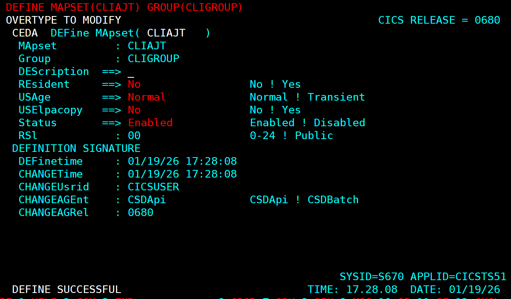

*La commande CEDA DEFINE MAPSET(CLIAJT) GROUP(CLIGROUP) crée la définition du mapset d'ajout. Le message "DEFINE SUCCESSFUL" confirme la création. On note le statut Enabled par défaut.*

#### Installation du mapset CLIAJT

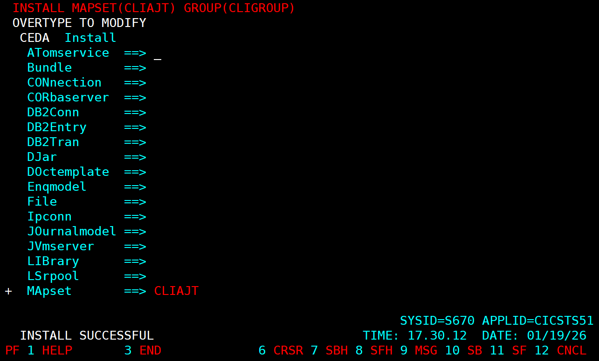

*La commande CEDA INSTALL MAPSET(CLIAJT) charge le mapset en mémoire CICS. Le message "INSTALL SUCCESSFUL" indique que le mapset est prêt à être utilisé.*

#### Vérification de la définition

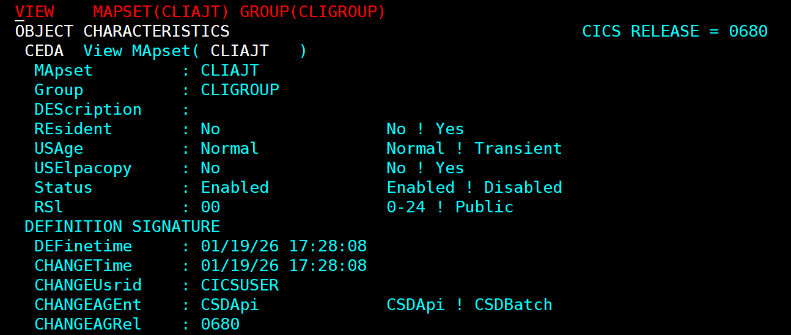

*CEDA VIEW permet de consulter tous les paramètres du mapset : nom, groupe, résidence (Normal), et statut (Enabled).*

---

## Exercice 7 : Programme d'ajout (WRITE)

### Énoncé

Créer le PROGRAMME pour une opération d'ajout d'un nouveau CLIENT dans le Data Set CLIENT. Un contrôle de conformité de donnée et de doublure doit être effectué.

### Mon travail

J'ai développé le programme PRGAJT qui gère l'ajout de nouveaux clients. Ce programme est plus complexe que PRGCLIA car il doit valider les données avant l'écriture et gérer plusieurs types d'erreurs.

#### Pourquoi un mode pseudo-conversationnel à 2 phases ?

Contrairement à la mise à jour (3 phases), l'ajout ne nécessite que 2 phases car il n'y a pas de recherche préalable :

```
┌─────────────────────────────────────────────────────────────────┐
│ LANCEMENT TRANSACTION "AJOU"                                    │
└─────────────────────────────────────────────────────────────────┘
                            │
                            ▼
┌─────────────────────────────────────────────────────────────────┐
│ PHASE 1 : SAISIE (EIBCALEN = 0)                                 │
│ ──────────────────────────────────────────────────────────────  │
│ → CICS lance le programme pour la première fois                 │
│ → EIBCALEN = 0 (pas de COMMAREA, c'est un nouveau contexte)     │
│ → Le programme affiche l'écran vide (SEND MAP avec ERASE)       │
│ → Le programme se TERMINE (RETURN TRANSID)                      │
│ → Mémoire libérée, ressources libérées                          │
└─────────────────────────────────────────────────────────────────┘
                            │
        L'utilisateur saisit les données et appuie sur ENTRÉE
                            │
                            ▼
┌─────────────────────────────────────────────────────────────────┐
│ PHASE 2 : VALIDATION ET ÉCRITURE (EIBCALEN > 0)                 │
│ ──────────────────────────────────────────────────────────────  │
│ → CICS relance le programme (nouveau processus)                 │
│ → EIBCALEN > 0 (la COMMAREA indique un contexte existant)       │
│ → Le programme reçoit la saisie (RECEIVE MAP)                   │
│ → Sauvegarde des données dans WS-SAISIE                         │
│ → Validation des données (contrôles de conformité)              │
│ → Vérification de doublure (READ pour NOTFND attendu)           │
│ → Écriture du client (WRITE)                                    │
│ → Affichage message succès ou erreur (SEND MAP)                 │
│ → Le programme se TERMINE (RETURN TRANSID)                      │
└─────────────────────────────────────────────────────────────────┘
                            │
                            ▼
        Si succès : écran vide pour nouveau client
        Si erreur : message d'erreur, l'utilisateur corrige
```

Voir Partie 1, Exercice 3 pour les explications détaillées sur le mode pseudo-conversationnel et les variables EIB.

#### Pourquoi sauvegarder les données dans WS-SAISIE ?

C'est un point technique crucial. Avec `MODE=INOUT` et `STORAGE=AUTO` dans la définition BMS, les zones input (suffixe I) et output (suffixe O) **partagent la même zone mémoire** (voir Partie 1, Exercice 2 pour les explications sur la structure DSECT).

**Problème** : Après le `RECEIVE MAP`, les données saisies sont dans `NUMCPTI`, `CODREGL`, etc. Mais dès qu'on fait `MOVE LOW-VALUES TO MAPAJTO` pour préparer l'affichage, ces données sont écrasées !

**Solution** : Sauvegarder immédiatement les données dans des variables Working-Storage (préfixe WS-) :

```cobol
* SAUVEGARDE DES DONNEES AVANT ECRASEMENT PAR LOW-VALUES
MOVE NUMCPTI   TO WS-NUMCPT
MOVE NUMCPTL   TO WS-NUMCPTL
MOVE CODREGI   TO WS-CODREG
MOVE CODREGL   TO WS-CODREGL
...
```

#### Pourquoi vérifier la doublure avant l'écriture ?

La commande `WRITE` avec une clé existante retourne l'erreur `DUPREC` (Duplicate Record). Cependant, il est préférable de vérifier **avant** l'écriture avec un `READ` :

1. **Meilleur message** : On peut afficher "CE CLIENT EXISTE DÉJÀ" au lieu de l'erreur technique DUPREC
2. **Cohérence** : On valide toutes les données avant toute tentative d'écriture
3. **Performance** : Le READ est moins coûteux qu'un WRITE qui échoue

**Logique inversée** : Dans ce READ, on **espère** un `NOTFND` ! Si le READ retourne `NORMAL`, c'est que le client existe déjà → erreur de doublure.

### Résolution

**Programme : PRGAJT.cbl**

Le code source est stocké dans `ROCHA.CICS.SOURCE(PRGAJT)`. Voici les sections clés du programme.

**Structure de la COMMAREA (WORKING-STORAGE) :**

```cobol
      *-----------------------------------------------------------------
      * ZONE DE COMMUNICATION (COMMAREA)
      *-----------------------------------------------------------------
       01  WS-COMMAREA.
           05 WS-FLAG-INIT         PIC X(01) VALUE 'N'.
              88 PREMIER-PASSAGE   VALUE 'N'.
              88 PASSAGE-SUIVANT   VALUE 'O'.
```

La COMMAREA de l'ajout est simple : un seul indicateur pour distinguer le premier passage des suivants.

**Zone de sauvegarde des données saisies :**

```cobol
      *-----------------------------------------------------------------
      * SAUVEGARDE DES DONNEES SAISIES (EVITE ECRASEMENT PAR LOW-VALUES)
      *-----------------------------------------------------------------
       01  WS-SAISIE.
           05 WS-NUMCPT            PIC X(06).
           05 WS-NUMCPTL           PIC S9(04) COMP.
           05 WS-CODREG            PIC X(02).
           05 WS-CODREGL           PIC S9(04) COMP.
           05 WS-NATCPT            PIC X(02).
           05 WS-NOM               PIC X(10).
           05 WS-NOML              PIC S9(04) COMP.
           05 WS-PRENOM            PIC X(10).
           05 WS-DATNAISS          PIC X(08).
           05 WS-SEXE              PIC X(01).
           05 WS-SEXEL             PIC S9(04) COMP.
           05 WS-ACTPRO            PIC X(02).
           05 WS-SITSO             PIC X(01).
           05 WS-SITSOL            PIC S9(04) COMP.
           05 WS-ADRESSE           PIC X(10).
           05 WS-SOLDE             PIC X(10).
           05 WS-POSITION          PIC X(02).
           05 WS-POSITL            PIC S9(04) COMP.
```

> **Note** : On sauvegarde aussi les longueurs (suffixe L) car elles indiquent si l'utilisateur a saisi quelque chose dans le champ. Une longueur = 0 signifie que le champ est vide.

**Point d'entrée avec gestion des touches :**

```cobol
       0000-PRINCIPAL.
           EVALUATE TRUE
               WHEN EIBCALEN = 0
                   PERFORM 1000-PREMIER-PASSAGE
               WHEN EIBAID = DFHPF3
                   PERFORM 9000-FIN-PROGRAMME
               WHEN EIBAID = DFHCLEAR
                   PERFORM 1000-PREMIER-PASSAGE
               WHEN OTHER
                   PERFORM 2000-TRAITEMENT THRU 2000-FIN
           END-EVALUATE

           EXEC CICS RETURN
               TRANSID('AJOU')
               COMMAREA(WS-COMMAREA)
               LENGTH(LENGTH OF WS-COMMAREA)
           END-EXEC.
```

**Paragraphe de traitement avec PERFORM THRU :**

```cobol
       2000-TRAITEMENT.
           MOVE 'N' TO WS-ERREUR

           EXEC CICS RECEIVE MAP('MAPAJT')
               MAPSET('CLIAJT')
               RESP(WS-RESP)
           END-EXEC

      * Gestion MAPFAIL (aucune donnée transmise)
           IF WS-RESP = DFHRESP(MAPFAIL)
               MOVE LOW-VALUES TO MAPAJTO
               MOVE 'AUCUNE DONNEE SAISIE - VEUILLEZ REMPLIR' TO MSGO
               EXEC CICS SEND MAP('MAPAJT')
                   MAPSET('CLIAJT')
                   ERASE
               END-EXEC
               GO TO 2000-FIN
           END-IF

      * SAUVEGARDE DES DONNEES AVANT ECRASEMENT PAR LOW-VALUES
           MOVE NUMCPTI   TO WS-NUMCPT
           MOVE NUMCPTL   TO WS-NUMCPTL
           MOVE CODREGI   TO WS-CODREG
           MOVE CODREGL   TO WS-CODREGL
           ...

      * Validation des données
           PERFORM 2100-VALIDER-DONNEES THRU 2100-FIN

           IF ERREUR-DETECTEE
               EXEC CICS SEND MAP('MAPAJT')
                   MAPSET('CLIAJT')
                   ERASE
               END-EXEC
               GO TO 2000-FIN
           END-IF

      * Vérification doublure (client existe déjà ?)
           PERFORM 2200-VERIFIER-DOUBLURE THRU 2200-FIN
           IF ERREUR-DETECTEE
               EXEC CICS SEND MAP('MAPAJT')
                   MAPSET('CLIAJT')
                   ERASE
               END-EXEC
               GO TO 2000-FIN
           END-IF

      * Préparation et écriture de l'enregistrement
           PERFORM 2300-PREPARER-ENREGISTREMENT
           PERFORM 2400-ECRIRE-CLIENT

           EXEC CICS SEND MAP('MAPAJT')
               MAPSET('CLIAJT')
           END-EXEC.

       2000-FIN.
           EXIT.
```

**Paragraphe de validation des données :**

```cobol
       2100-VALIDER-DONNEES.
      *-----------------------------------------------------------------
      * Contrôles de conformité des données saisies
      * Utilise les variables WS- sauvegardées (pas MAPAJTI)
      *-----------------------------------------------------------------
           MOVE LOW-VALUES TO MAPAJTO

      * Contrôle numéro de compte (obligatoire et numérique)
           IF WS-NUMCPTL = 0 OR WS-NUMCPT = SPACES
               MOVE 'NUMERO DE COMPTE OBLIGATOIRE' TO MSGO
               MOVE 'O' TO WS-ERREUR
               GO TO 2100-FIN
           END-IF

           IF WS-NUMCPT NOT NUMERIC
               MOVE 'NUMERO DE COMPTE DOIT ETRE NUMERIQUE' TO MSGO
               MOVE 'O' TO WS-ERREUR
               GO TO 2100-FIN
           END-IF

      * Contrôle code région (01, 02, 03 ou 04)
           IF WS-CODREGL = 0 OR WS-CODREG = SPACES
               MOVE 'CODE REGION OBLIGATOIRE' TO MSGO
               MOVE 'O' TO WS-ERREUR
               GO TO 2100-FIN
           END-IF

           IF WS-CODREG NOT = '01' AND WS-CODREG NOT = '02'
              AND WS-CODREG NOT = '03' AND WS-CODREG NOT = '04'
               MOVE 'CODE REGION INVALIDE (01/02/03/04)' TO MSGO
               MOVE 'O' TO WS-ERREUR
               GO TO 2100-FIN
           END-IF

      * Contrôle nom (obligatoire)
           IF WS-NOML = 0 OR WS-NOM = SPACES
               MOVE 'NOM OBLIGATOIRE' TO MSGO
               MOVE 'O' TO WS-ERREUR
               GO TO 2100-FIN
           END-IF

      * Contrôle sexe (M ou F)
           IF WS-SEXEL = 0 OR WS-SEXE = SPACES
               MOVE 'SEXE OBLIGATOIRE' TO MSGO
               MOVE 'O' TO WS-ERREUR
               GO TO 2100-FIN
           END-IF

           IF WS-SEXE NOT = 'M' AND WS-SEXE NOT = 'F'
               MOVE 'SEXE INVALIDE (M OU F)' TO MSGO
               MOVE 'O' TO WS-ERREUR
               GO TO 2100-FIN
           END-IF
           ...

       2100-FIN.
           EXIT.
```

**Paragraphe de vérification de doublure :**

```cobol
       2200-VERIFIER-DOUBLURE.
      *-----------------------------------------------------------------
      * Vérification que le client n'existe pas déjà
      * Note: NOTFND est attendu (client nouveau), NORMAL = doublure
      *-----------------------------------------------------------------
           MOVE WS-NUMCPT TO CLI-NUMCPT

           EXEC CICS READ
               FILE('FCLIENT')
               INTO(ENR-CLIENT)
               RIDFLD(CLI-NUMCPT)
               RESP(WS-RESP)
           END-EXEC

           IF WS-RESP = DFHRESP(NORMAL)
               MOVE 'ENREGISTREMENT EN DOUBLE - CE CLIENT EXISTE DEJA'
                   TO MSGO
               MOVE 'O' TO WS-ERREUR
           END-IF.

       2200-FIN.
           EXIT.
```

**Paragraphe d'écriture du client :**

```cobol
       2400-ECRIRE-CLIENT.
      *-----------------------------------------------------------------
      * Écriture du nouvel enregistrement dans le fichier VSAM
      *-----------------------------------------------------------------
           EXEC CICS WRITE
               FILE('FCLIENT')
               FROM(ENR-CLIENT)
               RIDFLD(CLI-NUMCPT)
               RESP(WS-RESP)
           END-EXEC

           EVALUATE WS-RESP
               WHEN DFHRESP(NORMAL)
                   MOVE LOW-VALUES TO MAPAJTO
                   MOVE 'CLIENT AJOUTE AVEC SUCCES - NOUVEAU OU PF3'
                       TO MSGO
               WHEN DFHRESP(DUPREC)
                   MOVE 'ENREGISTREMENT EN DOUBLE' TO MSGO
                   MOVE 'O' TO WS-ERREUR
               WHEN OTHER
                   MOVE 'ERREUR ECRITURE FICHIER - CONTACTEZ SUPPORT'
                       TO MSGO
                   MOVE 'O' TO WS-ERREUR
           END-EVALUATE.
```

**JCL de compilation : CMPAJT.jcl**

Le JCL de compilation suit la même structure que CMPCLAF.jcl (voir Partie 1, Exercice 3). Seuls le nom du job (ROCHA06) et le membre source (PRGAJT) changent.

### Structure du programme

| Paragraphe | Fonction |
|------------|----------|
| 0000-PRINCIPAL | Point d'entrée, aiguillage selon EIBCALEN et EIBAID |
| 1000-PREMIER-PASSAGE | Affichage de l'écran vide pour saisie |
| 2000-TRAITEMENT | Réception saisie, validations, écriture |
| 2100-VALIDER-DONNEES | Contrôles de conformité des champs |
| 2200-VERIFIER-DOUBLURE | READ pour vérifier que le client n'existe pas |
| 2300-PREPARER-ENREGISTREMENT | Transfert WS-SAISIE vers ENR-CLIENT |
| 2400-ECRIRE-CLIENT | WRITE VSAM avec gestion erreurs |
| 9000-FIN-PROGRAMME | Message de fin et RETURN sans TRANSID |

### Commandes CICS utilisées

| Commande | Usage |
|----------|-------|
| SEND MAP | Envoyer l'écran (avec ERASE pour effacer) |
| RECEIVE MAP | Recevoir la saisie avec RESP pour MAPFAIL |
| READ FILE | Vérifier si client existe (doublure) - NOTFND attendu |
| WRITE FILE | Écrire le nouveau client |
| RETURN TRANSID | Retour pseudo-conversationnel avec COMMAREA |
| SEND TEXT | Message de fin (sans MAP) |

### Messages d'erreur gérés

| Message | Contexte |
|---------|----------|
| SAISIR LES DONNEES DU NOUVEAU CLIENT | Premier passage |
| AUCUNE DONNEE SAISIE | MAPFAIL - utilisateur a appuyé ENTER sans rien saisir |
| NUMERO DE COMPTE OBLIGATOIRE | Champ NUMCPT vide |
| NUMERO DE COMPTE DOIT ETRE NUMERIQUE | Caractères non numériques |
| CODE REGION OBLIGATOIRE | Champ CODREG vide |
| CODE REGION INVALIDE (01/02/03/04) | Code différent des valeurs autorisées |
| NOM OBLIGATOIRE | Champ NOM vide |
| SEXE OBLIGATOIRE | Champ SEXE vide |
| SEXE INVALIDE (M OU F) | Sexe différent de M ou F |
| SITUATION SOCIALE OBLIGATOIRE | Champ SITSO vide |
| SITUATION INVALIDE (C/M/D/V) | Situation non reconnue |
| POSITION OBLIGATOIRE | Champ POSIT vide |
| POSITION INVALIDE (DB OU CR) | Position non reconnue |
| ENREGISTREMENT EN DOUBLE | Client existe déjà (READ NORMAL ou WRITE DUPREC) |
| CLIENT AJOUTE AVEC SUCCES | WRITE VSAM réussi |

### Difficultés rencontrées et solutions

#### Problème 1 : Écrasement des données saisies par LOW-VALUES

**Symptôme** : Après le `RECEIVE MAP`, les données saisies étaient perdues lors du `MOVE LOW-VALUES TO MAPAJTO` dans le paragraphe de validation.

**Cause** : Avec `MODE=INOUT` et `STORAGE=AUTO` dans la définition BMS, les zones input (suffixe I) et output (suffixe O) partagent la même zone mémoire (voir Partie 1, Exercice 2 pour les explications sur la structure DSECT).

**Solution** : Sauvegarder les données saisies dans des variables Working-Storage (préfixe WS-) **immédiatement après** le `RECEIVE MAP`, avant tout `MOVE LOW-VALUES` :

```cobol
* Juste après RECEIVE MAP, avant toute autre opération
MOVE NUMCPTI   TO WS-NUMCPT
MOVE NUMCPTL   TO WS-NUMCPTL
MOVE SEXEI     TO WS-SEXE
MOVE SEXEL     TO WS-SEXEL
...
```

#### Problème 2 : Validations ignorées - le client était ajouté malgré les erreurs

**Symptôme** : Même avec des données invalides (sexe = 'X'), le client était ajouté dans le fichier.

**Cause** : Le `GO TO paragraphe-FIN` dans les validations sortait de la plage du `PERFORM`, ce qui faisait continuer le programme **séquentiellement** vers les paragraphes suivants (2200, 2300, 2400) au lieu de retourner à l'appelant.

**Illustration du problème** :

```cobol
* Code problématique
PERFORM 2100-VALIDER-DONNEES    ← Sans THRU, la plage s'arrête à 2100-VALIDER-DONNEES

2100-VALIDER-DONNEES.
    ...
    GO TO 2100-FIN              ← Sort de la plage du PERFORM !
    ...
2100-FIN.                       ← Hors de la plage, le programme continue séquentiellement
    EXIT.

2200-VERIFIER-DOUBLURE.         ← Exécuté même si erreur de validation !
```

**Solution** : Utiliser la clause `THRU` pour inclure le paragraphe FIN dans la plage du PERFORM :

```cobol
* Code corrigé
PERFORM 2100-VALIDER-DONNEES THRU 2100-FIN    ← La plage inclut 2100-FIN

2100-VALIDER-DONNEES.
    ...
    GO TO 2100-FIN              ← Reste dans la plage du PERFORM
    ...
2100-FIN.                       ← Dans la plage, EXIT retourne à l'appelant
    EXIT.
```

Avec `THRU`, le `GO TO 2100-FIN` reste dans la plage du PERFORM, et après le `EXIT` de 2100-FIN, le contrôle retourne correctement à l'appelant (2000-TRAITEMENT).

#### Problème 3 : Message d'erreur non visible sans CEDF

**Symptôme** : Le message d'erreur de validation s'affichait dans CEDF mais pas sur l'écran normal.

**Cause** : Le `SEND MAP` sans `ERASE` ne rafraîchissait pas l'écran complet, causant des artefacts visuels.

**Solution** : Ajouter `ERASE` au `SEND MAP` d'erreur pour rafraîchir l'écran :

```cobol
IF ERREUR-DETECTEE
    EXEC CICS SEND MAP('MAPAJT')
        MAPSET('CLIAJT')
        ERASE               ← Efface l'écran avant réaffichage
    END-EXEC
    GO TO 2000-FIN
END-IF
```

### Amélioration future : Conservation des données lors des erreurs

**Problème identifié** : Actuellement, lorsqu'une erreur de validation se produit, l'écran est effacé (`ERASE`) et seul le message d'erreur s'affiche. L'utilisateur doit ressaisir toutes les données, ce qui n'est pas ergonomique.

**Cause technique** : L'option `ERASE` dans la commande `SEND MAP` efface l'écran entier avant d'afficher la MAP. Comme le programme fait `MOVE LOW-VALUES TO MAPAJTO` pour préparer l'affichage, les données ne sont pas renvoyées à l'écran.

**Solution envisagée** : Lors d'une erreur de validation, il faudrait :
1. **Ne pas faire** `MOVE LOW-VALUES TO MAPAJTO` pour conserver les données
2. **Ou** recopier les données sauvegardées (WS-SAISIE) vers les zones output (MAPAJTO) avant le `SEND MAP`
3. Utiliser `SEND MAP ... DATAONLY` au lieu de `ERASE` pour ne rafraîchir que les données sans effacer l'écran

```cobol
* Amélioration : recopier les données avant affichage erreur
IF ERREUR-DETECTEE
    MOVE WS-NUMCPT  TO NUMCPTO
    MOVE WS-CODREG  TO CODREGO
    MOVE WS-NOM     TO NOMO
    ...
    EXEC CICS SEND MAP('MAPAJT')
        MAPSET('CLIAJT')
        DATAONLY            ← Ne rafraîchit que les données
    END-EXEC
END-IF
```

> **Note** : Cette amélioration n'a pas été implémentée dans la version actuelle du projet. Elle constitue une évolution possible pour améliorer l'expérience utilisateur.

### Captures d'écran

#### Compilation du programme PRGAJT

Après soumission du JCL CMPAJT, le job de compilation s'exécute avec succès.

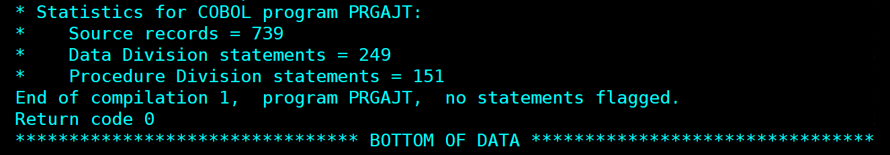

*Le job de compilation COBOL retourne RC=0, confirmant que le programme PRGAJT a été correctement compilé. On note 739 enregistrements sources traités.*

#### Définition du programme dans CICS

Après la compilation réussie, on définit le programme dans CICS avec CEDA.

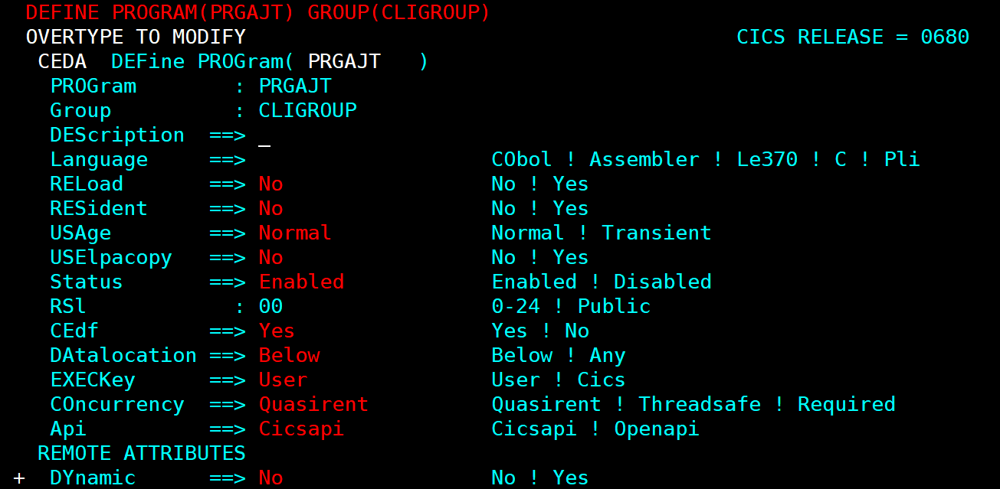

*La commande CEDA DEFINE PROGRAM(PRGAJT) GROUP(CLIGROUP) crée la définition du programme. On voit les options disponibles : Language (CObol par défaut), Status (Enabled), CEdf (Yes pour le débogage).*

#### Installation du programme PRGAJT

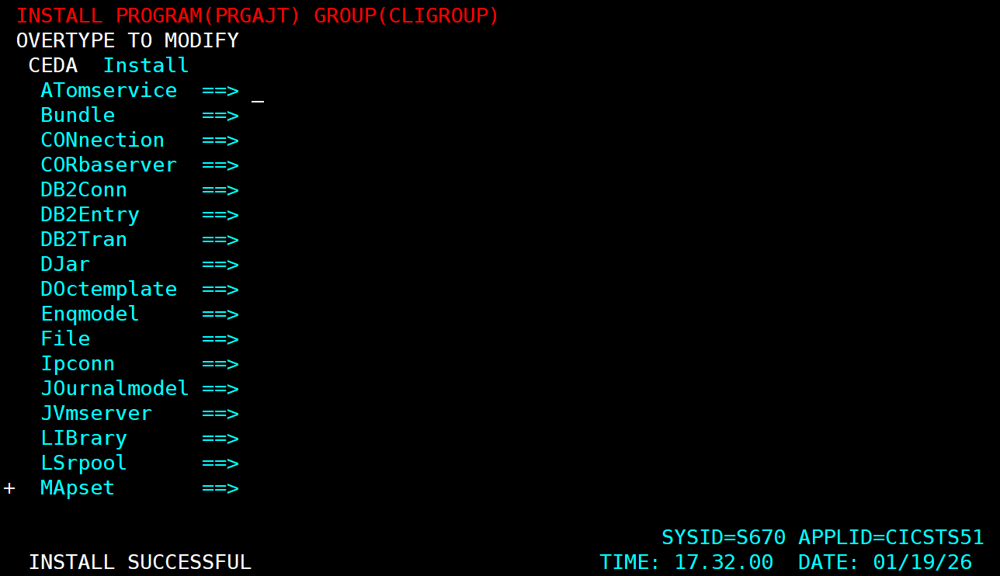

*La commande CEDA INSTALL PROGRAM(PRGAJT) charge le programme compilé en mémoire CICS. Le message "INSTALL SUCCESSFUL" confirme l'activation.*

#### Vérification avec CEDA VIEW

La commande CEDA VIEW permet de visualiser les caractéristiques du programme enregistré dans CICS.

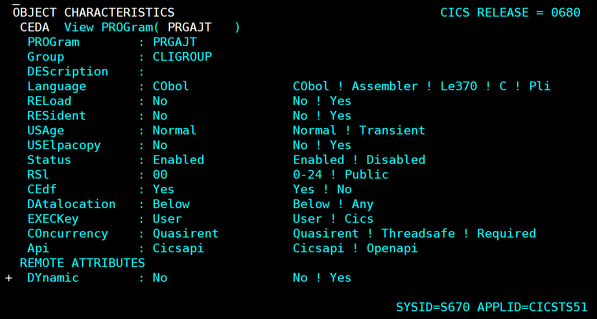

*Vue de la définition du programme PRGAJT dans le groupe CLIGROUP. On note le langage COBOL et le statut Enabled.*

#### Vérification avec CEMT

La commande CEMT INQ permet de vérifier que le programme est bien actif dans CICS.


*Le programme PRGAJT est correctement installé : "Cob Pro Ena" indique un programme COBOL (Cob), compilé et prêt (Pro), et activé (Ena).*

---

## Exercice 8 : Transaction d'ajout

### Énoncé

Suivre cette opération par l'ajout d'une nouvelle Transaction dans le GROUP et activer la transaction en mode debugger CEDF et sans debugger.

### Mon travail

La transaction AJOU est le point d'entrée utilisateur pour l'ajout de clients. Comme pour AFFI, elle fait le lien entre le code saisi par l'utilisateur et le programme COBOL-CICS à exécuter.

#### Architecture CICS - Liaison des ressources

```
+-------------+     +-------------+     +-------------+
| TRANSACTION | --> | PROGRAMME   | --> | MAPSET      |
|    AJOU     |     |   PRGAJT    |     |   CLIAJT    |
+-------------+     +-------------+     +-------------+
                           |
                           v
                    +-------------+
                    |   FICHIER   |
                    |   FCLIENT   |
                    +-------------+
```

Pour que la transaction fonctionne, quatre ressources doivent être définies et installées dans CICS :

1. **FILE FCLIENT** : Le fichier VSAM contenant les données (défini dans l'exercice 1)
2. **MAPSET CLIAJT** : L'écran BMS compilé (défini et installé dans l'exercice 6)
3. **PROGRAM PRGAJT** : Le programme COBOL-CICS compilé (défini et installé dans l'exercice 7)
4. **TRANSACTION AJOU** : Le code de 4 caractères qui lance le programme

À ce stade, seule la **transaction** reste à définir. Les autres ressources ont été créées dans les exercices précédents.

### Résolution

**Définition et installation de la transaction :**

Comme pour la transaction AFFI (voir Partie 1, Exercice 4 pour les explications détaillées sur CEDA), on définit puis on installe la transaction :

```
CEDA DEFINE TRANSACTION(AJOU) GROUP(CLIGROUP) PROGRAM(PRGAJT)
CEDA INSTALL TRANSACTION(AJOU) GROUP(CLIGROUP)
```

**Vérification :**

```
CEMT INQ TRAN(AJOU)
```

Résultat attendu : `Tra(AJOU) Pro(PRGAJT) Ena` confirmant que la transaction est active et liée au bon programme.

### Tableau récapitulatif du groupe CLIGROUP après exercice 8

| Type | Nom | Description | Défini dans |
|------|-----|-------------|-------------|
| FILE | FCLIENT | Fichier VSAM CLIENT | Exercice 1 |
| MAPSET | CLIAFF | Écran d'affichage | Exercice 4 |
| PROGRAM | PRGCLIA | Programme d'affichage | Exercice 4 |
| TRANSACTION | AFFI | Transaction d'affichage | Exercice 4 |
| MAPSET | CLIAJT | Écran d'ajout | Exercice 8 |
| PROGRAM | PRGAJT | Programme d'ajout | Exercice 8 |
| TRANSACTION | AJOU | Transaction d'ajout | Exercice 8 |

### Test de la transaction

**Test avec CEDF** (voir Partie 1, Exercice 5 pour la navigation CEDF) :

```
CEDF
AJOU
```

Points d'arrêt observés pour un ajout complet :

| Étape | Commande CICS | RESP attendu | Description |
|-------|---------------|--------------|-------------|
| 1 | SEND MAP | NORMAL | Affichage écran vide |
| 2 | RETURN TRANSID | - | Fin premier passage |
| 3 | RECEIVE MAP | NORMAL | Réception saisie |
| 4 | READ FILE | **NOTFND** | Vérification doublure |
| 5 | WRITE FILE | NORMAL | Écriture client |
| 6 | SEND MAP | NORMAL | Message succès |
| 7 | RETURN TRANSID | - | Fin traitement |

> **Note importante sur NOTFND** : Lors du READ FILE (étape 4), CEDF affiche souvent une réponse `NOTFND`. C'est le comportement **attendu et normal** ! Ce READ sert à vérifier que le client n'existe pas déjà (contrôle de doublure). Si NOTFND est retourné, cela signifie que le numéro de compte est disponible et qu'on peut procéder à l'écriture.

**Test sans debugger :**

```
AJOU
```

Scénarios de test :

| Scénario | Action | Résultat attendu |
|----------|--------|------------------|
| Ajout normal | Saisir toutes les données valides | "CLIENT AJOUTE AVEC SUCCES" |
| Doublon | Saisir un numéro existant | "ENREGISTREMENT EN DOUBLE" |
| Sexe invalide | Saisir SEXE = 'X' | "SEXE INVALIDE (M OU F)" |
| Champ vide | Laisser NOM vide | "NOM OBLIGATOIRE" |
| Aucune saisie | Appuyer ENTER sans rien saisir | "AUCUNE DONNEE SAISIE" |
| Quitter | Appuyer PF3 | Fin de la transaction |

**Vérification de l'ajout :**

Après un ajout réussi, utiliser la transaction AFFI pour vérifier que le client a bien été créé :

```
AFFI
```
Saisir le numéro du client ajouté → Les données doivent s'afficher.

### Captures d'écran

#### Définition de la transaction AJOU

La commande CEDA DEFINE crée la liaison entre le code transaction et le programme.

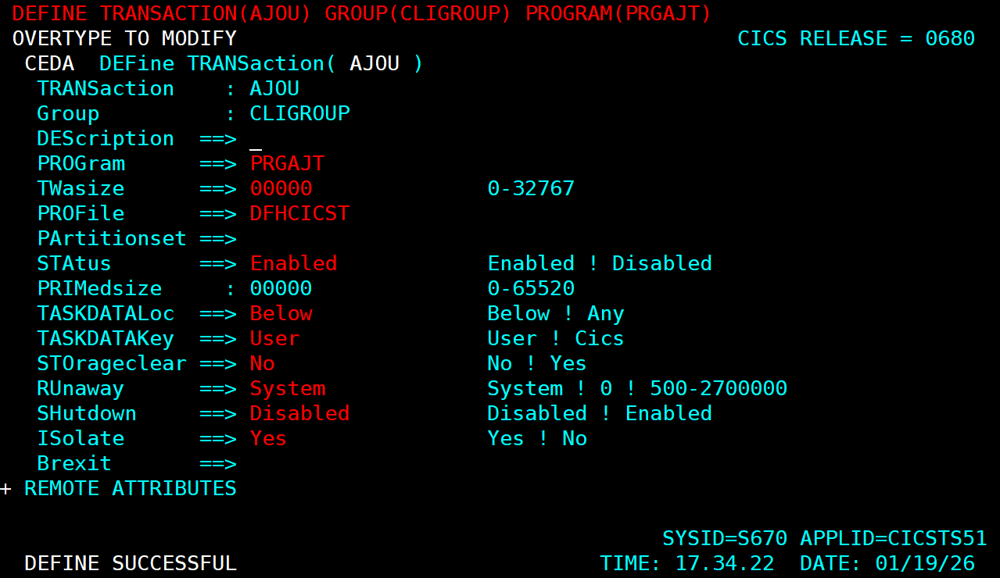

*La commande CEDA DEFINE TRANSACTION(AJOU) GROUP(CLIGROUP) PROGRAM(PRGAJT) associe le code "AJOU" au programme PRGAJT. On voit les paramètres : PROFile (DFHCICST), STAtus (Enabled), TWasize, etc.*

#### Installation de la transaction AJOU

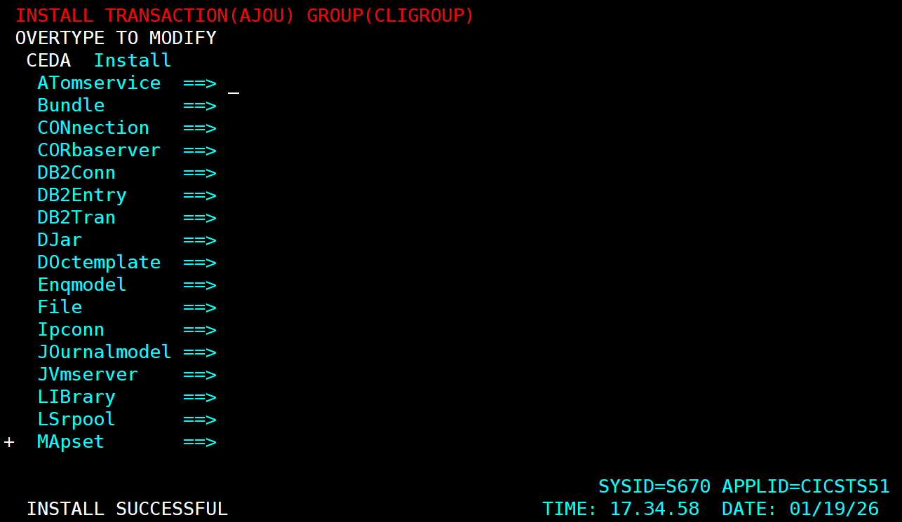

*La commande CEDA INSTALL TRANSACTION(AJOU) rend la transaction accessible aux utilisateurs. Le message "INSTALL SUCCESSFUL" confirme l'activation.*

#### Vérification de la transaction avec CEMT

La commande CEMT INQ permet de vérifier que la transaction est bien active.


*La transaction AJOU est correctement installée et activée (Ena Sta). Elle est liée au programme PRGAJT.*

#### Vérification avec CEDA VIEW

La commande CEDA VIEW affiche les caractéristiques détaillées de la transaction.

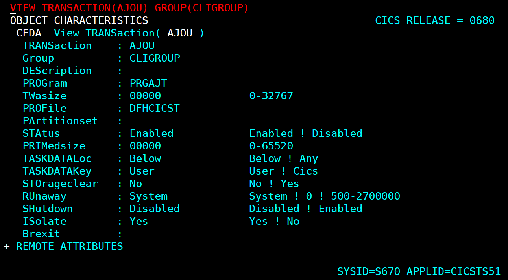

*Vue complète de la définition de la transaction AJOU : elle appartient au groupe CLIGROUP, est liée au programme PRGAJT, avec un statut Enabled.*

#### Premier passage - Écran vide

Lorsque l'utilisateur lance la transaction AJOU, l'écran de saisie s'affiche vide.

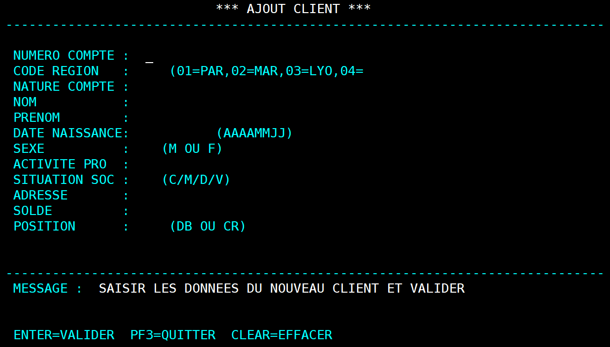

*L'écran de saisie MAPAJT s'affiche avec tous les champs vides et le message d'instruction "SAISIR LES DONNEES DU NOUVEAU CLIENT ET VALIDER".*

#### Messages d'erreur de validation

Le programme valide les données saisies et affiche des messages d'erreur appropriés.

##### Aucune donnée saisie

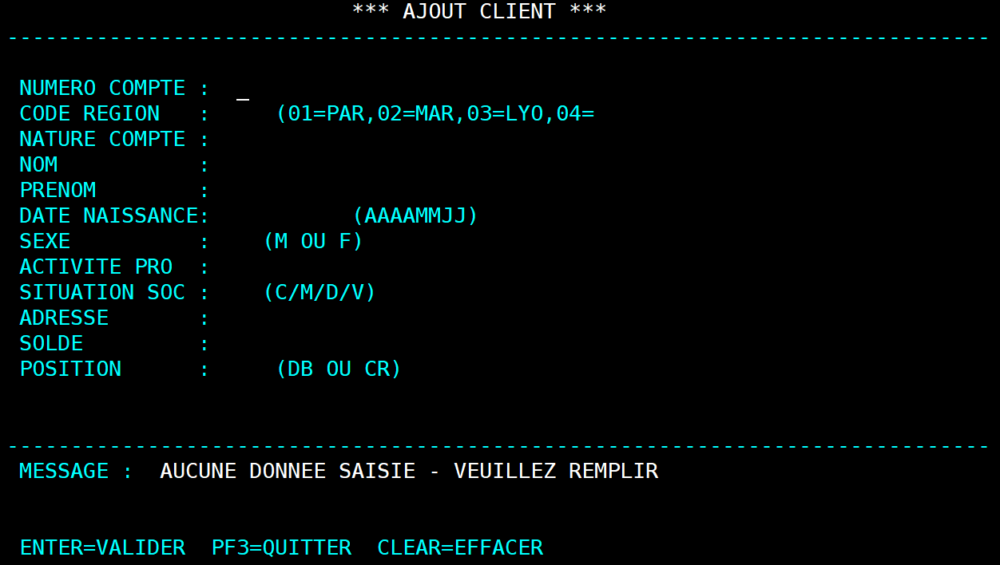

*Message "AUCUNE DONNEE SAISIE - VEUILLEZ REMPLIR" lorsque l'utilisateur appuie sur ENTER sans avoir saisi de données (MAPFAIL).*

##### Client existant (doublon)

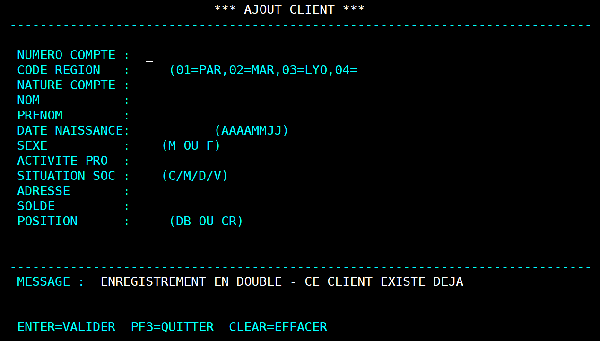

*Message "ENREGISTREMENT EN DOUBLE - CE CLIENT EXISTE DEJA" lorsque le numéro de compte existe déjà dans le fichier VSAM.*

##### Numéro de compte obligatoire

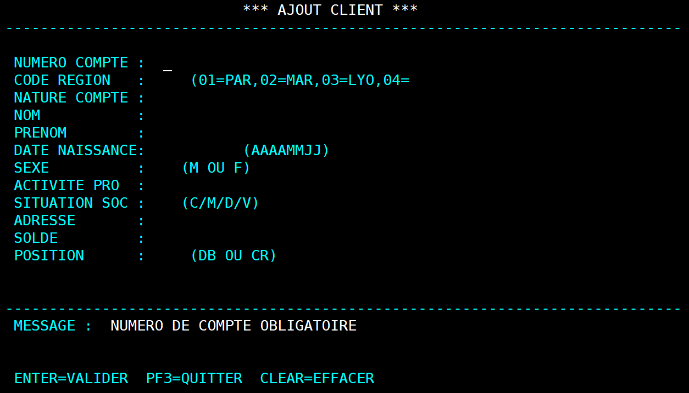

*Message "NUMERO DE COMPTE OBLIGATOIRE" lorsque le champ NUMCPT est vide.*

##### Code région invalide

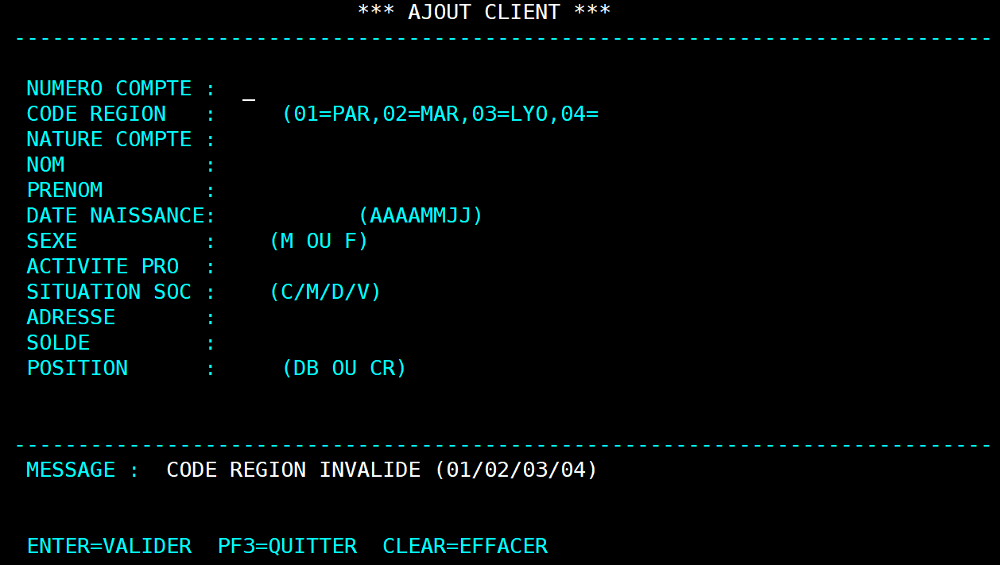

*Message "CODE REGION INVALIDE (01/02/03/04)" lorsque le code région n'est pas une valeur autorisée.*

##### Sexe invalide

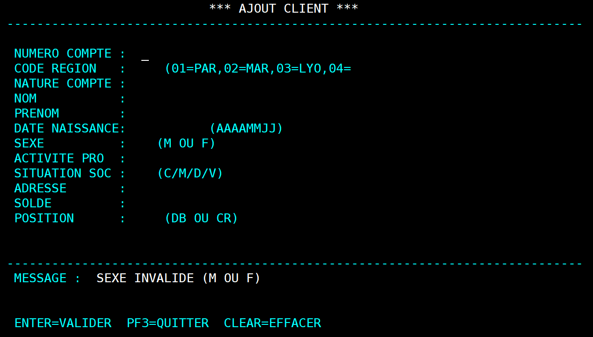

*Message "SEXE INVALIDE (M OU F)" lorsque le sexe saisi n'est pas M ou F.*

##### Situation sociale invalide

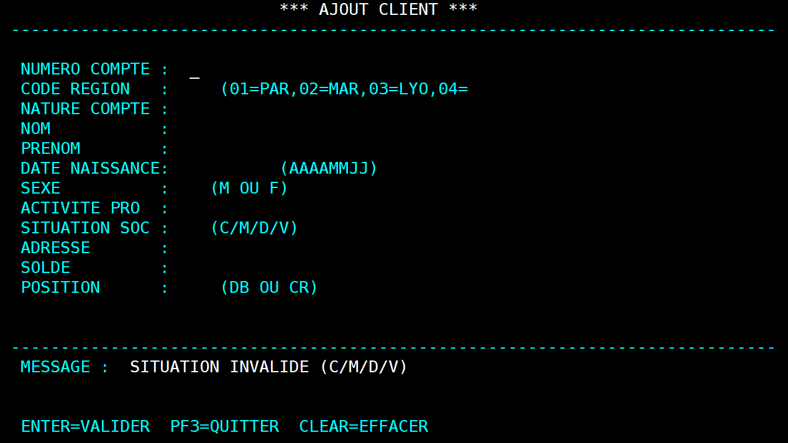

*Message "SITUATION INVALIDE (C/M/D/V)" lorsque la situation sociale n'est pas reconnue.*

##### Position invalide

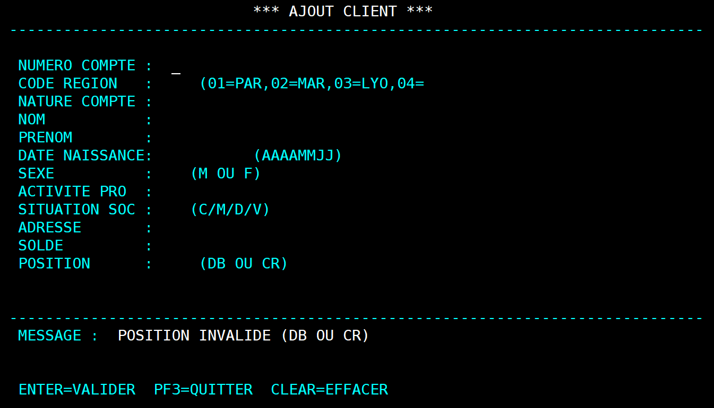

*Message "POSITION INVALIDE (DB OU CR)" lorsque la position n'est pas DB (débiteur) ou CR (créditeur).*

#### Test d'ajout réussi - Premier client

Ajout du client RONALDO CRISTIANO avec toutes les données valides.

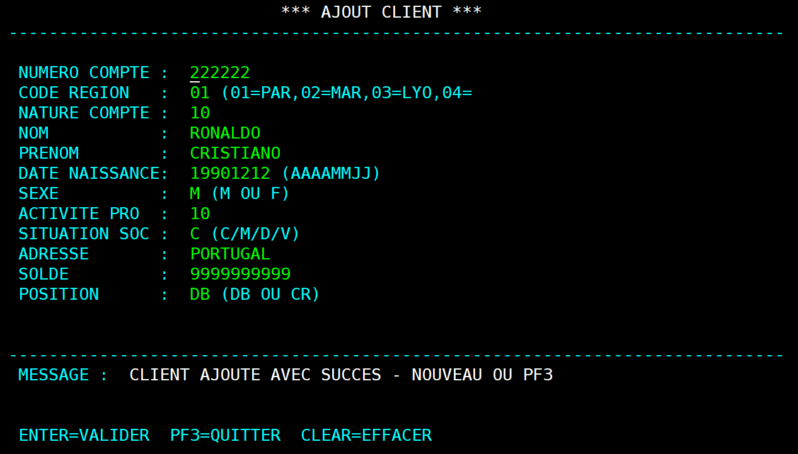

*Message "CLIENT AJOUTE AVEC SUCCES - NOUVEAU OU PF3" après l'ajout du client 222222 (RONALDO CRISTIANO, Paris, Célibataire, Débiteur).*

#### Vérification avec AFFI

Après l'ajout, on vérifie que le client existe bien en utilisant la transaction d'affichage.

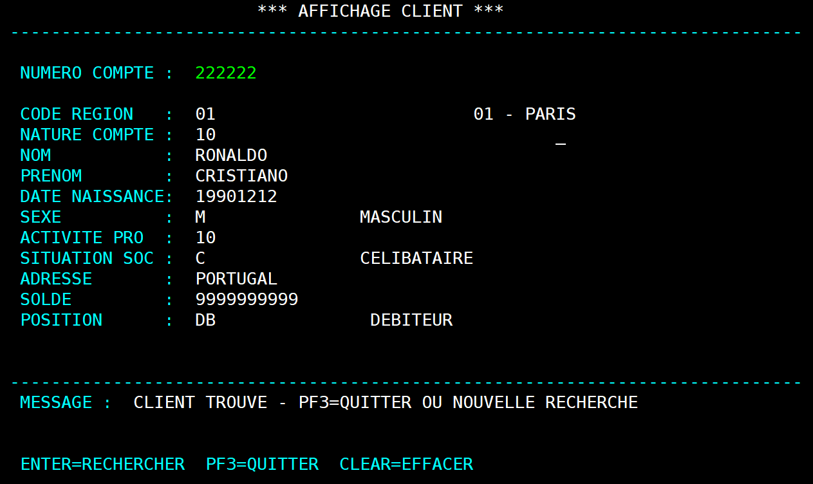

*Le client 222222 (RONALDO CRISTIANO) s'affiche correctement dans la transaction AFFI, confirmant que l'ajout a bien été effectué dans le fichier VSAM.*

#### Session de débogage CEDF

Le débogueur CEDF permet de suivre l'exécution des commandes CICS pas à pas.

##### CEDF - SEND MAP (affichage écran)


*Point d'arrêt CEDF sur la commande SEND MAP : envoi de MAPAJT depuis le mapset CLIAJT. RESPONSE: NORMAL indique le succès de l'opération.*

##### Saisie d'un nouveau client

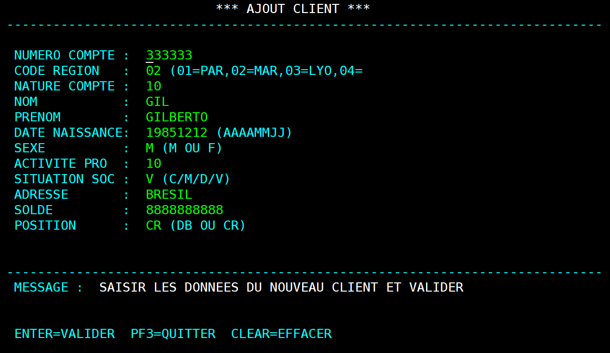

*Saisie des données pour un nouveau client : 333333, région 02 (Marseille), GIL GILBERTO, Veuf, Créditeur.*

##### CEDF - RECEIVE MAP (réception saisie)

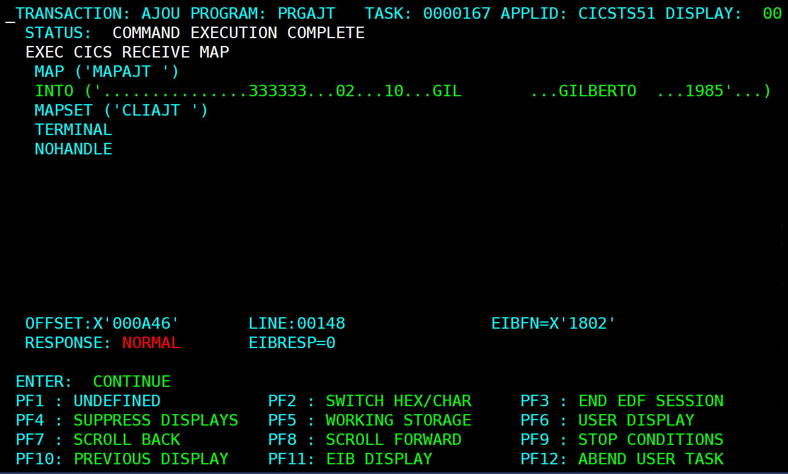

*Point d'arrêt CEDF sur la commande RECEIVE MAP : réception des données saisies. On voit les valeurs transmises (333333, 02, 10, GIL, GILBERTO...). RESPONSE: NORMAL.*

##### CEDF - READ FILE (vérification doublon)

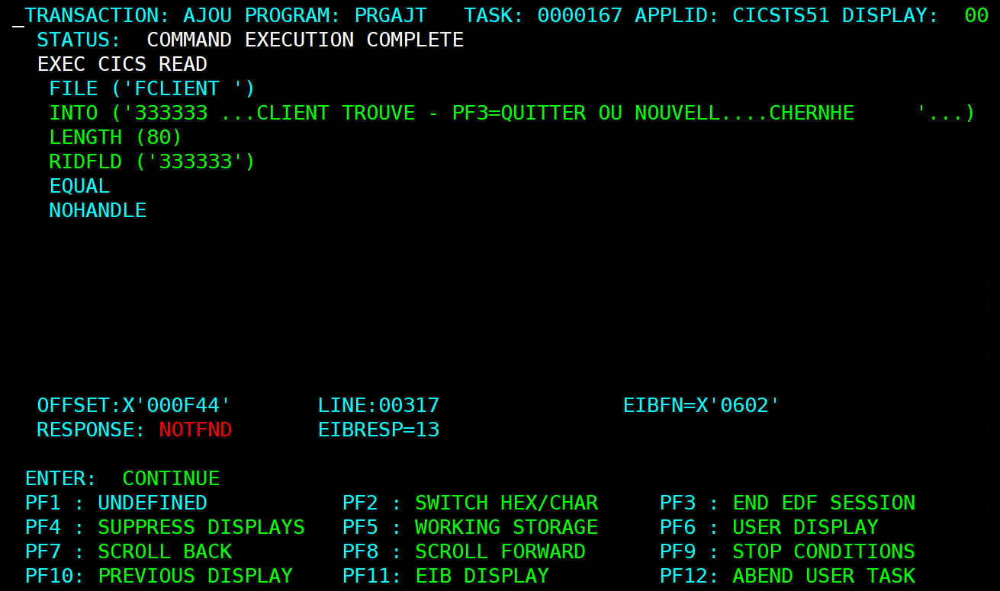

*Point d'arrêt CEDF sur la commande READ FILE avec RIDFLD('333333'). **RESPONSE: NOTFND** (EIBRESP=13) est le résultat **attendu** : le client n'existe pas encore, on peut procéder à l'écriture.*

##### CEDF - WRITE FILE (écriture client)

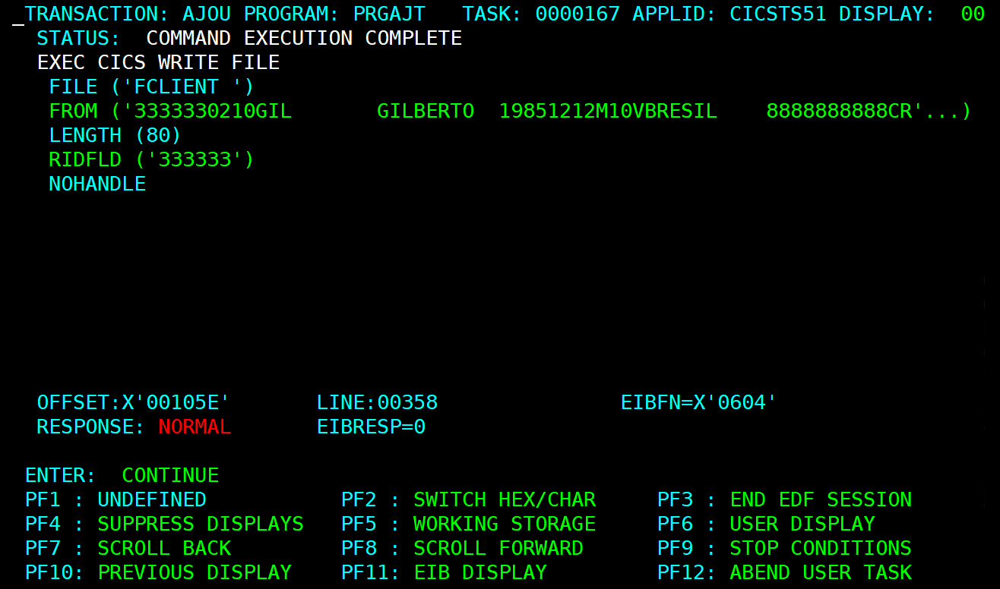

*Point d'arrêt CEDF sur la commande WRITE FILE : écriture de l'enregistrement complet du client. On voit les données (3333330210GIL GILBERTO 19851212M10VBRESIL 8888888888CR). RESPONSE: NORMAL confirme l'écriture réussie.*

##### Ajout réussi - Deuxième client

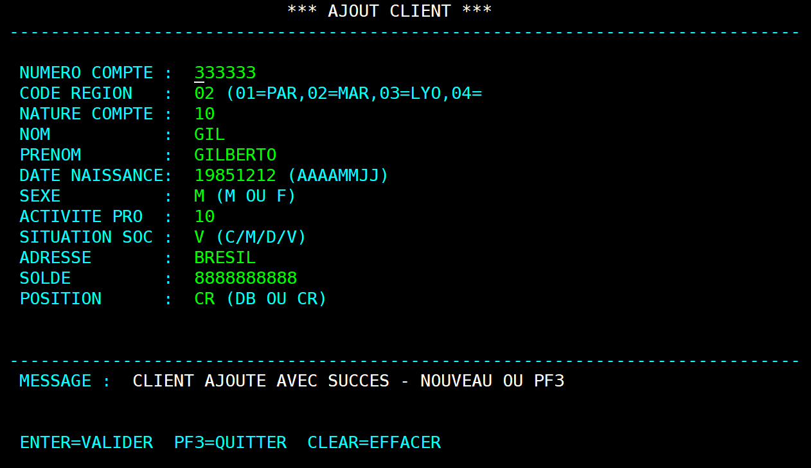

*Message "CLIENT AJOUTE AVEC SUCCES" après l'ajout du client 333333 (GIL GILBERTO, Marseille, Veuf, Créditeur).*

##### CEDF - SEND MAP final

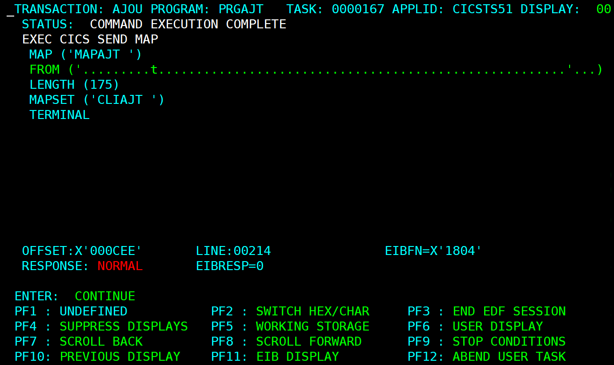

*Point d'arrêt CEDF sur le SEND MAP final : envoi du message de succès à l'écran. RESPONSE: NORMAL.*

---

[< Partie 1 : Affichage](02-partie-1-affichage.md) | [Retour au sommaire](00-introduction.md) | [Partie 2b : Mise à jour >](04-partie-2b-maj.md)
