# Partie 2c : Opérations de Suppression (DELETE)

[< Partie 2b : Mise à jour](04-partie-2b-maj.md) | [Retour au sommaire](00-introduction.md) | [Partie 3 : Avancées >](06-partie-3-avancees.md)

---

Cette section couvre les exercices 12 à 15 : MAP de suppression, programme de suppression avec la commande DELETE, et définition de transaction.

## La commande DELETE : Supprimer des enregistrements VSAM

Après avoir maîtrisé READ (lecture), WRITE (ajout) et REWRITE (mise à jour), cette partie introduit la dernière opération CRUD : la suppression avec DELETE.

### Caractéristiques de DELETE

| Aspect | DELETE | Comparaison avec REWRITE |
|--------|--------|--------------------------|
| **Fonction** | Supprimer un enregistrement | Modifier un enregistrement |
| **Prérequis** | Aucun | READ UPDATE obligatoire |
| **Verrouillage** | Non nécessaire | Obligatoire |
| **Erreur si absent** | NOTFND | NOTFND |
| **Atomicité** | Oui (opération unique) | Non (READ + REWRITE) |

> **Point clé** : Contrairement à REWRITE, la commande DELETE est autonome et ne nécessite pas de READ UPDATE préalable. Elle supprime directement l'enregistrement identifié par RIDFLD.

### Variantes de suppression en CICS

CICS offre plusieurs façons de supprimer des enregistrements :

| Variante | Syntaxe | Usage |
|----------|---------|-------|
| **DELETE simple** | `DELETE FILE(...) RIDFLD(clé)` | Supprime un enregistrement par sa clé exacte |
| **DELETE avec GENERIC** | `DELETE FILE(...) RIDFLD(préfixe) KEYLENGTH(...) GENERIC` | Supprime tous les enregistrements dont la clé commence par le préfixe |
| **DELETE en browse** | `DELETE FILE(...) RIDFLD(...) (après READNEXT)` | Supprime l'enregistrement courant lors d'un parcours |

Dans cette partie, nous implémentons le **DELETE simple** avec confirmation visuelle. Le **DELETE avec GENERIC** sera traité dans la Partie 3 (Exercice 17) pour la suppression de plusieurs clients en une seule opération.

## Mon choix de conception

L'énoncé original prévoyait deux programmes distincts :
- **Exercice 13** : Suppression directe (DELETE sans affichage préalable)
- **Exercice 15** : Suppression avec lecture préalable (READ + affichage + DELETE)

**J'ai fait le choix de développer directement la version complète** (avec lecture et confirmation) dès l'exercice 13, car c'est la bonne pratique en environnement de production. On ne supprime jamais de données sans permettre à l'utilisateur de vérifier visuellement ce qu'il supprime.

| Ce qui était prévu | Ce que j'ai implémenté | Justification |
|--------------------|------------------------|---------------|
| Ex 13 : DELETE direct | DELETE avec confirmation | Sécurité des données |
| Ex 15 : READ + DELETE | Déjà couvert par Ex 13 | Évite code redondant |

> **Bonne pratique mainframe** : En production, une suppression accidentelle peut avoir des conséquences graves. L'affichage préalable et la confirmation explicite (O/N) sont des garde-fous essentiels.

---

## Exercice 12 : MAP pour suppression

### Énoncé

Créer ou adapter la MAP précédente pour une opération de suppression de CLIENT dans le Data Set CLIENT.

### Mon travail

J'ai créé une nouvelle MAP de suppression (CLISUP) qui combine les caractéristiques des MAPs précédentes.

#### Pourquoi une MAP spécifique pour la suppression ?

La suppression nécessite un écran hybride :
1. **Phase recherche** : Le numéro de compte est saisissable (UNPROT) pour identifier le client
2. **Phase confirmation** : Les données sont affichées en lecture seule (ASKIP,BRT) pour que l'utilisateur vérifie qu'il supprime le bon client
3. **Champ CONFIRM** : Un nouveau champ (O/N) permet de valider ou annuler la suppression

#### Différences avec les autres MAPs

| Aspect | CLIAFF (Affichage) | CLIAJT (Ajout) | CLIMAJ (Maj) | CLISUP (Suppression) |
|--------|-------------------|----------------|--------------|---------------------|
| NUMCPT | UNPROT (saisie) | UNPROT (saisie) | UNPROT→ASKIP | UNPROT (saisie) |
| Autres champs | ASKIP (affichage) | UNPROT (saisie) | UNPROT (modif) | ASKIP (affichage) |
| Confirmation | Non | Non | Non | Oui (O/N) |
| Libellés | Oui (LIBREG...) | Non | Non | Oui (LIBREG...) |

#### Flux de suppression en 2 phases

```
Phase 1 (Recherche)           Phase 2 (Confirmation)
+------------------------+    +------------------------+
| NUMCPT: ______ [saisie]|    | NUMCPT: 100001         |
| Autres: vides          |    | NOM: DUPONT            |
| CONFIRM: _             | -> | PRENOM: JEAN           |
|                        |    | ...                    |
| Message: Saisir numéro |    | CONFIRM: _ [O/N]       |
+------------------------+    | Message: Confirmer ?   |
                              +------------------------+
```

### Résolution

**MAP BMS : CLISUP.bms**

Le code source est stocké dans `ROCHA.CICS.SOURCE(CLISUP)`. La structure reprend les mêmes concepts BMS que les MAPs précédentes (voir Partie 1, Exercice 2 pour les explications sur DFHMSD, DFHMDI, DFHMDF et les attributs).

**Extrait du code BMS - En-tête avec commentaires explicatifs :**

```
***********************************************************************
*  MAPSET : CLISUP - Suppression Client
*  Transaction : SUPP / SULE
*
*  PARTICULARITE SUPPRESSION :
*  ---------------------------
*  Le numero de compte est saisi pour rechercher le client.
*  Les donnees sont affichees en lecture seule pour confirmation.
*  Un champ CONFIRM (O/N) permet de valider la suppression.
***********************************************************************
CLISUP   DFHMSD TYPE=&SYSPARM,MODE=INOUT,LANG=COBOL,                   X
               STORAGE=AUTO,CTRL=(FREEKB,FRSET),TIOAPFX=YES
```

**Extrait - Zones d'affichage en lecture seule (ASKIP,BRT) :**

```
*----------------------------------------------------------------------
* ZONES D'AFFICHAGE - DONNEES CLIENT (LECTURE SEULE)
*----------------------------------------------------------------------
         DFHMDF POS=(6,2),LENGTH=16,ATTRB=ASKIP,                        X
               INITIAL='CODE REGION   :'
CODREG   DFHMDF POS=(6,19),LENGTH=2,ATTRB=(ASKIP,BRT)
         DFHMDF POS=(6,25),LENGTH=20,ATTRB=ASKIP
LIBREG   DFHMDF POS=(6,46),LENGTH=15,ATTRB=(ASKIP,BRT)
```

> **Différence clé avec les autres MAPs** : Tous les champs de données sont en `ASKIP,BRT` (protégés, brillants) car l'utilisateur ne peut que visualiser, pas modifier. Seuls NUMCPT (recherche) et CONFIRM (O/N) sont saisissables.

**Extrait - Zone de confirmation (élément spécifique à la suppression) :**

```
*----------------------------------------------------------------------
* ZONE DE CONFIRMATION
*----------------------------------------------------------------------
         DFHMDF POS=(18,2),LENGTH=30,ATTRB=(ASKIP,BRT),                 X
               INITIAL='CONFIRMER SUPPRESSION (O/N) :'
CONFIRM  DFHMDF POS=(18,33),LENGTH=1,ATTRB=UNPROT
         DFHMDF POS=(18,35),LENGTH=1,ATTRB=ASKIP
```

> **Élément distinctif** : Le champ CONFIRM est unique à cette MAP. Il permet une validation explicite avant la suppression irréversible.

**Zones de la MAP :**

| Zone | Longueur | Attribut | Description |
|------|----------|----------|-------------|
| NUMCPT | 6 | UNPROT,NUM,IC | Numéro de compte (clé de recherche) |
| CODREG | 2 | ASKIP,BRT | Code région (affichage) |
| LIBREG | 15 | ASKIP,BRT | Libellé région |
| NOM | 10 | ASKIP,BRT | Nom client (affichage) |
| PRENOM | 10 | ASKIP,BRT | Prénom client (affichage) |
| ... | ... | ASKIP,BRT | Autres champs en lecture seule |
| CONFIRM | 1 | UNPROT | Confirmation O/N (saisie) |
| MSG | 60 | ASKIP,BRT | Zone message |

> **Note** : Contrairement à CLIMAJ, le champ NUMCPT ne passe pas dynamiquement en ASKIP après la recherche. Il reste techniquement saisissable mais l'utilisateur se concentre sur le champ CONFIRM.

**JCL d'assemblage : ASMSUP.jcl**

Le JCL d'assemblage suit la même structure que ASMCLAF.jcl (voir Partie 1, Exercice 2). Seuls le nom du job (ROCHA12) et le membre source (CLISUP) changent.

### Définition CICS

La définition et l'installation du mapset suivent le même processus que pour les mapsets précédents (voir Partie 1, Exercice 4 pour les explications sur CEDA) :

```
CEDA DEFINE MAPSET(CLISUP) GROUP(CLIGROUP)
CEDA INSTALL MAPSET(CLISUP) GROUP(CLIGROUP)
```

### Vérification

```
CEDA VIEW MAPSET(CLISUP) GROUP(CLIGROUP)
```

### Captures d'écran

#### Définition du mapset CLISUP dans CICS

Après l'assemblage BMS réussi, on définit le mapset dans CICS avec CEDA.

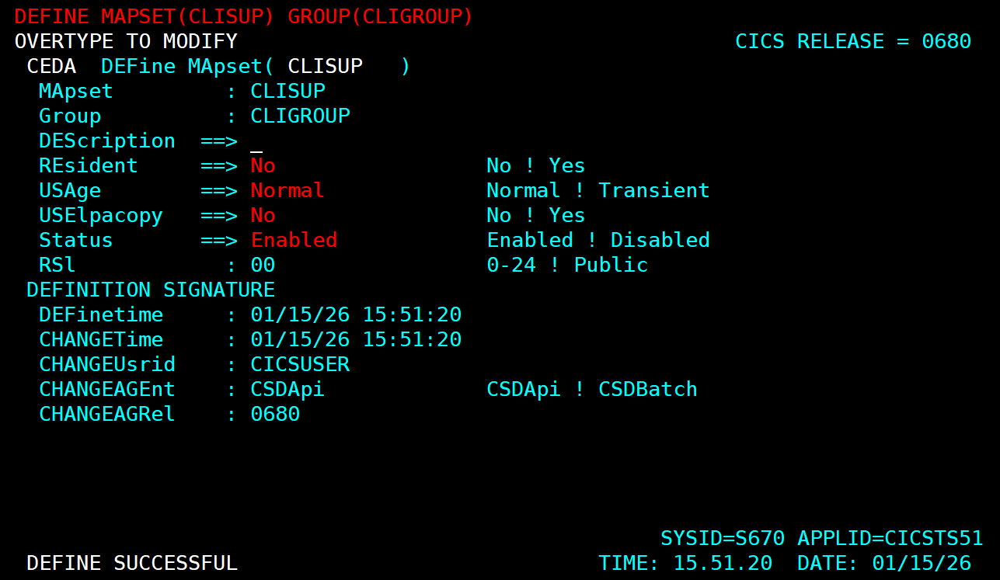

*La commande CEDA DEFINE MAPSET(CLISUP) GROUP(CLIGROUP) crée la définition du mapset de suppression. Le message "DEFINE SUCCESSFUL" confirme la création.*

#### Installation du mapset CLISUP

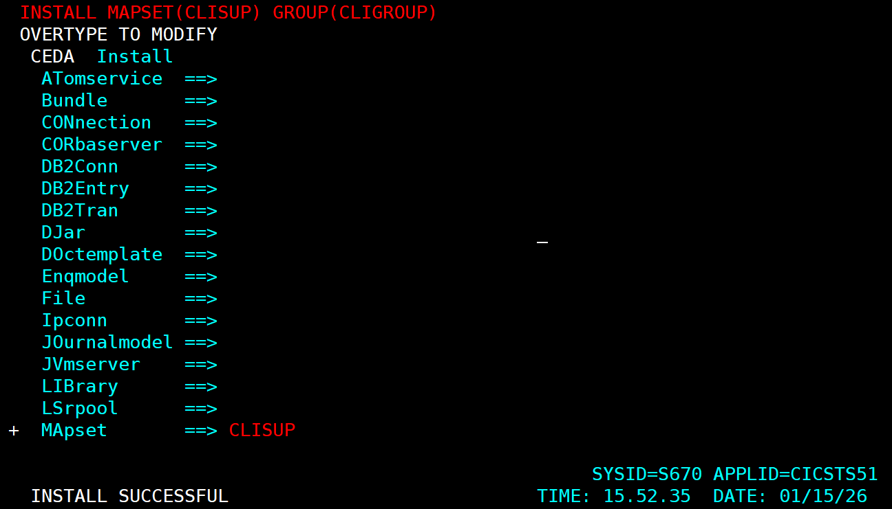

*La commande CEDA INSTALL MAPSET(CLISUP) charge le mapset en mémoire CICS. Le message "INSTALL SUCCESSFUL" indique que le mapset est prêt.*

#### Vérification de la définition

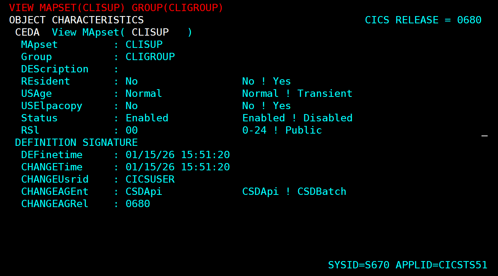

*CEDA VIEW permet de consulter tous les paramètres du mapset : nom, groupe, résidence, et statut d'installation.*

#### Résultat de l'assemblage BMS

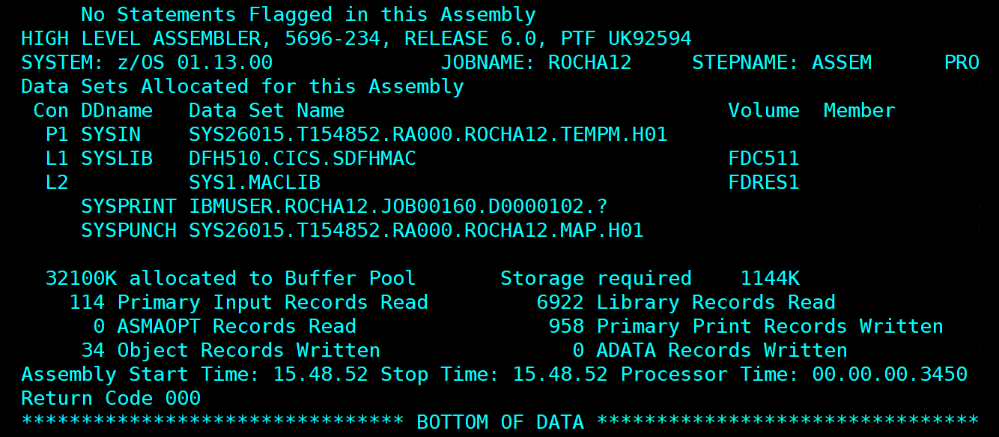

*Le job ROCHA12 (assemblage BMS) retourne Return Code 000. On note 114 Primary Input Records Read et 34 Object Records Written, confirmant la génération correcte du mapset CLISUP.*

---

## Exercice 13 : Programme de suppression (DELETE)

### Énoncé

Créer le PROGRAMME pour une opération de suppression d'un CLIENT dans le Data Set CLIENT en précisant le code CLIENT. Un contrôle de conformité de donnée et d'existence doit être effectué.

### Mon travail

J'ai développé le programme PRGSUP qui gère la suppression de clients avec confirmation visuelle.

> **Note** : J'ai directement implémenté la version complète avec lecture préalable et affichage des données (prévue initialement pour l'exercice 15). Cette approche est la bonne pratique en production.

#### Pourquoi DELETE ne nécessite pas READ UPDATE ?

C'est une différence importante avec REWRITE :

| Commande | Prérequis | Raison |
|----------|-----------|--------|
| **REWRITE** | READ UPDATE obligatoire | L'enregistrement doit être verrouillé pour la modification |
| **DELETE** | Aucun | La suppression est atomique, pas besoin de verrouillage préalable |

La commande DELETE supprime directement par la clé (RIDFLD). Si le client n'existe pas, elle retourne NOTFND.

#### Pourquoi un mode à 2 phases avec confirmation ?

```
┌─────────────────────────────────────────────────────────────────┐
│ PHASE 1 : RECHERCHE (EIBCALEN = 0 ou WS-PHASE = '1')            │
│ ──────────────────────────────────────────────────────────────  │
│ → L'utilisateur saisit un numéro de compte                      │
│ → READ pour vérifier existence et récupérer les données         │
│ → Affichage des données pour confirmation visuelle              │
│ → WS-PHASE passe à '2'                                          │
└─────────────────────────────────────────────────────────────────┘
                            │
        L'utilisateur voit les données et répond O ou N
                            │
                            ▼
┌─────────────────────────────────────────────────────────────────┐
│ PHASE 2 : CONFIRMATION (WS-PHASE = '2')                         │
│ ──────────────────────────────────────────────────────────────  │
│ → Réception de la réponse O/N                                   │
│ → Si N : Message "SUPPRESSION ANNULÉE", retour phase 1          │
│ → Si O : DELETE RIDFLD, message "CLIENT SUPPRIMÉ"               │
│ → Retour en phase 1 pour nouveau client                         │
└─────────────────────────────────────────────────────────────────┘
```

Voir Partie 1, Exercice 3 pour les explications détaillées sur le mode pseudo-conversationnel et les variables EIB.

### Résolution

**Programme : PRGSUP.cbl**

Le code source est stocké dans `ROCHA.CICS.SOURCE(PRGSUP)`. Voici les extraits clés spécifiques à la suppression.

**Structure de la COMMAREA :**

```cobol
       01  WS-COMMAREA.
           05 WS-PHASE            PIC X(01) VALUE '1'.
              88 PHASE-RECHERCHE  VALUE '1'.
              88 PHASE-CONFIRM    VALUE '2'.
           05 WS-NUMCPT-SAVED     PIC X(06) VALUE SPACES.
```

La COMMAREA contient la phase et le numéro de compte sauvegardé pour la suppression.

**Paragraphe de confirmation avec validation O/N :**

```cobol
       4000-CONFIRMER-SUPPRESSION.
      *-----------------------------------------------------------------
      * Phase 2 : Réception de la confirmation et suppression
      *-----------------------------------------------------------------
           EXEC CICS RECEIVE MAP('MAPSUP')
               MAPSET('CLISUP')
               RESP(WS-RESP)
           END-EXEC

           IF WS-RESP = DFHRESP(MAPFAIL)
               MOVE LOW-VALUES TO MAPSUPO
               MOVE WS-NUMCPT-SAVED TO NUMCPTO
               MOVE DFHBMASK TO NUMCPTA
               MOVE 'VEUILLEZ REPONDRE O OU N' TO MSGO
               EXEC CICS SEND MAP('MAPSUP')
                   MAPSET('CLISUP')
                   ERASE
               END-EXEC
               GO TO 4000-FIN
           END-IF

      *    Sauvegarde de la confirmation
           MOVE CONFIRMI TO WS-CONFIRM
           MOVE CONFIRML TO WS-CONFIRML

      *    Vérification de la réponse (accepte O/N majuscules et minuscules)
           IF WS-CONFIRM NOT = 'O' AND WS-CONFIRM NOT = 'N'
              AND WS-CONFIRM NOT = 'o' AND WS-CONFIRM NOT = 'n'
               MOVE LOW-VALUES TO MAPSUPO
               MOVE WS-NUMCPT-SAVED TO NUMCPTO
               MOVE DFHBMASK TO NUMCPTA
               MOVE 'REPONSE INVALIDE - SAISIR O OU N' TO MSGO
               EXEC CICS SEND MAP('MAPSUP')
                   MAPSET('CLISUP')
                   ERASE
               END-EXEC
               GO TO 4000-FIN
           END-IF

      *    Si N ou n : Annulation
           IF WS-CONFIRM = 'N' OR WS-CONFIRM = 'n'
               MOVE LOW-VALUES TO MAPSUPO
               MOVE 'SUPPRESSION ANNULEE - NOUVEAU NUMERO OU PF3' TO MSGO
               MOVE '1' TO WS-PHASE
               MOVE SPACES TO WS-NUMCPT-SAVED
               EXEC CICS SEND MAP('MAPSUP')
                   MAPSET('CLISUP')
                   ERASE
               END-EXEC
               GO TO 4000-FIN
           END-IF

      *    Si O ou o : Suppression
           PERFORM 4100-SUPPRIMER-CLIENT THRU 4100-FIN.

       4000-FIN.
           EXIT.
```

**Paragraphe de suppression avec DELETE :**

```cobol
       4100-SUPPRIMER-CLIENT.
      *-----------------------------------------------------------------
      * Suppression effective de l'enregistrement
      * La commande DELETE ne nécessite PAS de READ UPDATE préalable
      *-----------------------------------------------------------------
           MOVE WS-NUMCPT-SAVED TO CLI-NUMCPT

           EXEC CICS DELETE
               FILE('FCLIENT')
               RIDFLD(CLI-NUMCPT)
               RESP(WS-RESP)
           END-EXEC

           EVALUATE WS-RESP
               WHEN DFHRESP(NORMAL)
                   MOVE LOW-VALUES TO MAPSUPO
                   MOVE 'CLIENT SUPPRIME - NOUVEAU NUMERO OU PF3' TO MSGO
      *            Retour en phase recherche
                   MOVE '1' TO WS-PHASE
                   MOVE SPACES TO WS-NUMCPT-SAVED
               WHEN DFHRESP(NOTFND)
                   MOVE LOW-VALUES TO MAPSUPO
                   MOVE 'ERREUR : CLIENT DEJA SUPPRIME' TO MSGO
                   MOVE '1' TO WS-PHASE
                   MOVE SPACES TO WS-NUMCPT-SAVED
               WHEN OTHER
                   MOVE LOW-VALUES TO MAPSUPO
                   MOVE WS-NUMCPT-SAVED TO NUMCPTO
                   MOVE DFHBMASK TO NUMCPTA
                   MOVE 'ERREUR SUPPRESSION - CONTACTEZ SUPPORT' TO MSGO
           END-EVALUATE

           EXEC CICS SEND MAP('MAPSUP')
               MAPSET('CLISUP')
               ERASE
           END-EXEC.

       4100-FIN.
           EXIT.
```

**JCL de compilation : CMPSUP.jcl**

Le JCL de compilation suit la même structure que CMPCLAF.jcl (voir Partie 1, Exercice 3). Seuls le nom du job (ROCHA13) et le membre source (PRGSUP) changent.

### Structure du programme

| Paragraphe | Fonction |
|------------|----------|
| 0000-PRINCIPAL | Point d'entrée, aiguillage pseudo-conversationnel |
| 1000-INIT-RECHERCHE | Affichage écran vide |
| 2000-TRAITEMENT | Aiguillage selon la phase |
| 3000-RECHERCHER-CLIENT | Phase 1 : Saisie et lecture du client |
| 3100-AFFICHER-CLIENT | Affichage des données avec libellés |
| 4000-CONFIRMER-SUPPRESSION | Phase 2 : Réception confirmation O/N |
| 4100-SUPPRIMER-CLIENT | Exécution de la commande DELETE |
| 9000-FIN-PROGRAMME | Fin de transaction (PF3) |

### Commandes CICS utilisées

| Commande | Usage |
|----------|-------|
| SEND MAP | Envoyer l'écran (avec ERASE) |
| RECEIVE MAP | Recevoir la saisie avec RESP pour MAPFAIL |
| READ FILE | Vérifier existence et afficher les données |
| DELETE FILE | Supprimer l'enregistrement (sans READ UPDATE) |
| RETURN TRANSID | Retour pseudo-conversationnel |

### Messages d'erreur gérés

| Message | Contexte |
|---------|----------|
| SAISIR LE NUMERO DE COMPTE A SUPPRIMER | Premier passage |
| VEUILLEZ SAISIR UN NUMERO DE COMPTE | MAPFAIL ou champ vide |
| NUMERO DE COMPTE DOIT ETRE NUMERIQUE | Caractères non numériques |
| CLIENT INEXISTANT - VERIFIEZ LE NUMERO | READ retourne NOTFND |
| CLIENT TROUVE - CONFIRMER SUPPRESSION (O/N) ? | Client affiché, attente confirmation |
| VEUILLEZ REPONDRE O OU N | MAPFAIL en phase confirmation |
| REPONSE INVALIDE - SAISIR O OU N | Confirmation différente de O/N |
| SUPPRESSION ANNULEE - NOUVEAU NUMERO OU PF3 | Utilisateur a saisi N |
| CLIENT SUPPRIME - NOUVEAU NUMERO OU PF3 | DELETE réussi |
| ERREUR : CLIENT DEJA SUPPRIME | DELETE retourne NOTFND |

### Définition CICS

```
CEDA DEFINE PROGRAM(PRGSUP) GROUP(CLIGROUP) LANGUAGE(COBOL)
CEDA INSTALL PROGRAM(PRGSUP) GROUP(CLIGROUP)
```

### Vérification

```
CEMT INQ PROGRAM(PRGSUP)
```

Résultat attendu : `Prog(PRGSUP) Cob Ena`

### Points importants

1. **DELETE sans READ UPDATE** : Contrairement à REWRITE, la commande DELETE n'a pas besoin de verrouillage préalable. Elle supprime directement par la clé.

2. **Confirmation obligatoire** : L'utilisateur doit explicitement répondre O ou N. Toute autre réponse est rejetée.

3. **Acceptation majuscules/minuscules** : Le programme accepte O/o et N/n pour plus de convivialité.

4. **PERFORM THRU avec GO TO** : Comme pour les autres programmes (voir Partie 2a, Exercice 7), la clause THRU permet aux GO TO de rester dans la plage du PERFORM.

### Difficultés rencontrées et solutions

Le programme PRGSUP a bénéficié des leçons apprises lors du développement des programmes précédents. Les difficultés suivantes ont été anticipées et évitées :

| Problème potentiel | Prévention appliquée |
|-------------------|----------------------|
| GO TO hors plage PERFORM | Utilisation systématique de `PERFORM ... THRU paragraphe-FIN` |
| Écrasement données après RECEIVE | Sauvegarde immédiate dans WS-NUMCPT-SAVED et WS-CONFIRM |
| Message non visible | `ERASE` systématique sur tous les SEND MAP |
| Données non transmises (NUMCPT protégé) | Sauvegarde du numéro dans COMMAREA (WS-NUMCPT-SAVED) |

> **Note** : L'approche avec confirmation visuelle (READ + affichage + DELETE) évite les suppressions accidentelles, contrairement à un DELETE direct qui aurait été techniquement plus simple mais risqué.

### Captures d'écran

#### Définition du programme PRGSUP dans CICS

Après la compilation COBOL réussie, on définit le programme dans CICS.

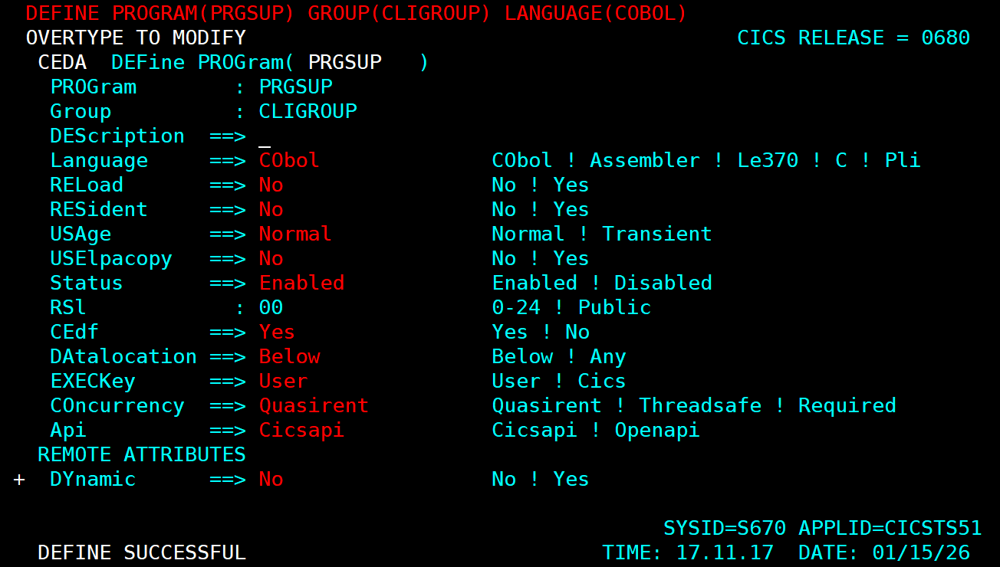

*La commande CEDA DEFINE PROGRAM(PRGSUP) GROUP(CLIGROUP) LANGUAGE(COBOL) crée la définition du programme. Le message "DEFINE SUCCESSFUL" confirme la création.*

#### Installation du programme PRGSUP

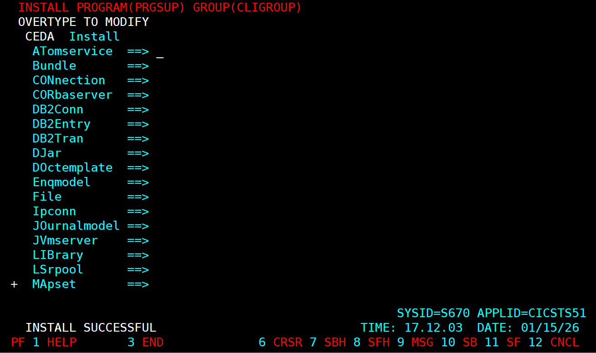

*La commande CEDA INSTALL PROGRAM(PRGSUP) charge le programme compilé en mémoire CICS. Le message "INSTALL SUCCESSFUL" indique que le programme est prêt.*

#### Vérification avec CEMT


*CEMT INQ PROGRAM(PRGSUP) affiche le statut du programme : "Cob" (COBOL), "Pro" (Protected), "Ena" (Enabled). Le programme est correctement installé et activé.*

#### Compilation du programme PRGSUP

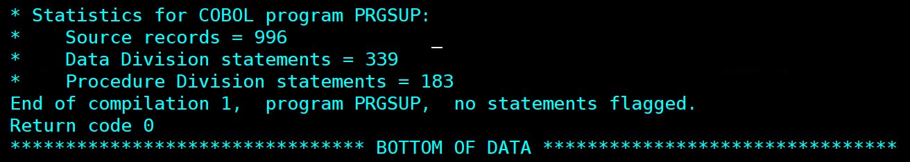

*Statistiques de compilation du programme PRGSUP : 996 enregistrements sources, 339 instructions DATA DIVISION, 183 instructions PROCEDURE DIVISION. Return code 0 confirme la compilation réussie.*

---

## Exercice 14 : Transaction de suppression

### Énoncé

Définir une transaction indépendante des précédentes pour appeler le programme de suppression.

### Mon travail

La transaction SUPP est le point d'entrée utilisateur pour la suppression de clients.

#### Architecture CICS - Liaison des ressources

```
+-------------+     +-------------+     +-------------+
| TRANSACTION | --> | PROGRAMME   | --> | MAPSET      |
|    SUPP     |     |   PRGSUP    |     |   CLISUP    |
+-------------+     +-------------+     +-------------+
                           |
                           v
                    +-------------+
                    |   FICHIER   |
                    |   FCLIENT   |
                    +-------------+
```

### Résolution

**Définition de la transaction :**

```
CEDA DEFINE TRANSACTION(SUPP) GROUP(CLIGROUP) PROGRAM(PRGSUP)
```

| Paramètre | Valeur | Description |
|-----------|--------|-------------|
| TRANSACTION | SUPP | Code transaction (4 caractères max) |
| GROUP | CLIGROUP | Groupe de ressources du projet |
| PROGRAM | PRGSUP | Programme COBOL à exécuter |

**Installation de la transaction :**

```
CEDA INSTALL TRANSACTION(SUPP) GROUP(CLIGROUP)
```

> **Bonne pratique** : Installer uniquement la ressource ajoutée plutôt que tout le groupe. Réinstaller le groupe peut causer des problèmes si FCLIENT est ouvert.

### Vérification

```
CEDA VIEW TRANSACTION(SUPP) GROUP(CLIGROUP)
CEMT INQ TRAN(SUPP)
```

Résultat attendu : `Tra(SUPP) Pro(PRGSUP) Ena`

### Test de la transaction

**Test sans debugger :**

```
SUPP
```

Comportement attendu :
1. Écran de saisie du numéro de compte
2. Saisir un numéro existant (ex: 100005)
3. Affichage des données du client avec demande de confirmation
4. Saisir O pour confirmer ou N pour annuler
5. Si O : Message "CLIENT SUPPRIME"
6. Si N : Message "SUPPRESSION ANNULEE"

**Test avec CEDF** (voir Partie 1, Exercice 5 pour la navigation CEDF) :

```
CEDF
SUPP
```

Points d'arrêt observés :

| Étape | Commande CICS | RESP attendu | Description |
|-------|---------------|--------------|-------------|
| 1 | SEND MAP | NORMAL | Affichage écran recherche |
| 2 | RETURN TRANSID | - | Fin phase 1 |
| 3 | RECEIVE MAP | NORMAL | Réception numéro |
| 4 | READ FILE | NORMAL | Lecture client |
| 5 | SEND MAP | NORMAL | Affichage pour confirmation |
| 6 | RETURN TRANSID | - | Fin phase 1bis |
| 7 | RECEIVE MAP | NORMAL | Réception confirmation |
| 8 | DELETE FILE | NORMAL | Suppression |
| 9 | SEND MAP | NORMAL | Message succès |

### Ressources du groupe CLIGROUP après exercice 14

| Type | Nom | Description | Défini dans |
|------|-----|-------------|-------------|
| FILE | FCLIENT | Fichier VSAM clients | Exercice 1 |
| MAPSET | CLIAFF | Écran affichage | Exercice 4 |
| MAPSET | CLIAJT | Écran ajout | Exercice 8 |
| MAPSET | CLIMAJ | Écran mise à jour | Exercice 9 |
| MAPSET | CLISUP | Écran suppression | Exercice 12 |
| PROGRAM | PRGCLIA | Programme affichage | Exercice 4 |
| PROGRAM | PRGAJT | Programme ajout | Exercice 8 |
| PROGRAM | PRGMAJ | Programme mise à jour | Exercice 10 |
| PROGRAM | PRGSUP | Programme suppression | Exercice 13 |
| TRANSACTION | AFFI | Transaction affichage | Exercice 4 |
| TRANSACTION | AJOU | Transaction ajout | Exercice 8 |
| TRANSACTION | MAJO | Transaction mise à jour | Exercice 11 |
| TRANSACTION | SUPP | Transaction suppression | Exercice 14 |

### Captures d'écran

#### Définition de la transaction SUPP

La transaction fait le lien entre le code utilisateur et le programme COBOL.

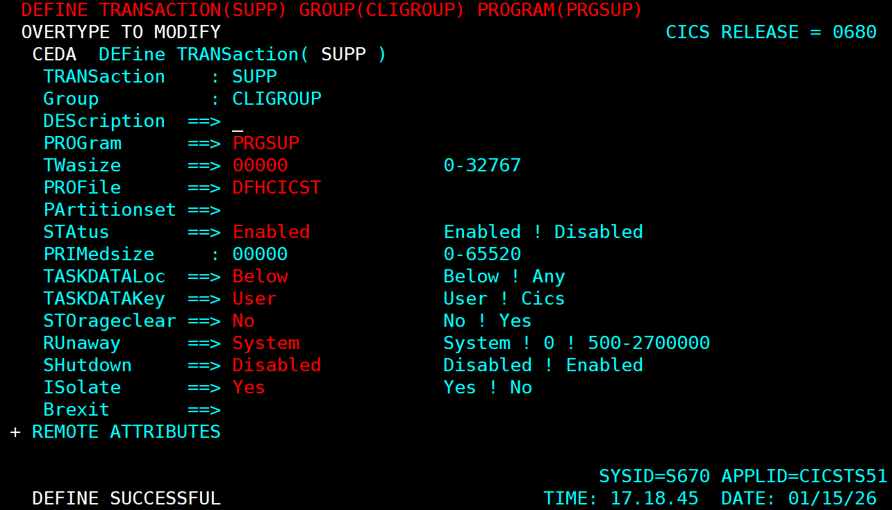

*La commande CEDA DEFINE TRANSACTION(SUPP) GROUP(CLIGROUP) PROGRAM(PRGSUP) associe le code "SUPP" au programme PRGSUP. Le message "DEFINE SUCCESSFUL" confirme la création.*

#### Installation de la transaction SUPP

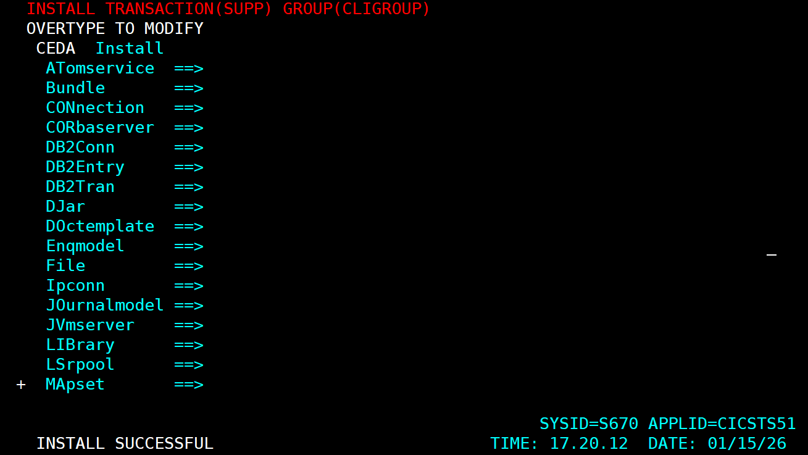

*La commande CEDA INSTALL TRANSACTION(SUPP) rend la transaction accessible aux utilisateurs. Le message "INSTALL SUCCESSFUL" confirme l'activation.*

#### Test fonctionnel - Écran de suppression vide

Après avoir tapé "SUPP" sur l'écran CICS, l'écran de saisie s'affiche.

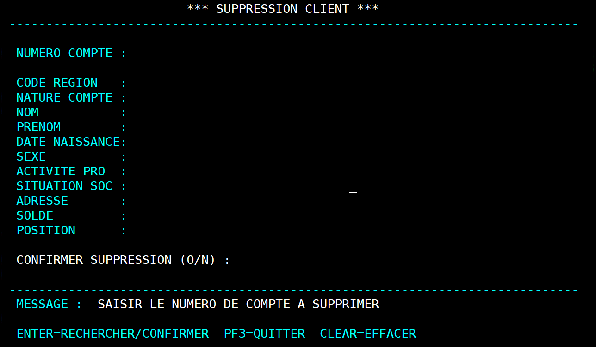

*Phase 1 : L'écran de suppression s'affiche vide avec le message "SAISIR LE NUMERO DE COMPTE A SUPPRIMER". L'utilisateur doit saisir un numéro de compte existant.*

#### Session de débogage CEDF - Suppression complète

Le débogueur CEDF permet de suivre l'exécution des commandes CICS pas à pas lors d'une suppression.

##### CEDF - RECEIVE MAP (réception du numéro)

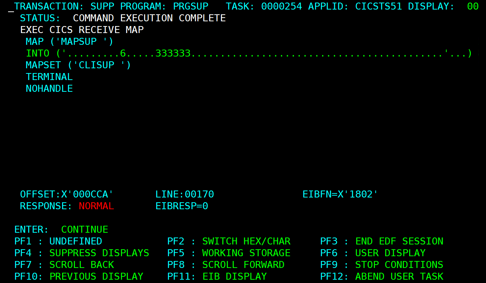

*Point d'arrêt CEDF sur la commande RECEIVE MAP : réception du numéro de compte 333333 saisi par l'utilisateur. RESPONSE: NORMAL.*

##### CEDF - READ FILE (lecture du client)

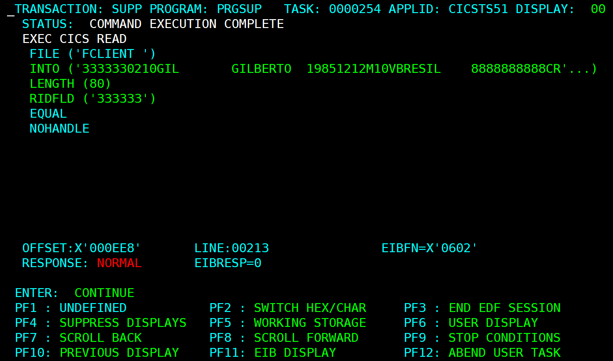

*Point d'arrêt CEDF sur la commande READ FILE avec RIDFLD('333333'). Le client GIL GILBERTO est trouvé (données visibles : 19851212M10VBRESIL 8888888888CR). RESPONSE: NORMAL.*

##### Écran - Client trouvé, demande de confirmation

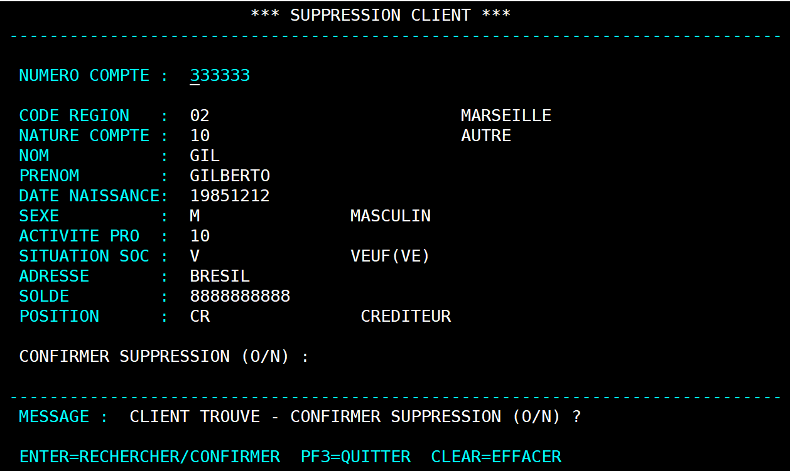

*L'écran affiche les données complètes du client 333333 (GIL GILBERTO, MARSEILLE, VEUF, CREDITEUR). Le message "CLIENT TROUVE - CONFIRMER SUPPRESSION (O/N) ?" invite l'utilisateur à confirmer ou annuler.*

##### CEDF - SEND MAP (affichage pour confirmation)

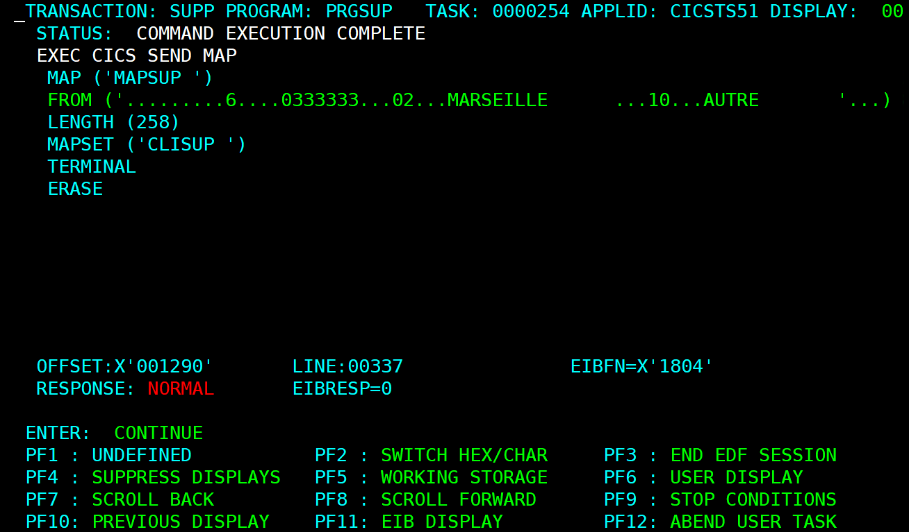

*Point d'arrêt CEDF sur la commande SEND MAP : envoi de l'écran avec les données du client (333333, 02, MARSEILLE...). RESPONSE: NORMAL.*

##### CEDF - DELETE FILE (suppression VSAM)

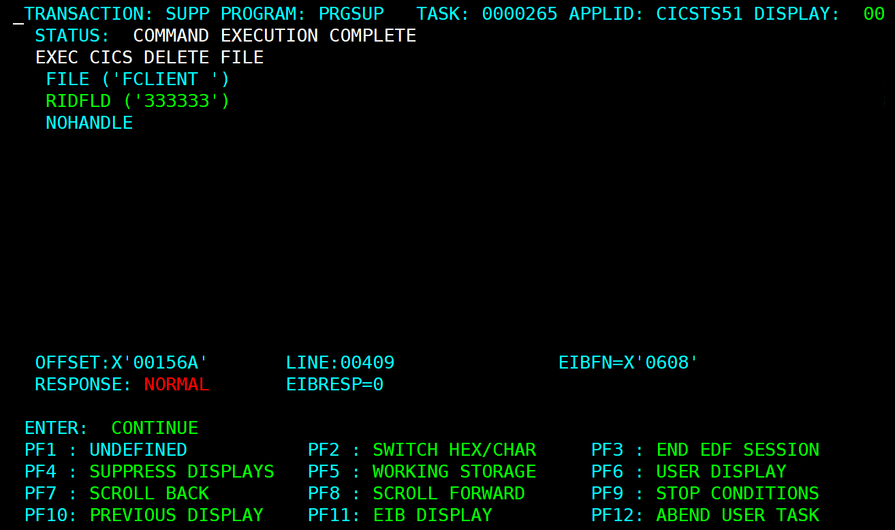

*Point d'arrêt CEDF sur la commande DELETE FILE avec RIDFLD('333333'). **RESPONSE: NORMAL** confirme que l'enregistrement a été supprimé du fichier VSAM.*

##### Écran - Suppression effectuée

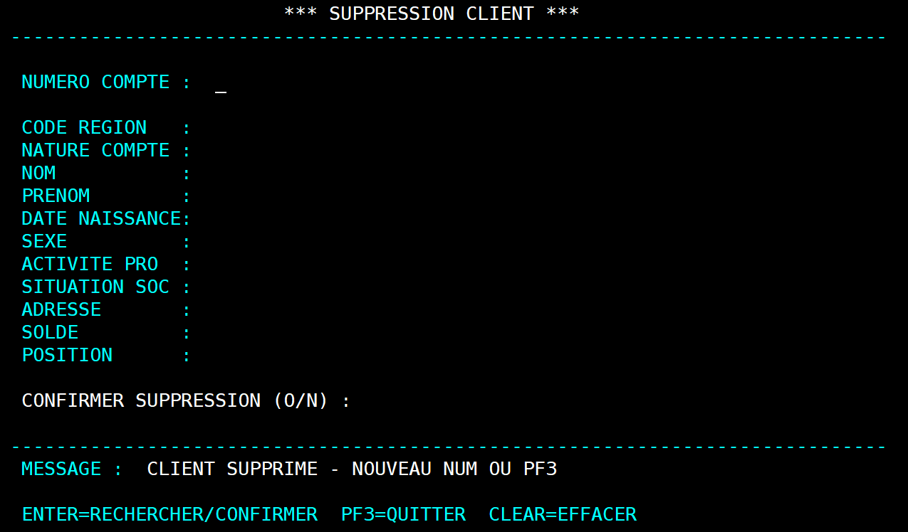

*Message "CLIENT SUPPRIME - NOUVEAU NUM OU PF3" confirmant le succès de l'opération. L'écran est réinitialisé pour permettre une nouvelle suppression.*

##### Test d'erreur - Client déjà supprimé

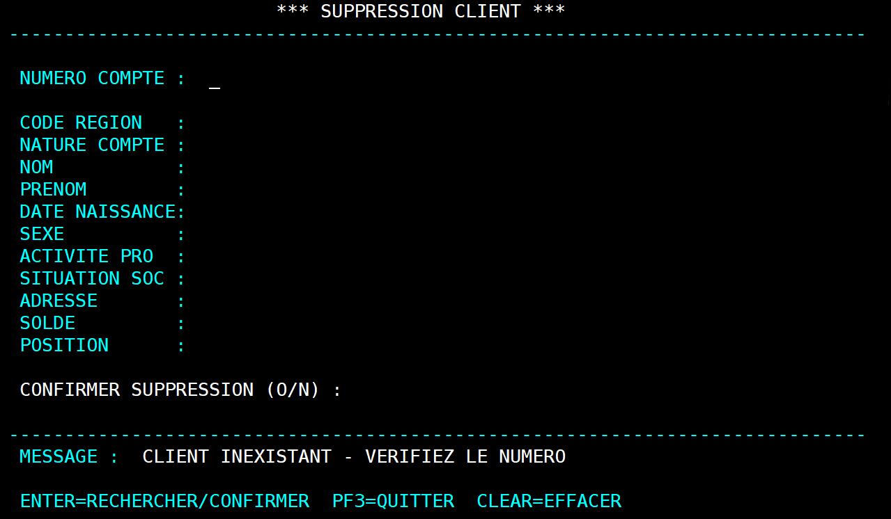

*En tentant de supprimer à nouveau le client 333333, le programme affiche "CLIENT INEXISTANT - VERIFIEZ LE NUMERO" car l'enregistrement n'existe plus.*

##### Vérification avec AFFI

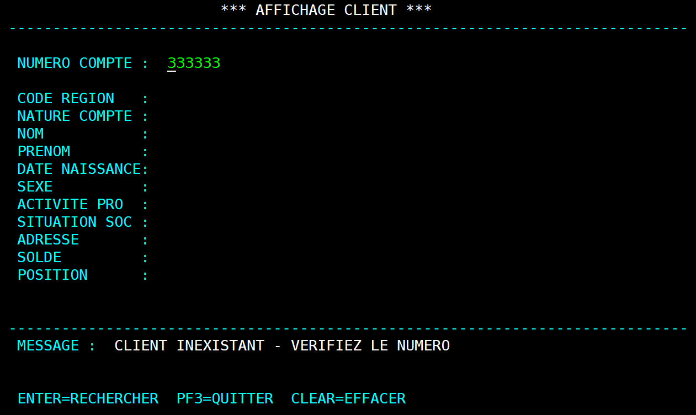

*Vérification avec la transaction AFFI : le client 333333 n'existe plus. Le message "CLIENT INEXISTANT - VERIFIEZ LE NUMERO" confirme que la suppression a bien été effectuée.*

---

## Exercice 15 : Suppression avec lecture préalable

### Énoncé

Reprendre cette opération de suppression en la précédant par une opération de lecture. Définir une transaction indépendante de la précédente.

### Mon travail

> **Exercice déjà couvert** : Le programme PRGSUP (exercice 13) implémente déjà la suppression avec lecture préalable. J'ai anticipé cette fonctionnalité en développant directement la version complète.

#### Pourquoi avoir anticipé ?

Le programme PRGSUP réalise exactement ce que demande l'exercice 15 :
1. **READ** pour vérifier l'existence et récupérer les données
2. **Affichage** des données du client pour confirmation visuelle
3. **Confirmation O/N** avant suppression
4. **DELETE** uniquement si l'utilisateur confirme

### Comparaison : Ce qui était prévu vs ce qui a été fait

| Élément | Prévu (Ex 13 + Ex 15) | Réalisé |
|---------|----------------------|---------|
| Ex 13 | DELETE direct (sans affichage) | DELETE avec READ + affichage |
| Ex 15 | READ + DELETE (avec affichage) | Déjà couvert par Ex 13 |
| Transaction SUPP | Programme simple | Programme complet |
| Transaction SULE | Programme avec lecture | Non nécessaire (alias possible) |

### Résolution

**Option 1 : Ne rien faire** - L'exercice est déjà couvert par PRGSUP.

**Option 2 : Créer une transaction alias** (optionnel)

Si on souhaite avoir les deux codes transaction (SUPP et SULE) pointant vers le même programme :

```
CEDA DEFINE TRANSACTION(SULE) GROUP(CLIGROUP) PROGRAM(PRGSUP)
CEDA INSTALL TRANSACTION(SULE) GROUP(CLIGROUP)
```

Cela permet d'utiliser indifféremment `SUPP` ou `SULE` pour accéder à la suppression avec confirmation visuelle.

### Conclusion

En implémentant directement la version sécurisée (avec lecture préalable) dans l'exercice 13, j'ai :
- Appliqué les bonnes pratiques de développement mainframe
- Évité la création d'un programme moins sécurisé (DELETE sans vérification)
- Couvert les objectifs des exercices 13 et 15 en une seule implémentation

> **Note** : Toutes les captures d'écran nécessaires sont présentées dans les exercices 13 et 14.

---

[< Partie 2b : Mise à jour](04-partie-2b-maj.md) | [Retour au sommaire](00-introduction.md) | [Partie 3 : Avancées >](06-partie-3-avancees.md)
