# Partie 3 : Opérations Avancées

[< Partie 2c : Suppression](05-partie-2c-suppression.md) | [Retour au sommaire](00-introduction.md) | [Conclusion >](07-conclusion.md)

---

Cette section couvre les exercices 16 à 19 : création de clients génériques, navigation VSAM avec STARTBR/READNEXT/ENDBR, et statistiques par région avec AIX/PATH.

## Au-delà du CRUD : La navigation séquentielle

Dans les parties précédentes, nous avons maîtrisé les quatre opérations CRUD sur un enregistrement à la fois :
- **Partie 1** : READ (lecture par clé exacte)
- **Partie 2a** : WRITE (ajout)
- **Partie 2b** : REWRITE (mise à jour)
- **Partie 2c** : DELETE (suppression)

Cette partie introduit une nouvelle dimension : **le parcours séquentiel** d'un fichier VSAM. Au lieu de travailler sur un enregistrement spécifique, on parcourt plusieurs enregistrements correspondant à un critère.

## Commandes CICS pour la navigation VSAM

| Commande | Usage | Comparaison avec READ |
|----------|-------|----------------------|
| **STARTBR** | Positionner le curseur de browse | Comme READ mais sans récupérer les données |
| **READNEXT** | Lire l'enregistrement suivant | Avance automatiquement dans le fichier |
| **READPREV** | Lire l'enregistrement précédent | Navigation arrière |
| **ENDBR** | Terminer le parcours | Libère les ressources (obligatoire !) |

**Cycle de vie d'un browse :**
```
STARTBR → READNEXT → READNEXT → ... → ENDBR
    ↑                                    ↑
    Positionnement              Libération ressources
```

> **Point clé** : Contrairement à READ qui travaille sur un enregistrement unique, le browse permet de traiter **tous les enregistrements** correspondant à un préfixe de clé. C'est indispensable pour des opérations comme "supprimer tous les clients 111xxx" ou "lister tous les clients d'une région".

---

## Exercice 16 : Création de clients génériques

### Énoncé

Sachant que le CODE CLIENT est sur six caractères, créer cinq CLIENT avec une partie de leur code générique commençant par '111...', de même '444...' et '777...'.

### Mon choix de conception

L'énoncé demande de créer manuellement des clients génériques. J'ai fait le choix de **préparer ces données dès le début du projet** pour plusieurs raisons :

| Ce qui était prévu | Ce que j'ai implémenté | Justification |
|--------------------|------------------------|---------------|
| Création manuelle ici | Données pré-chargées (LOADVSAM.jcl) | Gain de temps pour les tests |
| Uniquement 111xxx, 444xxx, 777xxx | Également 222xxx | Plus de variété pour les démonstrations |
| Via ISPF ou transaction | Via JCL initial + AJOU | Traçabilité et reproductibilité |

> **Anticipation** : En préparant les données de test dès la Partie 0, j'ai pu tester immédiatement les transactions AFFI, AJOU, MAJO et SUPP avec des clients "prêts à l'emploi".

### Mon travail

J'ai anticipé cet exercice lors des phases précédentes du projet.

#### Pourquoi des clients génériques ?

Les clients avec des préfixes communs (111xxx, 222xxx, etc.) sont nécessaires pour tester les commandes de navigation VSAM :
- **STARTBR** avec une clé partielle (ex: `111`) se positionne sur le premier client correspondant
- **READNEXT** lit séquentiellement tous les clients `111xxx` jusqu'à rencontrer une clé différente

### Résolution

**Clients pré-chargés via LOADVSAM.jcl (voir Partie 1, Exercice 1) :**

| Numéro | Nom | Région | Position |
|--------|-----|--------|----------|
| 222001 | LEROY Michel | Paris | CR |
| 222002 | ROUX Nathalie | Marseille | DB |
| 222003 | DAVID François | Lyon | CR |
| 222004 | BERTRAND Isabelle | Lille | DB |
| 222005 | MOREL Philippe | Paris | CR |

**Clients créés via AJOU (exercices 7-8) :**

Plusieurs clients 111xxx ont été créés lors des tests de la transaction d'ajout.

**Création supplémentaire (optionnel) :**

Pour créer les clients 444xxx et 777xxx, utiliser la transaction AJOU :

```
AJOU
→ Saisir numéro 444001, remplir les champs, valider
→ Répéter pour 444002, 444003, etc.
```

### Vérification

```
AFFI
→ Saisir 222001 → Client affiché
→ Saisir 111001 → Client affiché (si créé)
```

### Captures d'écran

#### Vérification des clients génériques avec DITTO/ESA

Avant de tester les fonctionnalités de navigation VSAM, on vérifie la présence des clients génériques dans le fichier.

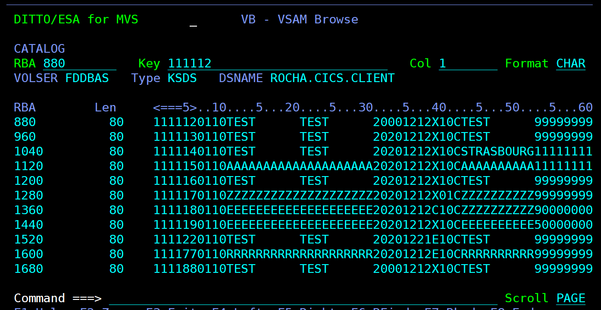

*L'utilitaire DITTO/ESA en mode VSAM Browse montre le contenu du fichier ROCHA.CICS.CLIENT. On voit les clients avec des préfixes génériques (111xxx) créés via la transaction AJOU lors des exercices précédents.*

---

## Exercice 17 : Suppression par code générique (STARTBR)

### Énoncé

En utilisant les commandes adéquates, supprimer les CLIENT dont le code générique est '111...'.

### Mon choix de conception

L'énoncé attendait probablement l'utilisation de la commande `DELETE ... GENERIC KEYLENGTH(...)` native de CICS, où l'utilisateur saisit **la clé ET sa longueur** :

```cobol
*    Solution attendue (DELETE GENERIC natif)
     EXEC CICS DELETE FILE('FCLIENT')
         RIDFLD(WS-REC-KEY) KEYLENGTH(WS-KEY-LEN)
         GENERIC NUMREC(WS-DEL-REC)
     END-EXEC
```

J'ai fait le choix d'une **approche différente** pour améliorer l'ergonomie :

| Approche attendue | Mon approche | Différence |
|-------------------|--------------|------------|
| Saisie clé + longueur | Saisie clé uniquement | Longueur calculée automatiquement |
| DELETE GENERIC natif | STARTBR/READNEXT + DELETE | Plus de contrôle sur le processus |
| Suppression immédiate | Comptage + confirmation | Sécurité des données |

> **Pourquoi ce choix ?** Demander à l'utilisateur de saisir la longueur de la clé est source d'erreurs. En calculant automatiquement la longueur à partir des caractères saisis (espaces ignorés), l'interface est plus intuitive. De plus, le comptage préalable et la confirmation évitent les suppressions accidentelles.

### Mon travail

J'ai implémenté une alternative au DELETE GENERIC natif avec :
- **Calcul automatique de la longueur** : l'utilisateur saisit juste le préfixe
- **Phase de comptage** : affiche le nombre de clients avant suppression
- **Confirmation obligatoire** : l'utilisateur doit valider avec O/N

#### Pourquoi ne pas faire DELETE pendant le browse ?

C'est un point technique crucial. On ne peut **pas** faire `DELETE RIDFLD` pendant un browse actif (STARTBR/READNEXT) car cela provoque un **deadlock** :
- Le browse tient un verrou lecture sur le fichier
- Le DELETE demande un verrou exclusif sur le même enregistrement
- CICS freeze

**Solution adoptée : Collecte puis suppression**

La technique consiste à séparer le browse de la suppression en deux étapes distinctes :

```
ÉTAPE 1 : COLLECTE (pendant le browse)
┌─────────────────────────────────────────────────────────────────┐
│ STARTBR → READNEXT → stocker clé en table → READNEXT → ...     │
│                                                                 │
│ Table WS-CLES :  [111001] [111002] [111003] ...  (max 100)     │
│                                                                 │
│ ENDBR  ← Fermeture OBLIGATOIRE avant les DELETE                │
└─────────────────────────────────────────────────────────────────┘

ÉTAPE 2 : SUPPRESSION (après le browse)
┌─────────────────────────────────────────────────────────────────┐
│ Pour chaque clé dans la table :                                 │
│   DELETE FILE('FCLIENT') RIDFLD(clé)                           │
│                                                                 │
│ Plus de conflit : le browse est fermé, DELETE a le champ libre │
└─────────────────────────────────────────────────────────────────┘
```

> **Limite** : La table est dimensionnée à 100 entrées. Si plus de 100 clients correspondent au préfixe, l'utilisateur doit relancer la transaction pour supprimer le reste.

#### Principe de la navigation VSAM pour suppression générique

```
STARTBR (111000, GTEQ)     READNEXT           READNEXT           READNEXT
        │                      │                  │                  │
        ▼                      ▼                  ▼                  ▼
   ┌─────────┐            ┌─────────┐        ┌─────────┐        ┌─────────┐
   │ 111001  │ ────────►  │ 111002  │ ────►  │ 111003  │ ────►  │ 222001  │
   │ Stocker │            │ Stocker │        │ Stocker │        │ STOP!   │
   │ clé     │            │ clé     │        │ clé     │        │ Clé!=111│
   └─────────┘            └─────────┘        └─────────┘        └─────────┘
        │                      │                  │
        └──────────────────────┴──────────────────┘
                               │
                            ENDBR
                               │
                               ▼
                    DELETE pour chaque clé collectée
```

#### Mode pseudo-conversationnel à 2 phases

```
┌─────────────────────────────────────────────────────────────────┐
│ PHASE 1 : COMPTAGE                                              │
│ ──────────────────                                              │
│ 1. Saisie préfixe (1-5 car) ou clé complète (6 car)            │
│ 2. STARTBR/READNEXT pour compter les clients                   │
│ 3. Affichage : "X client(s) trouvé(s)"                         │
└─────────────────────────────────────────────────────────────────┘
                            │
                            ▼
┌─────────────────────────────────────────────────────────────────┐
│ PHASE 2 : CONFIRMATION ET SUPPRESSION                           │
│ ─────────────────────────────────────                           │
│ 4. L'utilisateur répond O ou N                                  │
│ 5. Si N : Retour phase 1                                        │
│ 6. Si O : Suppression en 2 étapes (évite deadlock)             │
│    a) STARTBR/READNEXT → collecter clés en table (max 100)     │
│    b) ENDBR (fermer browse)                                     │
│    c) Pour chaque clé : DELETE RIDFLD                          │
└─────────────────────────────────────────────────────────────────┘
```

### Résolution

**MAP BMS : CLIDEL.bms**

Le code source est stocké dans `ROCHA.CICS.SOURCE(CLIDEL)`.

**En-tête du MAPSET avec commentaires :**

```
***********************************************************************
*  MAPSET : CLIDEL - Suppression Generique Client
*  Transaction : DELG
*  Fil Rouge CICS - Exercice 17
*
*  PARTICULARITE :
*  ---------------
*  Permet la suppression par prefixe (1 a 5 car) ou cle complete (6 car)
*  - Prefixe : Supprime tous les clients correspondants
*  - Cle complete : Supprime un seul client
*
*  Le champ PREFIXE est en PIC X (pas NUM) pour eviter la
*  justification a droite des valeurs numeriques.
***********************************************************************
CLIDEL   DFHMSD TYPE=&SYSPARM,MODE=INOUT,LANG=COBOL,                   X
               STORAGE=AUTO,CTRL=(FREEKB,FRSET),TIOAPFX=YES
```

**Champs de saisie et d'affichage :**

```
*----------------------------------------------------------------------
* ZONE DE SAISIE - PREFIXE OU CLE COMPLETE
*----------------------------------------------------------------------
PREFIXE  DFHMDF POS=(5,28),LENGTH=6,ATTRB=(UNPROT,IC)
         ^^^^^^^^^^^^^^^^^^^^^^^^^^^^^^^^^^^^^^^^^^^^^
         PIC X (pas NUM) : évite la justification à droite

*----------------------------------------------------------------------
* ZONE D'INFORMATION - NOMBRE DE CLIENTS
*----------------------------------------------------------------------
NBCLI    DFHMDF POS=(8,28),LENGTH=5,ATTRB=(ASKIP,BRT)
         ^^^^^^                      ^^^^^^^^^^^^^^^
         Résultat du comptage        ASKIP,BRT : lecture seule, surbrillance

*----------------------------------------------------------------------
* ZONE DE CONFIRMATION
*----------------------------------------------------------------------
CONFIRM  DFHMDF POS=(10,28),LENGTH=1,ATTRB=UNPROT
         ^^^^^^^                     ^^^^^^^^^^^
         O ou N                      Saisissable
```

**Programme : PRGDELG.cbl** - Extraits clés

**Table de stockage des clés (Working-Storage) :**

```cobol
      *-----------------------------------------------------------------
      * TABLE DES CLES A SUPPRIMER (max 100 clients)
      *-----------------------------------------------------------------
       01  WS-TABLE-CLES.
           05 WS-NB-CLES          PIC 9(03) VALUE 0.
           05 WS-CLES OCCURS 100 TIMES.
              10 WS-CLE-SUP       PIC X(06).
       01  WS-IDX-SUP             PIC 9(03) VALUE 0.
```

**Paragraphe de parcours pour comptage :**

```cobol
       3100-PARCOURIR-FICHIER.
      *-----------------------------------------------------------------
      * Parcours du fichier pour compter les clients correspondants
      *-----------------------------------------------------------------
           MOVE 0 TO WS-COMPTEUR
           MOVE 'N' TO WS-FIN-BROWSE

      *    Construction de la clé de début (préfixe)
           MOVE SPACES TO WS-CLE-DEBUT
           MOVE WS-PREFIXE(1:WS-LONGUEUR) TO WS-CLE-DEBUT

      *    Positionnement sur le premier client >= préfixe
           EXEC CICS STARTBR
               FILE('FCLIENT')
               RIDFLD(WS-CLE-DEBUT)
               GTEQ
               RESP(WS-RESP)
           END-EXEC

      *    Boucle de lecture
           PERFORM UNTIL FIN-BROWSE
               EXEC CICS READNEXT
                   FILE('FCLIENT')
                   INTO(ENR-CLIENT)
                   RIDFLD(WS-CLE-COURANTE)
                   RESP(WS-RESP)
               END-EXEC

               EVALUATE TRUE
                   WHEN WS-RESP = DFHRESP(ENDFILE)
                       MOVE 'O' TO WS-FIN-BROWSE
                   WHEN WS-CLE-COURANTE(1:WS-LONGUEUR) NOT =
                       WS-PREFIXE(1:WS-LONGUEUR)
      *                Clé ne correspond plus au préfixe
                       MOVE 'O' TO WS-FIN-BROWSE
                   WHEN OTHER
      *                Client correspondant trouvé
                       ADD 1 TO WS-COMPTEUR
               END-EVALUATE
           END-PERFORM

      *    Fermeture du browse
           EXEC CICS ENDBR FILE('FCLIENT') END-EXEC.
```

**Paragraphe de suppression en 2 étapes :**

```cobol
       4100-SUPPRIMER-CLIENTS.
      *-----------------------------------------------------------------
      * Suppression en 2 étapes pour éviter le deadlock
      * Étape 1 : Collecter les clés pendant le browse
      * Étape 2 : Supprimer après ENDBR
      *-----------------------------------------------------------------
           MOVE 0 TO WS-NB-CLES

           EXEC CICS STARTBR
               FILE('FCLIENT')
               RIDFLD(WS-CLE-DEBUT)
               GTEQ
               RESP(WS-RESP)
           END-EXEC

      *    ETAPE 1 : Collecter les clés (sans DELETE)
           PERFORM UNTIL FIN-BROWSE
               EXEC CICS READNEXT ... END-EXEC

               EVALUATE TRUE
                   WHEN WS-RESP = DFHRESP(ENDFILE)
                       MOVE 'O' TO WS-FIN-BROWSE
                   WHEN WS-CLE-COURANTE(1:WS-LONGUEUR) NOT =
                       WS-PREFIXE(1:WS-LONGUEUR)
                       MOVE 'O' TO WS-FIN-BROWSE
                   WHEN WS-NB-CLES >= 100
      *                Table pleine
                       MOVE 'O' TO WS-FIN-BROWSE
                   WHEN OTHER
      *                Stocker la clé dans la table
                       ADD 1 TO WS-NB-CLES
                       MOVE WS-CLE-COURANTE TO WS-CLE-SUP(WS-NB-CLES)
               END-EVALUATE
           END-PERFORM

      *    Fermer le browse AVANT les suppressions
           EXEC CICS ENDBR FILE('FCLIENT') END-EXEC

      *    ETAPE 2 : Supprimer chaque clé collectée
           PERFORM VARYING WS-IDX-SUP FROM 1 BY 1
               UNTIL WS-IDX-SUP > WS-NB-CLES
               MOVE WS-CLE-SUP(WS-IDX-SUP) TO WS-CLE-COURANTE
               EXEC CICS DELETE
                   FILE('FCLIENT')
                   RIDFLD(WS-CLE-COURANTE)
                   RESP(WS-RESP)
               END-EXEC
               IF WS-RESP = DFHRESP(NORMAL)
                   ADD 1 TO WS-COMPTEUR-SUP
               END-IF
           END-PERFORM.
```

**Définition CICS :**

```
CEDA DEFINE MAPSET(CLIDEL) GROUP(CLIGROUP)
CEDA INSTALL MAPSET(CLIDEL)

CEDA DEFINE PROGRAM(PRGDELG) GROUP(CLIGROUP) LANGUAGE(COBOL)
CEDA INSTALL PROGRAM(PRGDELG)

CEDA DEFINE TRANSACTION(DELG) GROUP(CLIGROUP) PROGRAM(PRGDELG)
CEDA INSTALL TRANSACTION(DELG)
```

> **Note** : L'installation individuelle de chaque ressource permet de vérifier leur bon fonctionnement au fur et à mesure. On peut ensuite utiliser `CEDA DISPLAY GROUP(CLIGROUP)` pour visualiser l'ensemble des ressources du groupe.

### Points importants

1. **Champ PREFIXE en PIC X** : Défini sans attribut NUM pour éviter la justification à droite. Ainsi `1` reste `1_____` et non `_____1`.

2. **Table limitée à 100 clés** : Si plus de 100 clients correspondent, l'utilisateur doit relancer la transaction pour supprimer le reste.

3. **GTEQ** : Greater Than or Equal. Le STARTBR se positionne sur le premier enregistrement dont la clé est >= au préfixe.

### Difficultés rencontrées et solutions

#### Problème 1 : Deadlock lors de la suppression pendant le browse

**Symptôme** : Le programme se figeait (freeze CICS) lors de l'exécution du DELETE pendant le parcours STARTBR/READNEXT.

**Cause** : Le browse tient un verrou de lecture sur le fichier. La commande DELETE demande un verrou exclusif sur le même enregistrement. CICS détecte un deadlock et freeze la transaction.

**Solution** : Implémenter une suppression en **deux phases** :

```cobol
*    ETAPE 1 : Collecter les clés (pendant le browse)
     PERFORM UNTIL FIN-BROWSE
         EXEC CICS READNEXT ... END-EXEC
         ADD 1 TO WS-NB-CLES
         MOVE WS-CLE-COURANTE TO WS-CLE-SUP(WS-NB-CLES)
     END-PERFORM

*    Fermer le browse AVANT les suppressions
     EXEC CICS ENDBR FILE('FCLIENT') END-EXEC

*    ETAPE 2 : Supprimer chaque clé collectée
     PERFORM VARYING WS-IDX-SUP FROM 1 BY 1
         UNTIL WS-IDX-SUP > WS-NB-CLES
         EXEC CICS DELETE FILE('FCLIENT') RIDFLD(...) END-EXEC
     END-PERFORM
```

#### Problème 2 : Logique de browse incorrecte et position du curseur

**Symptôme** : Le programme comptait des enregistrements qui ne correspondaient pas au préfixe, ou le curseur ne se positionnait pas correctement après une recherche.

**Cause** : La condition d'arrêt du browse comparait mal les préfixes, et le SEND MAP ne repositionnait pas le curseur sur le champ de saisie.

**Solution** : Corriger la comparaison avec une référence modifiée et ajouter le positionnement curseur :

```cobol
*    Comparaison correcte avec référence modifiée
     IF WS-CLE-COURANTE(1:WS-LONGUEUR) NOT =
        WS-PREFIXE(1:WS-LONGUEUR)
         MOVE 'O' TO WS-FIN-BROWSE
     END-IF
```

### Captures d'écran

#### Résultats des compilations

##### Assemblage BMS CLIDEL

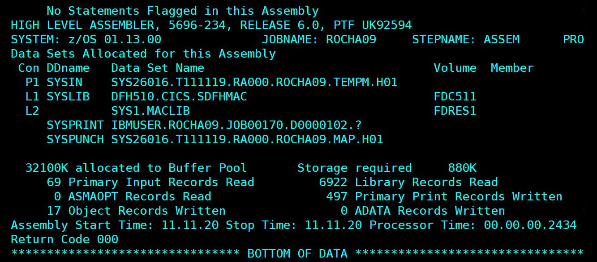

*Le job ROCHA09 (assemblage BMS) retourne Return Code 000. On note 69 Primary Input Records Read et 17 Object Records Written, confirmant la génération correcte du mapset CLIDEL (plus léger que CLISUP car moins de champs).*

##### Compilation du programme PRGDELG

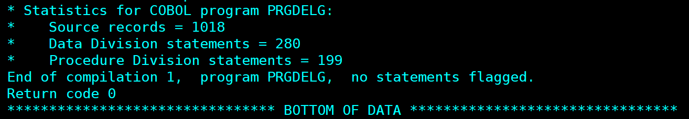

*Statistiques de compilation du programme PRGDELG : 1018 enregistrements sources, 280 instructions DATA DIVISION, 199 instructions PROCEDURE DIVISION. Return code 0 confirme la compilation réussie.*

#### Définition des ressources CICS pour DELG

La transaction de suppression générique nécessite trois ressources : MAPSET, PROGRAM et TRANSACTION.

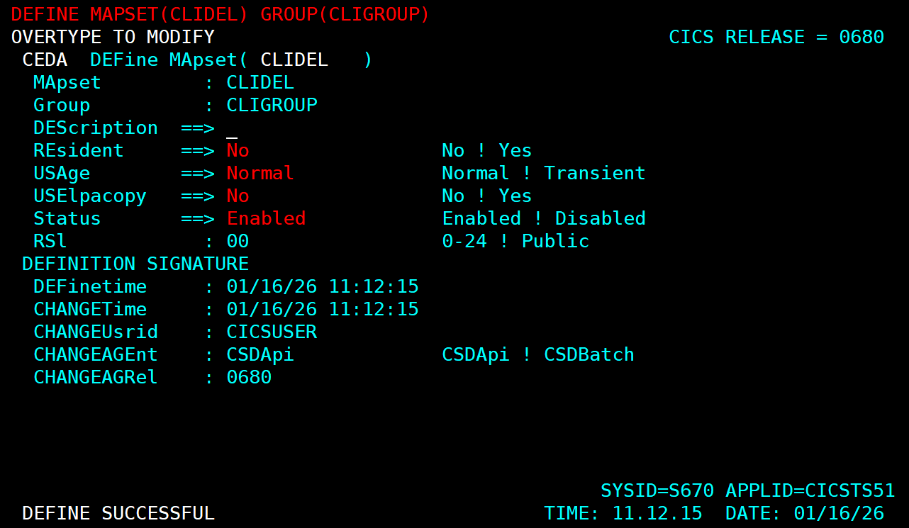

*La commande CEDA DEFINE MAPSET(CLIDEL) GROUP(CLIGROUP) crée la définition du mapset de suppression générique. Le message "DEFINE SUCCESSFUL" confirme la création.*

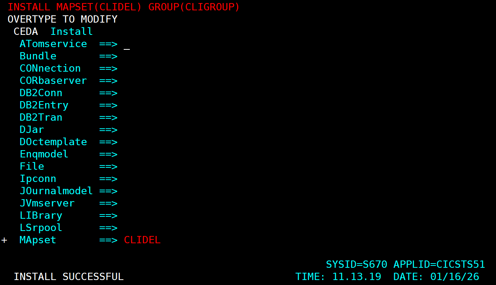

*La commande CEDA INSTALL MAPSET(CLIDEL) charge le mapset en mémoire CICS.*


*La commande CEDA DEFINE PROGRAM(PRGDELG) GROUP(CLIGROUP) LANGUAGE(COBOL) crée la définition du programme de suppression générique.*

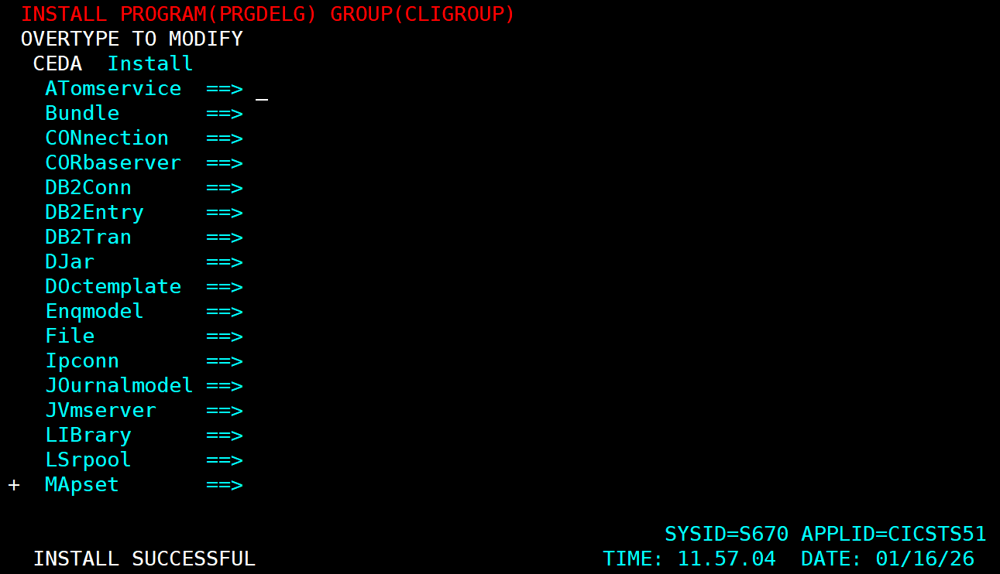

*La commande CEDA INSTALL PROGRAM(PRGDELG) charge le programme en mémoire.*

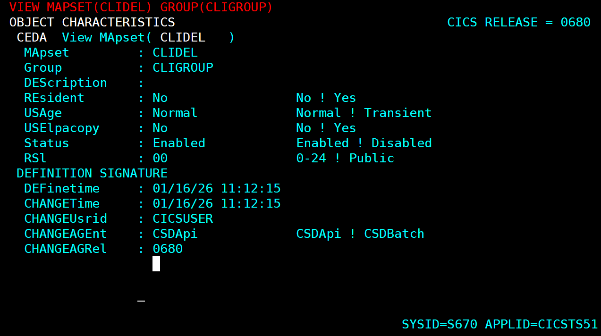

*CEDA VIEW permet de vérifier la définition du mapset CLIDEL.*


*La commande CEDA DEFINE TRANSACTION(DELG) GROUP(CLIGROUP) PROGRAM(PRGDELG) associe le code "DELG" au programme PRGDELG.*

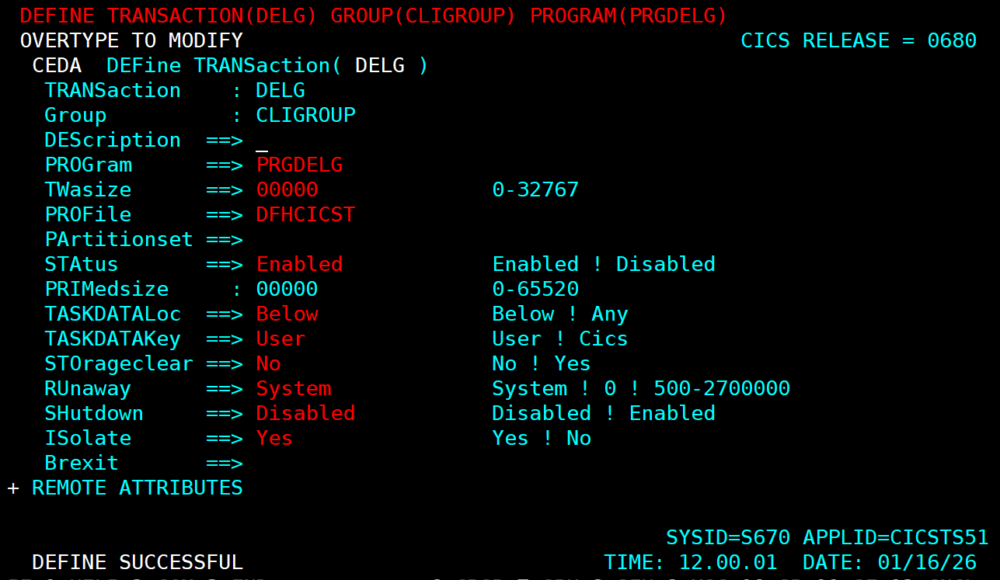

*La commande CEDA INSTALL TRANSACTION(DELG) rend la transaction accessible aux utilisateurs.*

#### Vérification des ressources du groupe

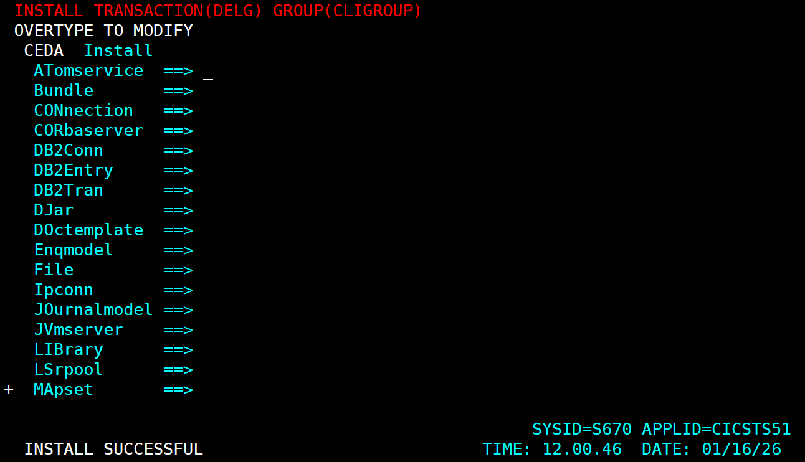

*CEDA DISPLAY GROUP(CLIGROUP) affiche toutes les ressources définies dans le groupe.*

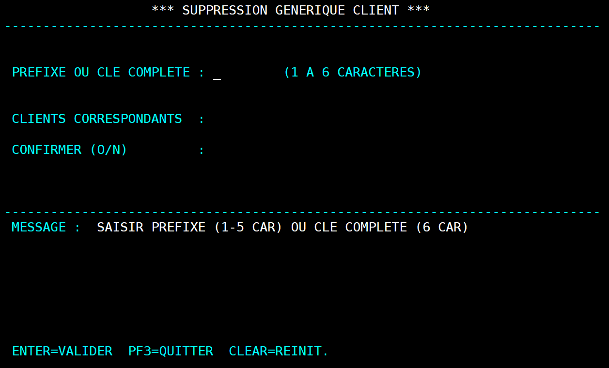

*Suite de la liste des ressources du groupe CLIGROUP.*

#### Test fonctionnel - Phase 1 : Comptage

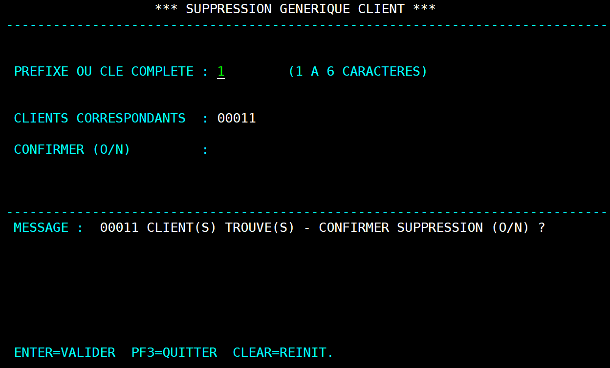

*L'utilisateur saisit le préfixe "1" et appuie sur ENTER. Le programme parcourt le fichier VSAM avec STARTBR/READNEXT et compte 11 clients correspondants (tous ceux dont le numéro commence par "1").*

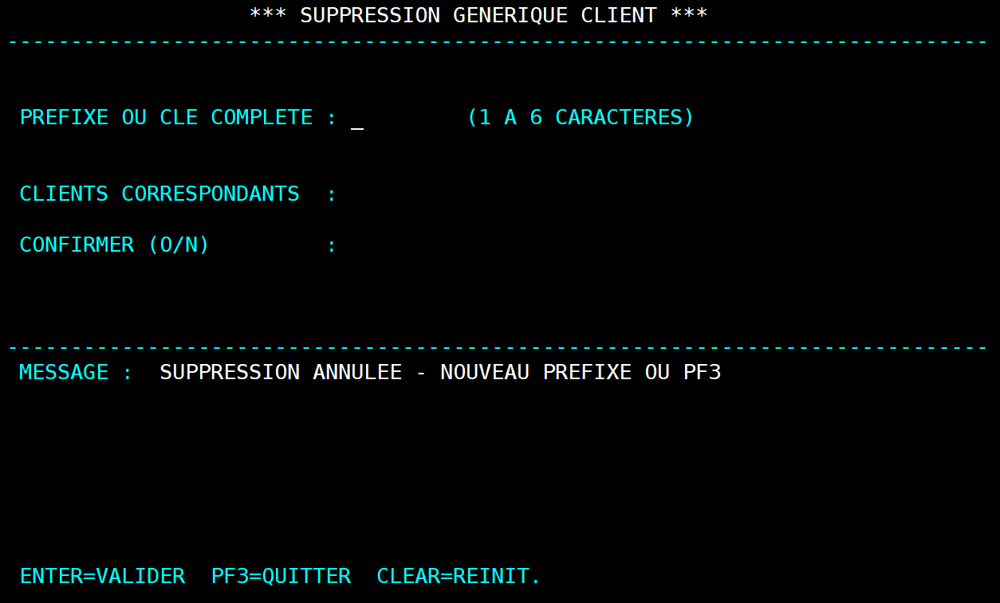

*L'utilisateur a répondu "N" à la confirmation. Le message "NOUVEAU PREFIXE OU PF3" indique que la suppression est annulée et qu'on peut saisir un nouveau préfixe.*

#### Test fonctionnel - Suppression d'un client unique

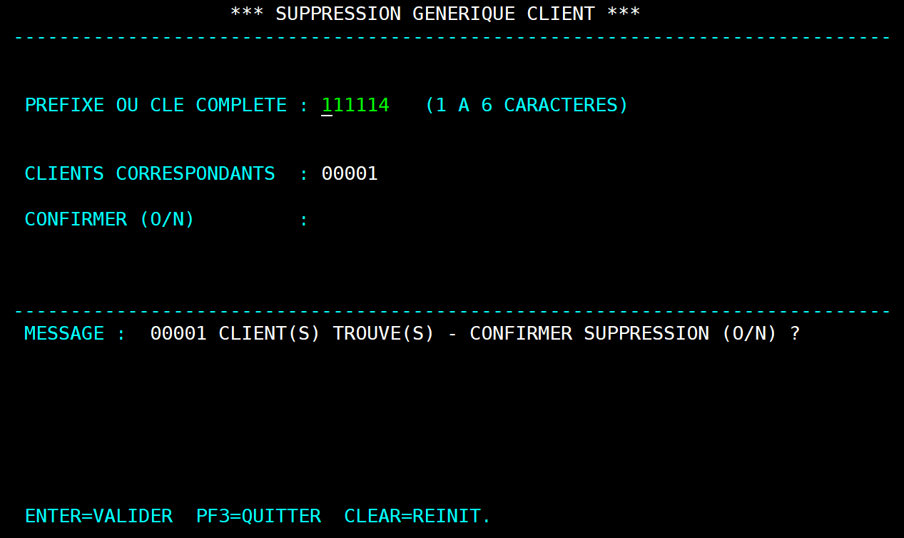

*Avec le préfixe "111114" (6 caractères = clé complète), seul 1 client correspond.*

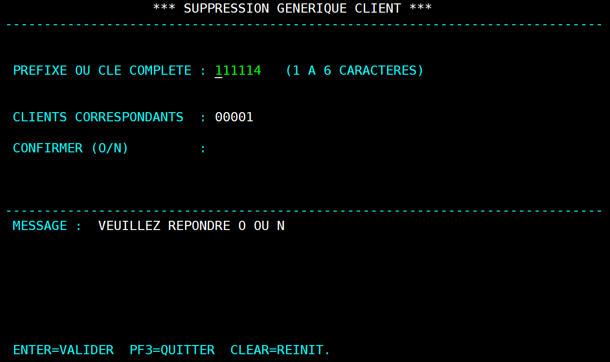

*Le programme demande une confirmation explicite. Si l'utilisateur appuie sur ENTER sans répondre, le message "VEUILLEZ REPONDRE O OU N" s'affiche.*

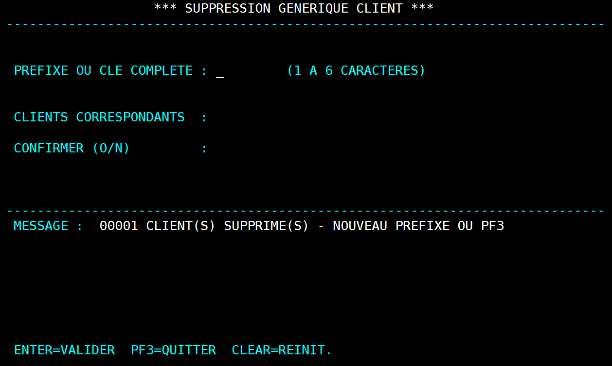

*Après confirmation "O", le client 111114 est supprimé. Le message "00001 CLIENT(S) SUPPRIME(S)" confirme l'opération.*

#### Test fonctionnel - Suppression multiple

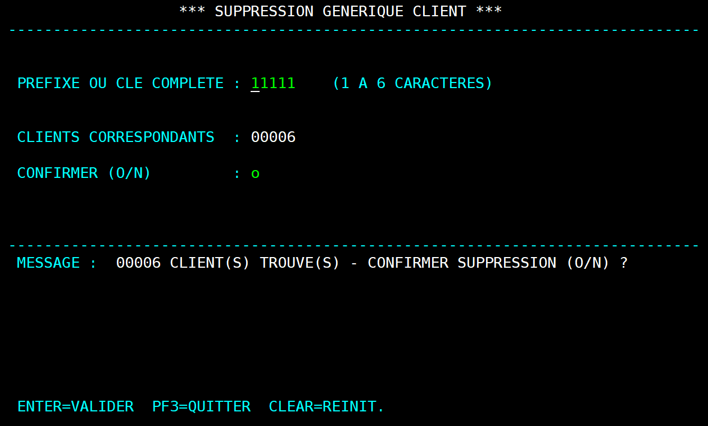

*Avec le préfixe "11111" (5 caractères), 6 clients correspondent. L'utilisateur répond "O" pour confirmer la suppression.*

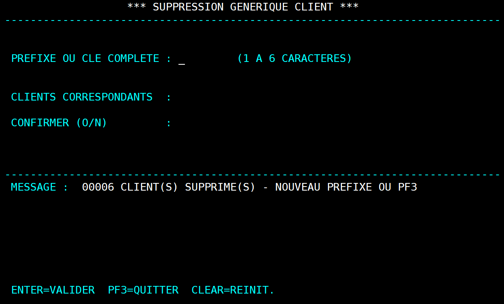

*Les 6 clients ont été supprimés. Le programme a collecté les clés dans une table, fermé le browse avec ENDBR, puis exécuté DELETE pour chaque clé (évitant ainsi le deadlock).*

#### Vérification après suppressions

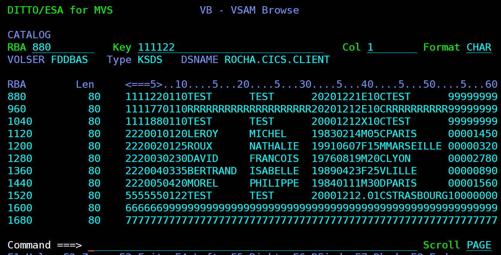

*Après les suppressions, DITTO/ESA montre que les clients 11111x ont bien été supprimés du fichier VSAM. Seuls les autres clients (000001, 222xxx, etc.) restent.*

---

## Exercice 18 : Liste générique paginée (READNEXT, ENDBR)

### Énoncé

Faire une lecture successive des CLIENT dont le code générique est '222...' en utilisant la commande READNEXT et ENDBR.

### Mon choix de conception

L'énoncé attendait probablement une navigation **un enregistrement à la fois** avec STARTBR/READNEXT :

```
┌─────────────────────────────────────────────────────────────────┐
│ APPROCHE ATTENDUE : Navigation séquentielle (1 par 1)           │
│ ─────────────────────────────────────────────                   │
│                                                                 │
│ ENTER → Affiche client 222001                                   │
│ ENTER → Affiche client 222002                                   │
│ ENTER → Affiche client 222003                                   │
│ ...                                                             │
│ ENTER → "FIN DE FICHIER"                                        │
│                                                                 │
│ Mode pseudo-conversationnel simple avec COMMAREA pour garder    │
│ la position courante dans le browse.                            │
└─────────────────────────────────────────────────────────────────┘
```

J'ai fait le choix d'une **approche différente** avec affichage de plusieurs clients à la fois :

| Approche attendue | Mon approche | Différence |
|-------------------|--------------|------------|
| 1 client par écran | 10 clients par écran | Vue d'ensemble |
| ENTER = suivant | ENTER = nouvelle recherche | Interaction différente |
| Navigation linéaire | PF7/PF8 (avant/arrière) | Navigation bidirectionnelle |
| Pas de compteur | Total clients + page X/Y | Information contextuelle |

> **Pourquoi ce choix ?** Afficher un seul client par écran oblige à faire beaucoup d'ENTER pour parcourir une liste. Avec 10 clients par page et la navigation PF7/PF8, l'utilisateur a une vue d'ensemble et peut revenir en arrière, ce qui est plus ergonomique pour une liste de résultats.

### Mon travail

J'ai implémenté une **liste paginée complète** au lieu d'un simple READ GENERIC :
- Affichage de **tous les clients** correspondant au préfixe
- **10 clients par page** (limite d'un écran 3270)
- Navigation **PF7** (précédent) / **PF8** (suivant)
- Compteur total et indicateur de page (X/Y)

#### Algorithme de pagination

```
┌─────────────────────────────────────────────────────────────────┐
│ ENTER : Nouvelle recherche                                      │
│ ───────────────────────────                                     │
│ 1. Compter tous les clients correspondants                      │
│ 2. Calculer le nombre de pages (total / 10)                     │
│ 3. Afficher la première page                                    │
└─────────────────────────────────────────────────────────────────┘
                            │
                            ▼
┌─────────────────────────────────────────────────────────────────┐
│ PF8 : Page suivante                                             │
│ ───────────────────                                             │
│ 1. STARTBR au début du préfixe                                  │
│ 2. READNEXT pour sauter (page - 1) × 10 enregistrements         │
│ 3. READNEXT × 10 pour remplir l'écran                          │
│ 4. ENDBR                                                        │
└─────────────────────────────────────────────────────────────────┘
```

### Résolution

**MAP BMS : CLILIST.bms**

Le code source est stocké dans `ROCHA.CICS.SOURCE(CLILIST)`.

**En-tête du MAPSET :**

```
***********************************************************************
*  MAPSET : CLILIST - Liste Generique des Clients
*  Transaction : LGEN
*  Fil Rouge CICS - Exercice 18
***********************************************************************
CLILIST  DFHMSD TYPE=&SYSPARM,MODE=INOUT,LANG=COBOL,                   X
               STORAGE=AUTO,CTRL=(FREEKB,FRSET),TIOAPFX=YES
```

**Structure en 10 lignes répétitives :**

```
*----------------------------------------------------------------------
* EN-TETE DES COLONNES
*----------------------------------------------------------------------
         DFHMDF POS=(5,1),LENGTH=50,ATTRB=(ASKIP,BRT),                  X
               INITIAL='NUMCPT RG NOM        PRENOM     SOLDE      POS'

*----------------------------------------------------------------------
* LIGNE 1 (lignes 2-10 suivent le même pattern)
*----------------------------------------------------------------------
L1NUM    DFHMDF POS=(7,1),LENGTH=6,ATTRB=ASKIP     <- Numéro client
L1REG    DFHMDF POS=(7,8),LENGTH=2,ATTRB=ASKIP     <- Code région
L1NOM    DFHMDF POS=(7,11),LENGTH=10,ATTRB=ASKIP   <- Nom
L1PRE    DFHMDF POS=(7,22),LENGTH=10,ATTRB=ASKIP   <- Prénom
L1SOL    DFHMDF POS=(7,33),LENGTH=10,ATTRB=ASKIP   <- Solde
L1POS    DFHMDF POS=(7,44),LENGTH=2,ATTRB=ASKIP    <- Position (DB/CR)
...
L10NUM   DFHMDF POS=(16,1),LENGTH=6,ATTRB=ASKIP    <- Ligne 10
```

**Zone de pagination :**

```
*----------------------------------------------------------------------
* ZONE INFORMATIONS PAGINATION
*----------------------------------------------------------------------
         DFHMDF POS=(18,2),LENGTH=6,ATTRB=ASKIP,INITIAL='PAGE :'
PAGNUM   DFHMDF POS=(18,9),LENGTH=3,ATTRB=(ASKIP,BRT)   <- Page courante
         DFHMDF POS=(18,13),LENGTH=1,ATTRB=ASKIP,INITIAL='/'
PAGTOT   DFHMDF POS=(18,15),LENGTH=3,ATTRB=(ASKIP,BRT)  <- Total pages
         DFHMDF POS=(18,22),LENGTH=7,ATTRB=ASKIP,INITIAL='TOTAL :'
CLITOT   DFHMDF POS=(18,30),LENGTH=5,ATTRB=(ASKIP,BRT)  <- Total clients
```

> **Conception** : Cette MAP utilise 60 champs (10 lignes × 6 colonnes) avec des noms courts (L1NUM, L2NUM...) pour respecter les limites de l'assembleur BMS. Les touches PF7/PF8 permettent la navigation entre les pages.

**Programme : PRGLGEN.cbl** - Extraits clés

**Structure COMMAREA (contexte de navigation) :**

```cobol
      *-----------------------------------------------------------------
      * ZONE DE COMMUNICATION (COMMAREA)
      * Sauvegarde le contexte de pagination entre passages
      *-----------------------------------------------------------------
       01  WS-COMMAREA.
           05 WS-PREFIXE-SAVED   PIC X(06) VALUE SPACES.
           05 WS-LONGUEUR-SAVED  PIC 9(01) VALUE 0.
           05 WS-DERNIERE-CLE    PIC X(06) VALUE SPACES.
           05 WS-PAGE-COURANTE   PIC 9(03) VALUE 0.
           05 WS-TOTAL-CLIENTS   PIC 9(05) VALUE 0.
           05 WS-TOTAL-PAGES     PIC 9(03) VALUE 0.
           05 WS-FIN-FICHIER     PIC X(01) VALUE 'N'.
```

**Logique de pagination (saut d'enregistrements) :**

```cobol
       6000-AFFICHER-PAGE.
      *-----------------------------------------------------------------
      * Affiche la page courante (10 clients)
      * Technique : sauter les enregistrements des pages précédentes
      *-----------------------------------------------------------------
      *    Sauter les enregistrements des pages precedentes
           COMPUTE WS-COMPTEUR = (WS-PAGE-COURANTE - 1) * 10
           PERFORM WS-COMPTEUR TIMES
               EXEC CICS READNEXT
                   FILE('FCLIENT')
                   INTO(ENR-CLIENT)
                   RIDFLD(WS-CLE-COURANTE)
                   RESP(WS-RESP)
               END-EXEC
           END-PERFORM

      *    Lire les 10 clients de cette page
           PERFORM UNTIL FIN-BROWSE OR WS-LIGNE-COURANTE >= 10
               EXEC CICS READNEXT ... END-EXEC
               ADD 1 TO WS-LIGNE-COURANTE
               MOVE CLI-NUMCPT TO WS-CLI-NUM(WS-LIGNE-COURANTE)
               ...
           END-PERFORM
```

> **Technique de pagination** : Pour afficher la page N, on effectue `(N-1) × 10` READNEXT "à vide" pour sauter les enregistrements des pages précédentes, puis 10 READNEXT pour remplir l'écran.

**Définition CICS :**

```
CEDA DEFINE MAPSET(CLILIST) GROUP(CLIGROUP)
CEDA INSTALL MAPSET(CLILIST)

CEDA DEFINE PROGRAM(PRGLGEN) GROUP(CLIGROUP) LANGUAGE(COBOL)
CEDA INSTALL PROGRAM(PRGLGEN)

CEDA DEFINE TRANSACTION(LGEN) GROUP(CLIGROUP) PROGRAM(PRGLGEN)
CEDA INSTALL TRANSACTION(LGEN)
```

> **Vérification** : Utiliser `CEDA DISPLAY GROUP(CLIGROUP)` pour voir toutes les ressources installées du groupe.

### Points importants

1. **COMMAREA pour pagination** : Sauvegarde le préfixe, la page courante, et le total pour permettre la navigation entre les pages.

2. **Calcul du nombre de pages** : `TOTAL-PAGES = (TOTAL-CLIENTS + 9) / 10` (arrondi supérieur)

3. **Saut d'enregistrements** : Pour afficher la page N, on fait `(N-1) × 10` READNEXT "à vide" avant de commencer à afficher.

### Difficultés rencontrées et solutions

| Problème | Symptôme | Cause | Solution |
|----------|----------|-------|----------|
| **Assemblage BMS** | Erreurs cryptiques à l'assemblage | 60 champs avec noms longs dépassant les limites | Noms courts (L1NUM, L2NUM...) |
| **Format JCL** | Jobs ASMLIST/CMPLGEN échouaient | Paramètres mal alignés | Respecter colonnes 1-71 |
| **COMMAREA non réinitialisée** | PF7/PF8 utilisait l'ancienne recherche | Pas de reset si aucun client | `INITIALIZE WS-COMMAREA` |
| **PERFORM sans THRU** | Double affichage de messages | GO TO sortait du PERFORM | Ajouter `THRU paragraphe-FIN` |
| **Curseur mal positionné** | Curseur sur dernier champ après recherche | SEND MAP sans CURSOR | Ajouter `FREEKB CURSOR` |

**Correction COMMAREA (recherche sans résultat) :**

```cobol
           IF WS-TOTAL-CLIENTS = 0
      *        Reinitialiser la COMMAREA AVANT le SEND MAP
               MOVE SPACES TO WS-PREFIXE-SAVED
               MOVE 0 TO WS-LONGUEUR-SAVED
               MOVE SPACES TO WS-DERNIERE-CLE
               MOVE 0 TO WS-PAGE-COURANTE
               MOVE 0 TO WS-TOTAL-PAGES
               MOVE 'N' TO WS-FIN-FICHIER
               ...
           END-IF
```

### Captures d'écran

#### Définition des ressources CICS pour LGEN

La transaction de liste générique nécessite trois ressources : MAPSET, PROGRAM et TRANSACTION.

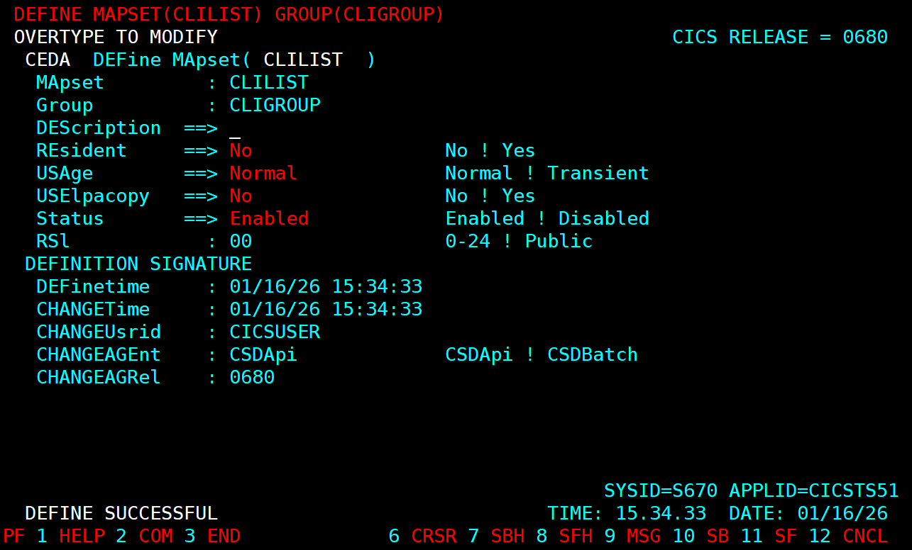

*La commande CEDA DEFINE MAPSET(CLILIST) GROUP(CLIGROUP) crée la définition du mapset de liste paginée. Le message "DEFINE SUCCESSFUL" confirme la création.*

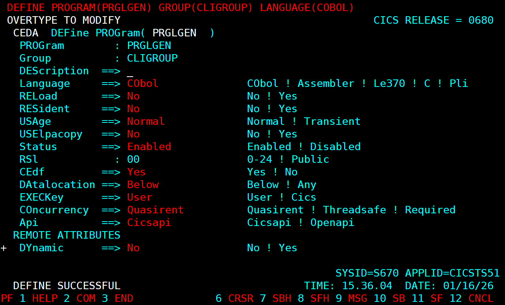

*La commande CEDA DEFINE PROGRAM(PRGLGEN) GROUP(CLIGROUP) LANGUAGE(COBOL) crée la définition du programme de liste générique.*

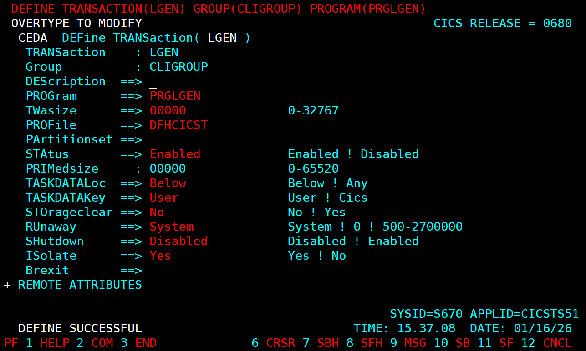

*La commande CEDA DEFINE TRANSACTION(LGEN) GROUP(CLIGROUP) PROGRAM(PRGLGEN) associe le code "LGEN" au programme PRGLGEN.*

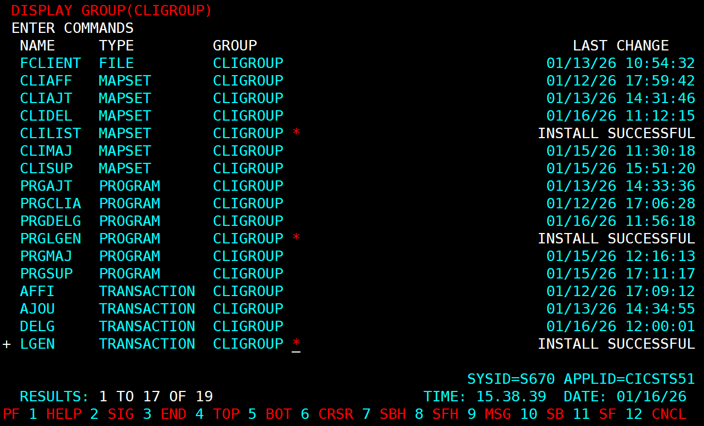

*Après installation du groupe, CEDA DISPLAY montre les ressources CLILIST, PRGLGEN et LGEN installées.*

#### Test fonctionnel - Liste avec peu de résultats

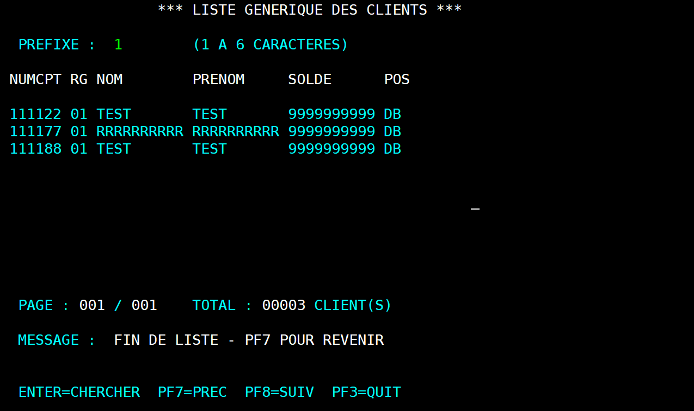

*L'utilisateur saisit le préfixe "1" et appuie sur ENTER. Le programme affiche les 3 clients restants (après les suppressions de l'exercice 17). Le message "FIN DE LISTE" indique qu'il n'y a pas d'autres pages.*

#### Test fonctionnel - Liste avec plusieurs résultats

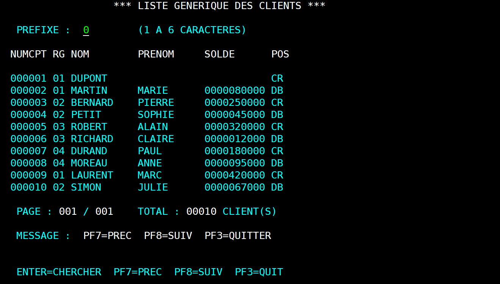

*Avec le préfixe "0", 10 clients sont affichés sur une seule page. Le format d'affichage montre pour chaque client : numéro, région, nom, prénom, solde et position (DB/CR).*

---

## Exercice 19 : Statistiques par région

### Énoncé

Élaborer une transaction permettant de calculer pour une REGION le nombre de CLIENT, la somme des montants des CLIENT Débiteurs et leur nombre et la somme des montants des CLIENT Créditeurs et leur nombre. Cette transaction aura en entrée le code REGION et affichera les quatre informations spécifiées ci-dessus.

### Mon choix de conception

L'énoncé demande d'utiliser un AIX/PATH pour accéder aux clients par région. Les deux approches (attendue et implémentée) utilisent donc le fichier PCLIENT défini sur le PATH. Les différences portent sur l'implémentation :

| Approche attendue | Mon approche | Différence |
|-------------------|--------------|------------|
| Affichage basique des statistiques | Validation du code région (01-04) | Ergonomie utilisateur |
| Gestion DUPKEY implicite | Gestion explicite de DFHRESP(DUPKEY) | Robustesse du code |
| Mode conversationnel simple | Mode pseudo-conversationnel | Pattern cohérent avec les autres transactions |

> **Point commun** : Les deux approches nécessitent la définition de l'AIX, du PATH, et du FILE CICS PCLIENT. La manipulation dans ADCD.Z113F.PROCLIB est également requise (voir ci-dessous).

### Mon travail

Cette transaction utilise l'**AIX (Alternate Index)** sur le champ CODREG comme demandé par l'énoncé. J'ai ajouté :
- **Validation du code région** : seules les valeurs 01-04 sont acceptées
- **Affichage du nom de la région** : Paris, Marseille, Lyon ou Lille
- **Gestion explicite de DFHRESP(DUPKEY)** : réponse normale pour un AIX avec NONUNIQUEKEY

#### Pourquoi un AIX/PATH est nécessaire ?

| Approche | Avantages | Inconvénients |
|----------|-----------|---------------|
| **Full scan** (sans AIX) | Simple, pas de configuration | Lit TOUT le fichier, inefficace |
| **AIX/PATH sur CODREG** | Accès direct par région, performant | Nécessite définition AIX + PATH + FILE CICS |

L'énoncé impose l'utilisation d'un AIX pour des raisons pédagogiques et de performance. En production, avec des milliers de clients, le full scan serait très lent.

#### Architecture AIX/PATH

```
┌─────────────────────────────────────────────────────────────────┐
│ FICHIER DE BASE : ROCHA.CICS.CLIENT (KSDS)                      │
│ Clé primaire : NUMCPT (position 0, longueur 6)                  │
└─────────────────────────────────────────────────────────────────┘
                              │
                              │ RELATE
                              ▼
┌─────────────────────────────────────────────────────────────────┐
│ AIX : ROCHA.CICS.CLIENT.AIX                                     │
│ Clé alternative : CODREG (offset 6, longueur 2)                 │
│ NONUNIQUEKEY (plusieurs clients par région)                     │
└─────────────────────────────────────────────────────────────────┘
                              │
                              │ PATHENTRY
                              ▼
┌─────────────────────────────────────────────────────────────────┐
│ PATH : ROCHA.CICS.CLIENT.PATH                                   │
│ Permet l'accès au fichier de base via la clé alternative        │
└─────────────────────────────────────────────────────────────────┘
                              │
                              │ DSN (FILE CICS)
                              ▼
┌─────────────────────────────────────────────────────────────────┐
│ FILE CICS : PCLIENT                                             │
│ Utilisé par le programme PRGSTAT                                │
└─────────────────────────────────────────────────────────────────┘
```

#### Différence Full scan vs AIX/PATH

```
Full scan (FCLIENT)                AIX/PATH (PCLIENT)
───────────────────                ──────────────────
STARTBR LOW-VALUES                 STARTBR '01' (code région)
  │                                  │
  ▼                                  ▼
┌────────┐                         ┌────────┐
│ 100001 │ CLI-CODREG=03? NON      │ 100003 │ CLI-CODREG=01 ✓
│ 100002 │ CLI-CODREG=02? NON      │ 100005 │ CLI-CODREG=01 ✓
│ 100003 │ CLI-CODREG=01? OUI ✓    │ 222001 │ CLI-CODREG=01 ✓
│ 100004 │ CLI-CODREG=04? NON      │ 222005 │ CLI-CODREG=01 ✓
│ 100005 │ CLI-CODREG=01? OUI ✓    │ 100001 │ CLI-CODREG=03 → STOP
│  ...   │                         └────────┘
│ 222015 │ FIN FICHIER               Lit uniquement 4 enreg.
└────────┘
  Lit TOUS les enregistrements
```

### Résolution

#### Étape 1 : Définition AIX et PATH (DEFPATH.jcl)

Ce JCL crée l'index alternatif sur le champ CODREG et le PATH associé :

```jcl
//*----------------------------------------------------------------*
//* ETAPE 2 : Definition de l'ALTERNATE INDEX (AIX)                *
//*           Cle alternative : CODREG (offset 6, longueur 2)      *
//*           NONUNIQUEKEY : plusieurs clients par region          *
//*----------------------------------------------------------------*
//STEP2    EXEC PGM=IDCAMS
//SYSIN    DD *
  DEFINE ALTERNATEINDEX ( -
         NAME(ROCHA.CICS.CLIENT.AIX) -
         RELATE(ROCHA.CICS.CLIENT) -
         KEYS(2 6) -
         NONUNIQUEKEY -
         UPGRADE -
         ) ...
/*
//*----------------------------------------------------------------*
//* ETAPE 3 : Construction de l'AIX (BLDINDEX)                     *
//*----------------------------------------------------------------*
//STEP3    EXEC PGM=IDCAMS
//SYSIN    DD *
  BLDINDEX -
         INDATASET(ROCHA.CICS.CLIENT) -
         OUTDATASET(ROCHA.CICS.CLIENT.AIX)
/*
//*----------------------------------------------------------------*
//* ETAPE 4 : Definition du PATH                                   *
//*----------------------------------------------------------------*
//STEP4    EXEC PGM=IDCAMS
//SYSIN    DD *
  DEFINE PATH ( -
         NAME(ROCHA.CICS.CLIENT.PATH) -
         PATHENTRY(ROCHA.CICS.CLIENT.AIX) -
         )
/*
```

**Paramètres clés de l'AIX :**

| Paramètre | Valeur | Explication |
|-----------|--------|-------------|
| KEYS(2 6) | 2 octets à l'offset 6 | Position du champ CODREG dans l'enregistrement |
| NONUNIQUEKEY | - | Plusieurs clients peuvent avoir le même code région |
| UPGRADE | - | L'AIX est mis à jour automatiquement quand le fichier de base change |
| RELATE | ROCHA.CICS.CLIENT | Fichier de base associé |

#### Étape 2 : MAP BMS (CLISTAT.bms)

Le code source est stocké dans `ROCHA.CICS.SOURCE(CLISTAT)`.

**En-tête du MAPSET avec commentaires :**

```
***********************************************************************
*  MAPSET : CLISTAT - Statistiques par Region
*  Transaction : STAT
*  Fil Rouge CICS - Exercice 19
*
*  FONCTIONNALITE :
*  ----------------
*  Affiche les statistiques d'une region :
*  - Nombre total de clients
*  - Nombre et somme des clients debiteurs (DB)
*  - Nombre et somme des clients crediteurs (CR)
*
*  REGIONS DISPONIBLES :
*  01 - Paris     02 - Marseille
*  03 - Lyon      04 - Lille
***********************************************************************
CLISTAT  DFHMSD TYPE=&SYSPARM,MODE=INOUT,LANG=COBOL,                   X
               STORAGE=AUTO,CTRL=(FREEKB,FRSET),TIOAPFX=YES
```

**Zone de saisie et zones de résultats :**

```
*----------------------------------------------------------------------
* ZONE DE SAISIE - CODE REGION
*----------------------------------------------------------------------
CODREG   DFHMDF POS=(4,28),LENGTH=2,ATTRB=(UNPROT,NUM,IC)
         ^^^^^^^^^^^^^^^^^^^^^^^^^^^^^^^^^^^^^^^^^^^^^^^^^^^^^
         Code région (01-04) - UNPROT,NUM : numérique saisissable

*----------------------------------------------------------------------
* NOM DE LA REGION (affiché après saisie)
*----------------------------------------------------------------------
NOMREG   DFHMDF POS=(6,28),LENGTH=15,ATTRB=(ASKIP,BRT)
         Paris, Marseille, Lyon ou Lille

*----------------------------------------------------------------------
* STATISTIQUES
*----------------------------------------------------------------------
NBTOT    DFHMDF POS=(10,38),LENGTH=5,ATTRB=(ASKIP,BRT)  <- Total clients
NBDB     DFHMDF POS=(12,38),LENGTH=5,ATTRB=(ASKIP,BRT)  <- Nb débiteurs
MTDB     DFHMDF POS=(13,38),LENGTH=15,ATTRB=(ASKIP,BRT) <- Somme DB
NBCR     DFHMDF POS=(15,38),LENGTH=5,ATTRB=(ASKIP,BRT)  <- Nb créditeurs
MTCR     DFHMDF POS=(16,38),LENGTH=15,ATTRB=(ASKIP,BRT) <- Somme CR
```

> **Conception** : Cette MAP affiche des statistiques calculées, tous les champs de résultat sont en ASKIP (lecture seule). Seul le code région est saisissable.

#### Étape 3 : Programme PRGSTAT.cbl - Extraits clés

**Variables pour conversion solde (REDEFINES) :**

```cobol
      *-----------------------------------------------------------------
      * VARIABLES POUR CONVERSION SOLDE (REDEFINES)
      * Note: FUNCTION NUMVAL non supporté sur IBM Enterprise COBOL
      *-----------------------------------------------------------------
       01  WS-SOLDE-ALPHA        PIC X(10) VALUE SPACES.
       01  WS-SOLDE-NUM REDEFINES WS-SOLDE-ALPHA
                                 PIC 9(10).
```

> **Note technique** : La fonction `NUMVAL` n'est pas supportée dans le contexte MOVE sur IBM Enterprise COBOL. La solution est d'utiliser `REDEFINES` pour réinterpréter la zone alphanumerique comme numérique.

**Paragraphe de calcul des statistiques :**

```cobol
       3000-CALCULER-STATS.
      *-----------------------------------------------------------------
      * Parcours du fichier via AIX/PATH pour la région demandée
      * L'AIX permet d'accéder directement aux clients de la région
      *-----------------------------------------------------------------
           INITIALIZE WS-STATS
           MOVE 'N' TO WS-FIN-BROWSE

      *    Positionner sur la clé AIX (code région)
           MOVE WS-CODE-REGION TO WS-CLE-AIX

           EXEC CICS STARTBR
               FILE('PCLIENT')
               RIDFLD(WS-CLE-AIX)
               RESP(WS-RESP)
           END-EXEC

      *    Gestion explicite des erreurs STARTBR
           EVALUATE WS-RESP
               WHEN DFHRESP(NORMAL)
                   CONTINUE
               WHEN DFHRESP(NOTFND)
      *            Aucun client dans cette région
                   GO TO 3000-FIN
               WHEN OTHER
                   GO TO 3000-FIN
           END-EVALUATE

      *    Boucle de lecture des enregistrements de la région
           PERFORM UNTIL FIN-BROWSE
               EXEC CICS READNEXT
                   FILE('PCLIENT')
                   INTO(ENR-CLIENT)
                   RIDFLD(WS-CLE-AIX)
                   RESP(WS-RESP)
               END-EXEC

               EVALUATE TRUE
                   WHEN WS-RESP = DFHRESP(ENDFILE)
                       MOVE 'O' TO WS-FIN-BROWSE
                   WHEN WS-RESP NOT = DFHRESP(NORMAL)
                      AND WS-RESP NOT = DFHRESP(DUPKEY)
      *                Erreur autre que DUPKEY (normal pour AIX)
                       MOVE 'O' TO WS-FIN-BROWSE
                   WHEN CLI-CODREG NOT = WS-CODE-REGION
      *                Changement de région = fin du browse
                       MOVE 'O' TO WS-FIN-BROWSE
                   WHEN OTHER
      *                Client de la région - comptabiliser
                       ADD 1 TO WS-NB-TOTAL
                       PERFORM 3100-CONVERTIR-SOLDE
                       IF CLI-POSITION = 'DB'
                           ADD 1 TO WS-NB-DEBITEURS
                           ADD WS-SOLDE-NUM TO WS-MT-DEBITEURS
                       ELSE
                           ADD 1 TO WS-NB-CREDITEURS
                           ADD WS-SOLDE-NUM TO WS-MT-CREDITEURS
                       END-IF
               END-EVALUATE
           END-PERFORM

      *    Fermeture du browse
           EXEC CICS ENDBR FILE('PCLIENT') END-EXEC.

       3000-FIN.
           EXIT.
```

#### Étape 4 : Définitions CICS

**Définition du FILE PCLIENT (PATH) :**

```
CEDA DEFINE FILE(PCLIENT) GROUP(CLIGROUP)
     DSNAME(ROCHA.CICS.CLIENT.PATH)
     ADD(NO) BROWSE(YES) DELETE(NO) READ(YES) UPDATE(NO)
     LSRPOOLID(1)
     STRINGS(2)
     RECORDFORMAT(F)

CEDA INSTALL FILE(PCLIENT)
```

| Paramètre | Valeur | Explication |
|-----------|--------|-------------|
| ADD(NO) | - | Pas d'ajout via le PATH (utiliser FCLIENT) |
| BROWSE(YES) | - | Permet STARTBR/READNEXT/ENDBR |
| DELETE(NO) | - | Pas de suppression via le PATH |
| UPDATE(NO) | - | Pas de mise à jour via le PATH |

> **Note** : Le PATH est en lecture seule. Les opérations d'écriture doivent se faire via le fichier de base FCLIENT.

> **Note environnement TK4-** : Comme pour FCLIENT (voir Partie 1, Exercice 4), une manipulation dans le membre CICSTS51 de la bibliothèque ADCD.Z113F.PROCLIB est nécessaire pour que CICS reconnaisse le nouveau FILE PCLIENT. Il faut ajouter une entrée pour PCLIENT pointant vers le dataset ROCHA.CICS.CLIENT.PATH.

**Définition de la transaction :**

```
CEDA DEFINE MAPSET(CLISTAT) GROUP(CLIGROUP)
CEDA INSTALL MAPSET(CLISTAT)

CEDA DEFINE PROGRAM(PRGSTAT) GROUP(CLIGROUP) LANGUAGE(COBOL)
CEDA INSTALL PROGRAM(PRGSTAT)

CEDA DEFINE TRANSACTION(STAT) GROUP(CLIGROUP) PROGRAM(PRGSTAT)
CEDA INSTALL TRANSACTION(STAT)
```

> **Visualisation** : Utiliser `CEDA DISPLAY GROUP(CLIGROUP)` pour vérifier l'ensemble des ressources du groupe (voir captures ci-dessous).

### Procédure de déploiement complète

```
1. DÉFINITION AIX/PATH (JCL)
   → Soumettre DEFPATH.jcl
   → Crée ROCHA.CICS.CLIENT.AIX et ROCHA.CICS.CLIENT.PATH

2. DÉFINITION FILE CICS
   → CEDA DEFINE FILE(PCLIENT) ... DSN(ROCHA.CICS.CLIENT.PATH)
   → CEDA INSTALL FILE(PCLIENT)

3. ASSEMBLAGE MAP BMS
   → Copier CLISTAT.bms → ROCHA.CICS.SOURCE(CLISTAT)
   → Soumettre ASMSTAT.jcl

4. COMPILATION PROGRAMME
   → Copier PRGSTAT.cbl → ROCHA.CICS.SOURCE(PRGSTAT)
   → Soumettre CMPSTAT.jcl

5. DÉFINITION ET INSTALLATION CICS
   → CEDA DEFINE MAPSET/PROGRAM/TRANSACTION
   → CEDA INSTALL pour chaque ressource

6. TEST
   → STAT → Saisir 01, 02, 03 ou 04
```

### Résultats attendus (avec les données initiales)

| Région | Total | Débiteurs | Montant DB | Créditeurs | Montant CR |
|--------|-------|-----------|------------|------------|------------|
| 01 Paris | 5 | 1 | 80 000 | 4 | 871 000 |
| 02 Marseille | 4 | 2 | 77 000 | 2 | 395 000 |
| 03 Lyon | 3 | 1 | 12 000 | 2 | 598 000 |
| 04 Lille | 3 | 2 | 118 000 | 1 | 180 000 |

### Points importants

1. **FILE('PCLIENT')** : Le programme utilise le PATH (accès via AIX) au lieu de FCLIENT.

2. **WS-CLE-AIX PIC X(02)** : La clé de browse est de 2 caractères (code région) au lieu de 6.

3. **DFHRESP(DUPKEY)** : Réponse normale pour un AIX avec NONUNIQUEKEY. Elle indique qu'il existe d'autres enregistrements avec la même clé alternative.

4. **Condition d'arrêt** : `CLI-CODREG NOT = WS-CODE-REGION` - Quand on rencontre un client d'une autre région, on arrête le browse.

### Difficultés rencontrées et solutions

| Problème | Cause | Solution |
|----------|-------|----------|
| Erreur DFH7053I | Ligne COBOL dépassant colonne 72 | Raccourcir les messages |
| NUMVAL not allowed | `FUNCTION NUMVAL` non supporté dans MOVE | Utiliser `REDEFINES` |
| Double affichage | `PERFORM` sans `THRU` + `GO TO` | Ajouter `THRU paragraphe-FIN` |

> **Règle COBOL mainframe** : Si un paragraphe contient un `GO TO` vers un paragraphe de sortie, le `PERFORM` appelant doit inclure `THRU` jusqu'à ce paragraphe (voir Partie 2a, Exercice 7).

### Captures d'écran

#### Vérification des datasets AIX et PATH

Avant de définir les ressources CICS, on vérifie que l'AIX et le PATH ont été correctement créés par le JCL DEFPATH.

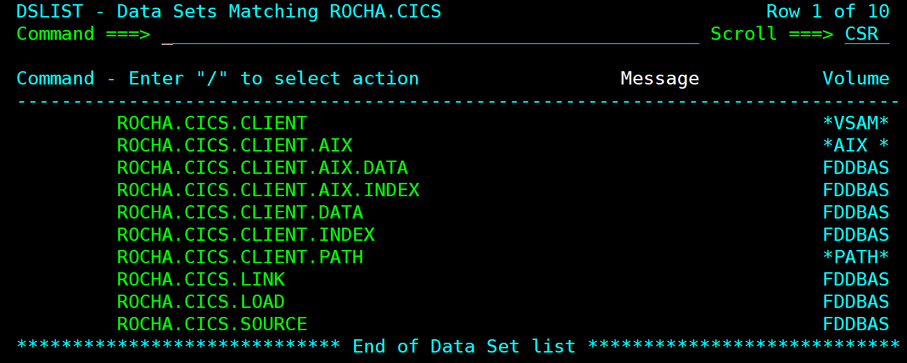

*La liste DSLIST montre les datasets du projet CICS : le fichier de base CLIENT, l'index alternatif CLIENT.AIX et le chemin d'accès CLIENT.PATH.*

#### Création de l'AIX et du PATH avec IDCAMS

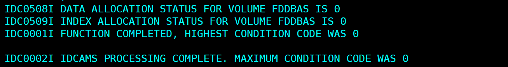

*Le JCL DEFPATH utilise IDCAMS pour créer l'AIX (Alternate Index) sur le champ CODREG avec les paramètres KEYS(2 6) et NONUNIQUEKEY.*

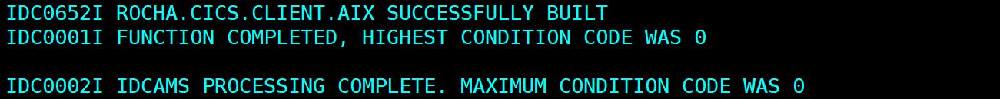

*La commande BLDINDEX construit l'index alternatif à partir des données du fichier de base. Le message "AIX SUCCESSFULLY BUILT" confirme la réussite.*

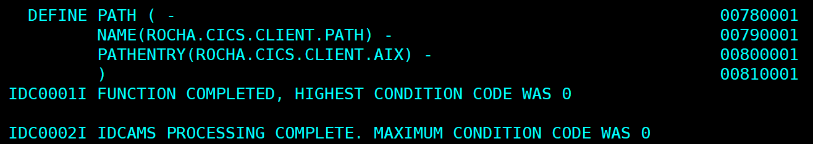

*La commande DEFINE PATH crée le chemin d'accès ROCHA.CICS.CLIENT.PATH qui permet d'accéder au fichier de base via l'index alternatif.*

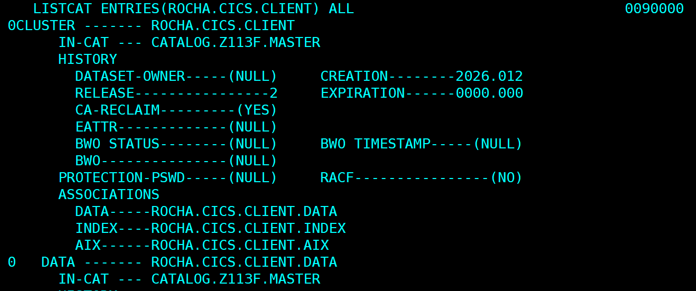

*LISTCAT montre les associations entre le cluster de base, les composants DATA et INDEX, l'AIX et le PATH.*

#### Définition du FILE CICS pour le PATH

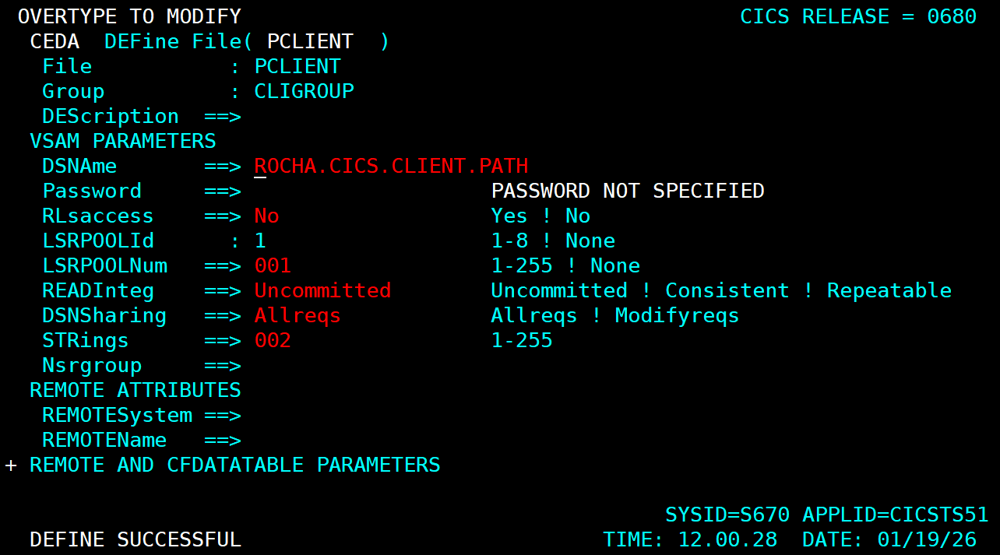

*La commande CEDA DEFINE FILE(PCLIENT) définit le fichier CICS qui pointe vers le PATH. Le DSN est ROCHA.CICS.CLIENT.PATH.*

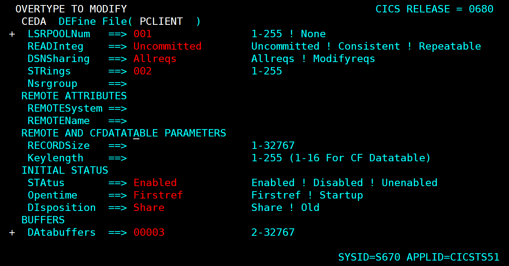

*Les paramètres du FILE : ADD(NO), BROWSE(YES), DELETE(NO), READ(YES), UPDATE(NO). Le PATH est en lecture seule.*

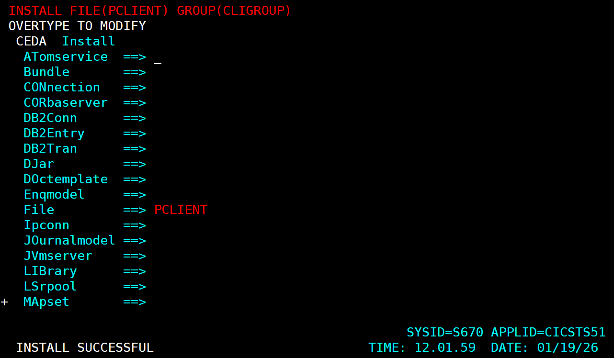

*La commande CEDA INSTALL FILE(PCLIENT) active le fichier. Le message "INSTALL SUCCESSFUL" confirme que le PATH est accessible.*

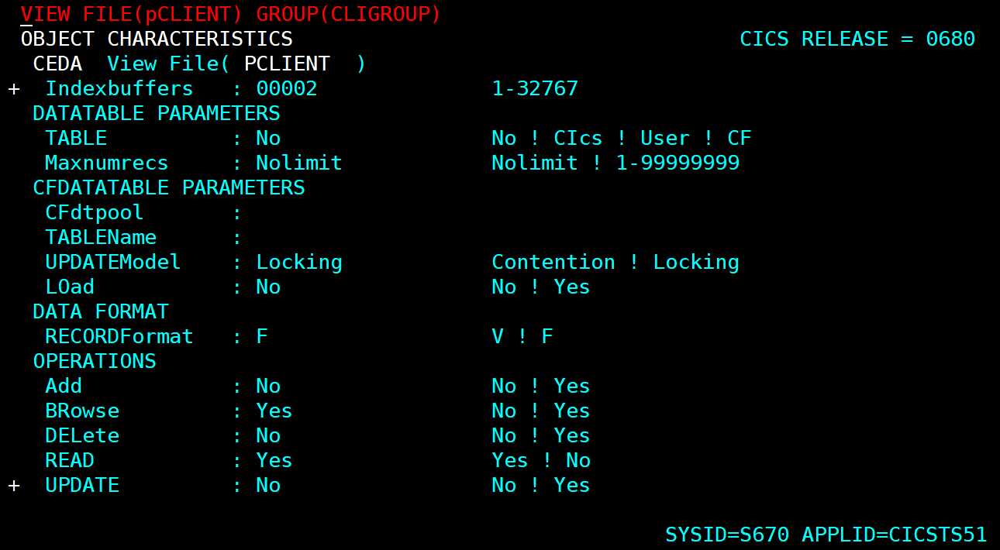

*CEDA VIEW FILE(PCLIENT) montre les opérations autorisées : Browse et Read uniquement (accès via l'index alternatif).*

#### Définition des ressources CICS pour STAT

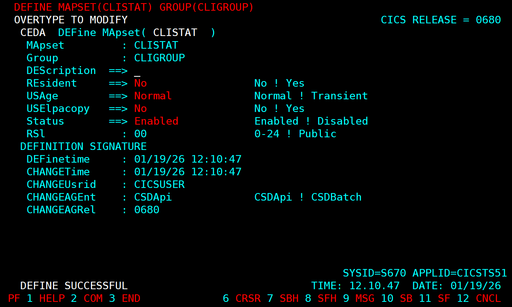

*La commande CEDA DEFINE MAPSET(CLISTAT) GROUP(CLIGROUP) crée la définition du mapset de statistiques.*

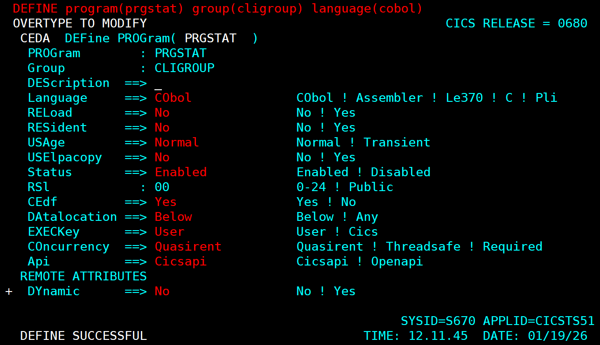

*La commande CEDA DEFINE PROGRAM(PRGSTAT) GROUP(CLIGROUP) LANGUAGE(COBOL) crée la définition du programme de statistiques.*

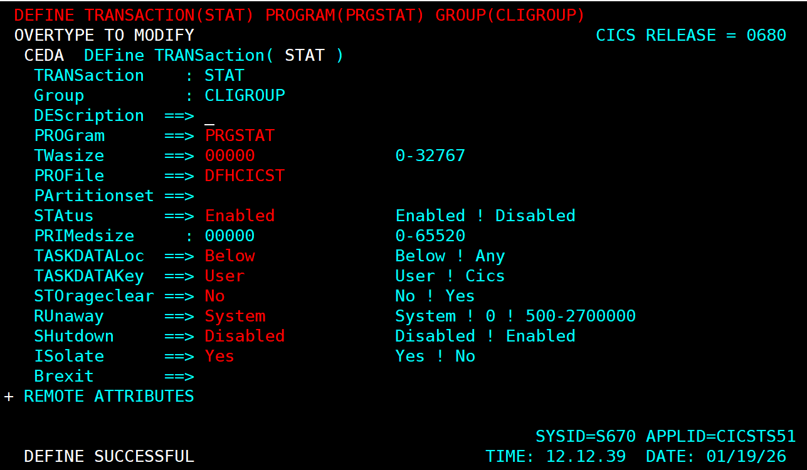

*La commande CEDA DEFINE TRANSACTION(STAT) GROUP(CLIGROUP) PROGRAM(PRGSTAT) associe le code "STAT" au programme PRGSTAT.*

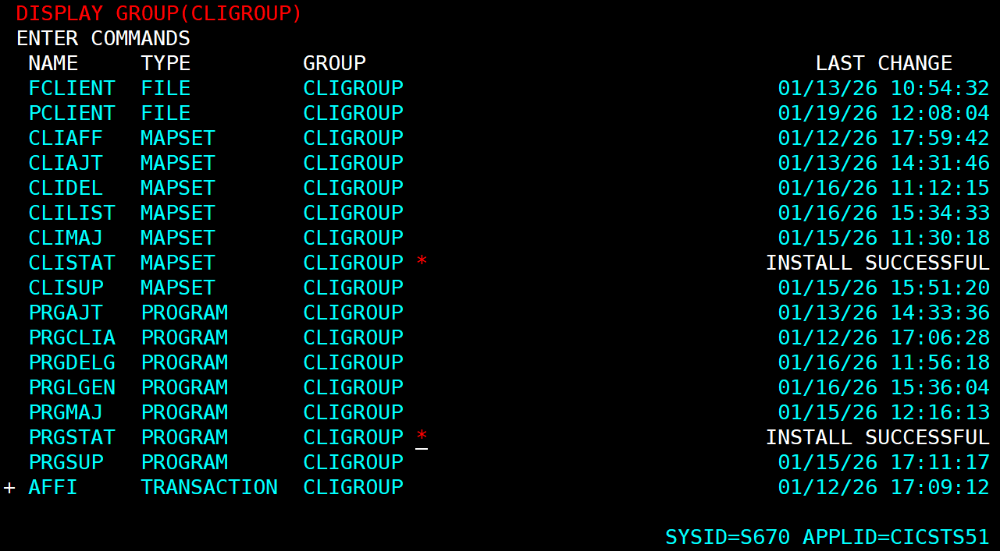

*CEDA DISPLAY GROUP(CLIGROUP) montre les ressources CLISTAT installées.*

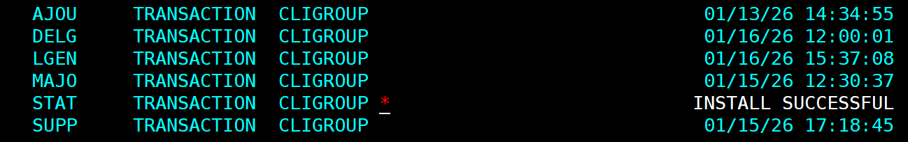

*Suite de la liste montrant la transaction STAT définie et installée.*

#### Test fonctionnel - Statistiques par région

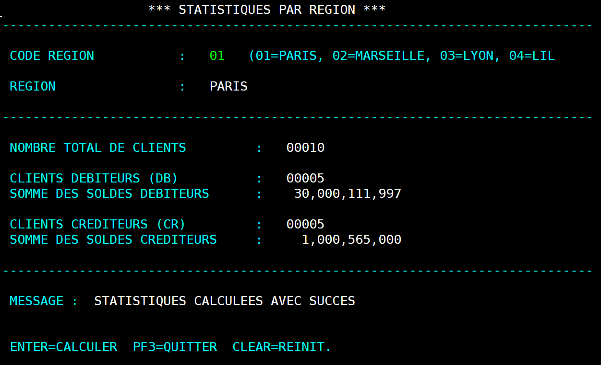

*Transaction STAT avec code région 01 (PARIS). L'écran affiche : 10 clients total, 5 débiteurs, 5 créditeurs, avec les sommes des soldes pour chaque catégorie.*

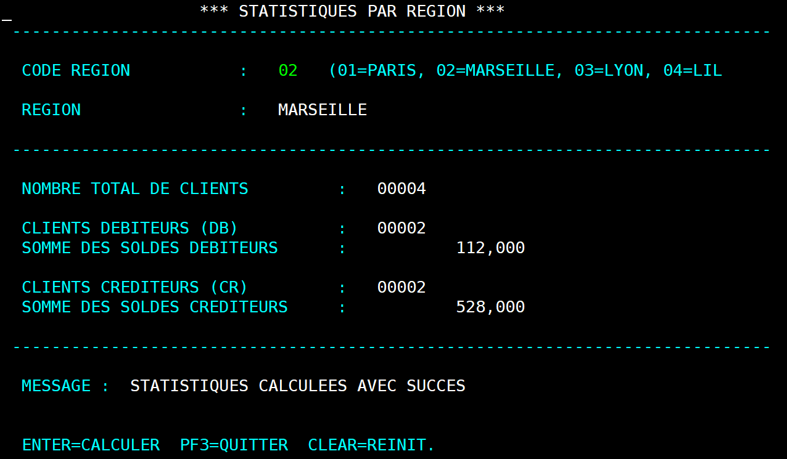

*Transaction STAT avec code région 02 (MARSEILLE). Résultats : 4 clients, 2 débiteurs, 2 créditeurs.*

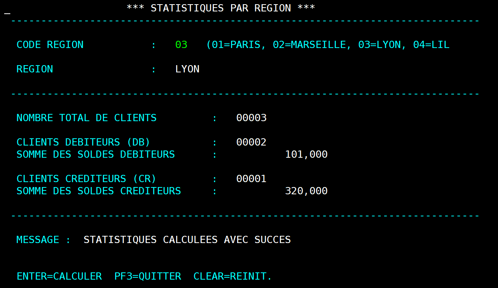

*Transaction STAT avec code région 03 (LYON). Résultats : 3 clients, 2 débiteurs, 1 créditeur.*

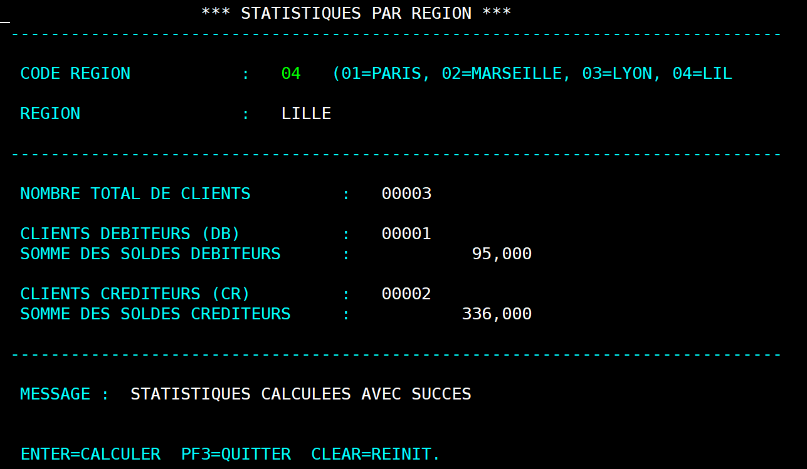

*Transaction STAT avec code région 04 (LILLE). Résultats : 3 clients, 1 débiteur, 2 créditeurs.*

#### Test des cas d'erreur

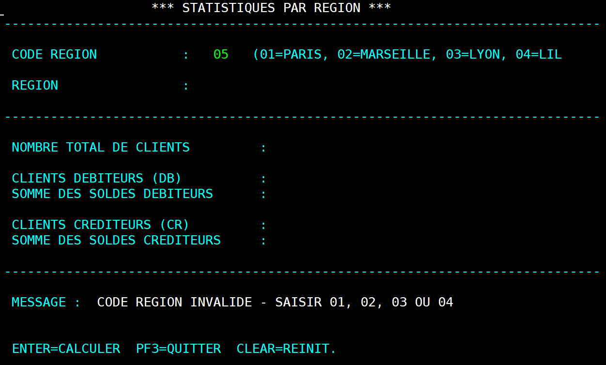

*Transaction STAT avec code région 05. Le message "CODE REGION INVALIDE" s'affiche car seules les régions 01 à 04 sont autorisées.*

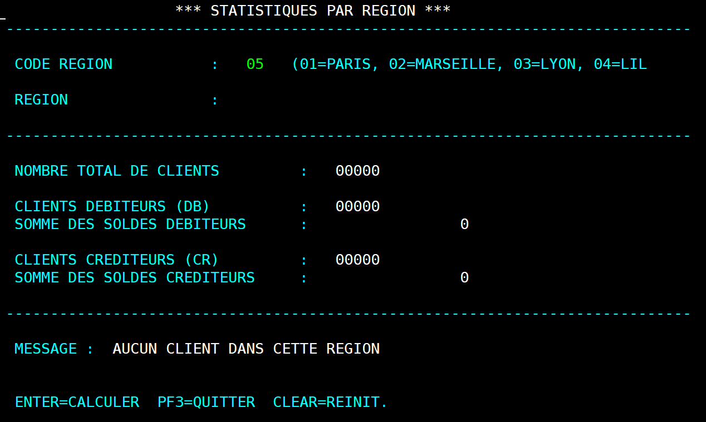

*Après correction, si une région valide ne contient aucun client, le message "AUCUN CLIENT DANS CETTE REGION" s'affiche avec des statistiques à zéro.*

---

## Récapitulatif des ressources CLIGROUP après Partie 3

| Type | Nom | Description | Défini dans |
|------|-----|-------------|-------------|
| FILE | FCLIENT | Fichier VSAM clients (base) | Exercice 1 |
| FILE | PCLIENT | PATH vers AIX sur CODREG | Exercice 19 |
| MAPSET | CLIAFF | Écran affichage | Exercice 4 |
| MAPSET | CLIAJT | Écran ajout | Exercice 8 |
| MAPSET | CLIMAJ | Écran mise à jour | Exercice 9 |
| MAPSET | CLISUP | Écran suppression | Exercice 12 |
| MAPSET | CLIDEL | Écran suppression générique | Exercice 17 |
| MAPSET | CLILIST | Écran liste paginée | Exercice 18 |
| MAPSET | CLISTAT | Écran statistiques | Exercice 19 |
| PROGRAM | PRGCLIA | Programme affichage | Exercice 4 |
| PROGRAM | PRGAJT | Programme ajout | Exercice 8 |
| PROGRAM | PRGMAJ | Programme mise à jour | Exercice 10 |
| PROGRAM | PRGSUP | Programme suppression | Exercice 13 |
| PROGRAM | PRGDELG | Programme suppression générique | Exercice 17 |
| PROGRAM | PRGLGEN | Programme liste paginée | Exercice 18 |
| PROGRAM | PRGSTAT | Programme statistiques | Exercice 19 |
| TRANSACTION | AFFI | Transaction affichage | Exercice 4 |
| TRANSACTION | AJOU | Transaction ajout | Exercice 8 |
| TRANSACTION | MAJO | Transaction mise à jour | Exercice 11 |
| TRANSACTION | SUPP | Transaction suppression | Exercice 14 |
| TRANSACTION | DELG | Transaction suppression générique | Exercice 17 |
| TRANSACTION | LGEN | Transaction liste paginée | Exercice 18 |
| TRANSACTION | STAT | Transaction statistiques | Exercice 19 |

---

[< Partie 2c : Suppression](05-partie-2c-suppression.md) | [Retour au sommaire](00-introduction.md) | [Conclusion >](07-conclusion.md)
